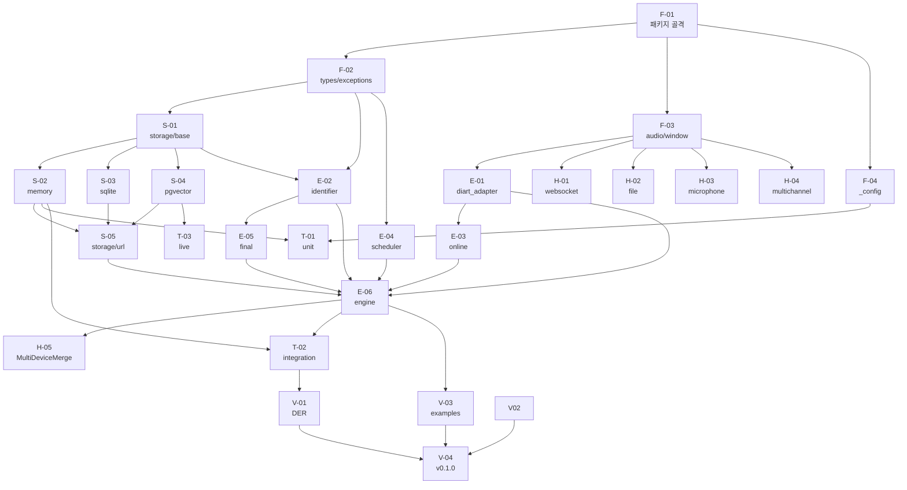

# speaker_engine v1 구현 마일스톤

## Summary

`speaker_engine` v1 구현을 위한 WBS(26개 작업 단위) + 마일스톤(M1~M5) + 발주 Wave(1~8) 박제. planning-02 + ADR 01~07 + SPEC 01~03 이 모두 accepted/ready 상태 — backend 코드 작성 진입 가능.

---

## §1 범위 / 목적

### v1 포함

- mono only 입력 (PCM 16kHz mono 강제, [[adr-06-mono-only-v1-multichannel-v2]])
- 3-tier 라벨 (registered / stored / auto, [[spec-01-speaker-engine-api]] §4)
- diart blocks 래핑 + asyncio + RxPY 격리 ([[adr-01-diart-wrapping-strategy]], [[spec-03-diart-adapter]])
- SpeakerStore 3 백엔드 (memory / sqlite / pgvector, [[spec-02-speaker-store-schema]])
- 오디오 입력 헬퍼 3종 (mixdown / MultiDeviceMerge / beamforming, [[adr-07-helper-scope]])
- WS Race 5종 정책 (R1~R5, [[adr-05-ws-race-defaults]])
- device 자동 감지 + 명시 override ([[spec-01-speaker-engine-api]] §2)
- 단위·통합 테스트 + DER 베이스라인

### v2 (범위 밖)

- Multi-Channel Diarization 모델 직접 도입 ([[adr-06-mono-only-v1-multichannel-v2]])
- beamforming layer 엔진 내부 옵션화
- PyPI 배포 (v1 은 git+ssh)

---

## §2 작업 단위 (WBS)

### Phase 1 — Foundation (코어 골격)

| ID | 산출물 | 의존성 | 추정 (단독) | 참조 |
|---|---|---|---|---|
| **F-01** | 패키지 골격 (`speaker_engine/` 디렉토리 + `pyproject.toml` + `__init__.py` public re-export) | — | 0.5일 | [[planning-02-speaker-engine]] §9 |
| **F-02** | `types.py` + `exceptions.py` (`SpeakerSegment` / `LabelChange` / `SpeakerCandidate` / `Speaker` / `MicrophoneGeometry` / `BeamformingConfig` + `ModelLoadError` / `StorageError`) | F-01 | 0.5일 | [[spec-01-speaker-engine-api]] §3, §5 |
| **F-03** | `audio/format.py` (PCM 검증) + `audio/window.py` (`WaveformBuffer` 10s sliding window) | F-01 | 1일 | [[spec-03-diart-adapter]] §2-2, reference-01 §1 |
| **F-04** | `_config.py` (env 로딩: `HF_TOKEN`, `STORAGE_URL`) | F-01 | 0.5일 | [[spec-01-speaker-engine-api]] §2, [[adr-03-storage-via-env-url]] |

**Phase 1 소계**: 2.5일

### Phase 2 — Storage (DB layer)

| ID | 산출물 | 의존성 | 추정 (단독) | 참조 |
|---|---|---|---|---|
| **S-01** | `storage/base.py` (`SpeakerStore` Protocol + `Speaker` / `SpeakerMatch` dataclass) | F-02 | 0.5일 | [[spec-02-speaker-store-schema]] §2 |
| **S-02** | `storage/memory.py` (`MemoryStore` — in-memory dict + numpy, default) | S-01 | 0.5일 | [[spec-02-speaker-store-schema]] §3 |
| **S-03** | `storage/sqlite.py` (`SqliteVecStore`, extras `[sqlite]`) | S-01 | 1일 | [[spec-02-speaker-store-schema]] §3 |
| **S-04** | `storage/pgvector.py` (`PgvectorStore` + DDL 마이그레이션 v1, extras `[pgvector]`) | S-01 | 1.5일 | [[spec-02-speaker-store-schema]] §3, §6 |
| **S-05** | `storage/url.py` (URL parser → backend 구현체 선택) | S-02, S-03, S-04 | 0.5일 | [[spec-02-speaker-store-schema]] §2, [[adr-03-storage-via-env-url]] |

**Phase 2 소계**: 4일

### Phase 3 — Engine Core (diart + clustering + identifier)

| ID | 산출물 | 의존성 | 추정 (단독) | 참조 |
|---|---|---|---|---|
| **E-01** | `diart_adapter.py` (diart blocks wrap + RxPY 격리 + `WaveformBuffer` 연결 + L2 normalize + `ModelLoadError`) | F-03 | 2일 | [[spec-03-diart-adapter]] 전체, [[adr-01-diart-wrapping-strategy]] |
| **E-02** | `speaker/identifier.py` (3-tier 매칭: registered/stored/auto + threshold 정책) | S-01, F-02 | 1일 | [[spec-04-clustering-algorithms]] §4.2/§4.3, [[spec-01-speaker-engine-api]] §4 |
| **E-03** | `speaker/online.py` (diart `OnlineSpeakerClustering` wrapper + `local_speaker_id` 안정성) | E-01 | 1일 | [[spec-04-clustering-algorithms]] §4.3, reference-08 §5 |
| **E-04** | `speaker/scheduler.py` (AdaptiveReclusterScheduler, R3 동기 inline) | — | 0.5일 | [[spec-04-clustering-algorithms]] §4.4, [[adr-05-ws-race-defaults]] R3 |
| **E-05** | `speaker/final.py` (FinalReclusterer + HDBSCAN + Hungarian) | E-02 | 1일 | [[spec-04-clustering-algorithms]] §4.5, [[adr-08-final-recluster-strategy]] |
| **E-06** | `engine.py` (`SpeakerEngine`: `stream` / `finalize` / `persist` / `set_alias` / `merge_speakers` / `delete_speaker` / `async with`, device 자동 감지 + `StorageError` 3회 backoff) | E-01~E-05, S-05 | 2일 | [[spec-01-speaker-engine-api]] §2, §4, §5 |

**Phase 3 소계**: 7.5일

### Phase 4 — Input Helpers (소스 + 멀티채널)

| ID | 산출물 | 의존성 | 추정 (단독) | 참조 |
|---|---|---|---|---|
| **H-01** | `sources/websocket.py` (`from_websocket`) | F-03 | 0.5일 | [[spec-01-speaker-engine-api]] §2 |
| **H-02** | `sources/file.py` (`from_file`) | F-03 | 0.5일 | [[spec-01-speaker-engine-api]] §2 |
| **H-03** | `sources/microphone.py` (`from_microphone`, extras `[microphone]`) | F-03 | 0.5일 | [[spec-01-speaker-engine-api]] §2 |
| **H-04** | `sources/multichannel.py` (`from_multichannel_mixdown` + `from_beamforming`, extras `[beamforming]`) | F-03 | 1.5일 | [[adr-07-helper-scope]], [[spec-01-speaker-engine-api]] §2-3 |
| **H-05** | `multi/merge.py` (`MultiDeviceMerge` — N engine 시간 기준 merge + label prefix) | E-06 | 1일 | [[adr-07-helper-scope]], [[planning-02-speaker-engine]] §7 |

**Phase 4 소계**: 4일

### Phase 5 — Tests

| ID | 산출물 | 의존성 | 추정 (단독) | 참조 |
|---|---|---|---|---|
| **T-01** | `tests/unit/` — 합성 embedding 픽스처, mock diart, 모듈별 독립 검증 | F-04, S-02 | 2일 | [[spec-05-test-strategy]] §2, §4, [[spec-01-speaker-engine-api]] §6, [[spec-03-diart-adapter]] §6 |
| **T-02** | `tests/integration/` — 실 audio fixture + memory store + e2e stream (R1~R5 race 포함) | E-06, S-02 | 2일 | [[spec-05-test-strategy]] §2, §4, [[spec-01-speaker-engine-api]] §6 |
| **T-03** | `tests/live/` — pgvector backend 실통합 (CI skip 표시) | S-04 | 1일 | [[spec-05-test-strategy]] §2, §5, [[spec-02-speaker-store-schema]] §3 |

**Phase 5 소계**: 5일

### Phase 6 — Eval + Release

| ID | 산출물 | 의존성 | 추정 (단독) | 참조 |
|---|---|---|---|---|
| **V-01** | DER 측정 베이스라인 (AMI 단일 fixture, 목표 < 15%) + 임계값 grid search 튜닝 + spec-04/adr-08 default 갱신 + `runbook-NN-engine-tuning` 박제 | T-02 | 2일 | [[spec-05-test-strategy]] §3, §6, [[planning-02-speaker-engine]] §10, §11 |
| **V-02** | `README.md` + quickstart (repo 최상위, mediness 외부) | — | 0.5일 | — |
| **V-03** | `examples/` (`basic_chunk_stream.py` / `persist_workflow.py` / `fastapi_ws_demo.py`) | E-06 | 1일 | [[planning-02-speaker-engine]] §9 |
| **V-04** | v0.1.0 git+ssh 첫 릴리스 태깅 | V-01, V-02, V-03 | 0.5일 | [[planning-02-speaker-engine]] §9 |

**Phase 6 소계**: 3일

---

**총 추정**: ~26일 (단독 직렬). 워커 병렬 분배 시 ~2주.

---

## §3 마일스톤

| M | 완료 시점 (단독 누적) | 완료 기준 |
|---|---|---|
| **M1 — Foundation + Storage** | Day 5 | F-01~04 + S-01~05 완성. `MemoryStore` 동작 확인. env 로딩 + URL parser 작동 |
| **M2 — Engine Core** | Day 9 | E-01~06 완성. 합성 audio 로 `SpeakerSegment` 발행 검증. 단일 출력 큐 R5 확인 |
| **M3 — Input Helpers** | Day 11 | H-01~05 완성. FastAPI WS 데모 (`fastapi_ws_demo.py`) 로컬 동작 |
| **M4 — Tests Green** | Day 13 | T-01 + T-02 Green. CI green (pgvector T-03 skip 제외) |
| **M5 — Release Ready** | Day 15 | V-01 DER 베이스라인 확인 + V-02 README + V-04 v0.1.0 태깅. **backend 구현 완료** |

---

## §4 의존성 그래프

---

## §5 발주 순서 (워커 병렬 분배)

| Wave | 작업 ID | 동시 실행 가능 | 비고 |
|---|---|---|---|
| **Wave 1** | F-01 | 단독 | 전체 블로커 — 먼저 완료 필요 |
| **Wave 2** | F-02, F-03, F-04 | 병렬 3 | F-01 완료 후 |
| **Wave 3a** | S-01 | 단독 (짧음) | F-02 완료 후 — S-02/03/04 의 블로커 |
| **Wave 3b** | S-02, S-03, S-04, E-01, E-04, H-01, H-02, H-03, H-04 | 병렬 9 | S-01 + F-03 완료 후. 가장 큰 병렬 Wave |
| **Wave 4** | S-05, E-02, E-03, E-05, T-01 | 병렬 5 | 각 의존성 완료 후 |
| **Wave 5** | E-06 | 단독 | S-05 + E-01~E-05 모두 완료 — 최대 블로커 |
| **Wave 6** | H-05, T-02, V-03 | 병렬 3 | E-06 완료 후 |
| **Wave 7** | T-03, V-01, V-02 | 병렬 3 | 각 의존성 완료 후 |
| **Wave 8** | V-04 | 단독 | V-01 + V-02 + V-03 완료 — 릴리스 |

워커 분배 기준 **~2주** 달성 가능 (Wave 3b 병렬 9가 핵심).

---

## §6 위험 / 보류

| 위험 | 영향 영역 | 대응 |
|---|---|---|
| pyannote/segmentation-3.0 HF 동의 미완료 또는 rate limit | E-01 블로커 (M2 지연) | HF token 사전 검증 + 모델 동의 확인. 실패 시 mock diart 로 E-01 stub 진행 |
| pgvector D 가변 처리 (단일 `vector(D)` 컬럼 한계) | S-04 마이그레이션 복잡화 | model_id 별 컬럼 파생 방식 — [[spec-02-speaker-store-schema]] §3 옵션 참조 |
| diart `>=0.9` vs `>=4.0` 호환성 충돌 | E-01 의존성 트리 | `diart>=0.9` 고정 pin (`diart~=0.9`) — [[spec-03-diart-adapter]] §7 주석 참조 |
| beamforming geometry 입력 캘리브레이션 복잡도 | H-04 사용처 UX | H-04 는 geometry 형식 검증 + 에러 메시지 충분히 제공 (`ValueError`) |
| Apple Silicon mps device 검증 | E-01, E-06 (device 인자) | T-01 에 mps mock 케이스 추가. 실기기 검증은 V-01 시 |
| 단독 vs 워커 병렬 일정 격차 | M1~M5 시점 | Wave 발주 순서(§5) 기준 워커 분배 우선. 단독 시 직렬 적용 (~26일) |

---

## §7 후속 문서 (plan-01 approved 후)

| 문서 | 카테고리 | 시점 | 상태 |
|---|---|---|---|
| `spec-05-test-strategy` | spec | 발주 전 정책 박제 | ✅ ready (2026-05-17) |
| `test-NN-speaker-engine` | test | M4 직전 — T-01~T-03 구체 케이스 (구현 단계 결정) | todo |
| `runbook-NN-engine-tuning` | runbook | V-01 시점 — DER 측정 raw + grid 결과 + 분할 시드 ([[spec-05-test-strategy]] §6) | todo |
| `release-NN-v0.1.0` | release-notes | V-04 태깅 후 | todo |

---

## §8 참조

- [[planning-02-speaker-engine]] §3~§13 전체 (범위·결정·후속 문서)
- [[adr-01-diart-wrapping-strategy]] / [[adr-02-pattern-b-fanout-chain]] / [[adr-03-storage-via-env-url]] / [[adr-04-manual-persist-flow]] / [[adr-05-ws-race-defaults]] / [[adr-06-mono-only-v1-multichannel-v2]] / [[adr-07-helper-scope]] / [[adr-08-final-recluster-strategy]]
- [[spec-01-speaker-engine-api]] / [[spec-02-speaker-store-schema]] / [[spec-03-diart-adapter]] / [[spec-04-clustering-algorithms]] / [[spec-05-test-strategy]]
