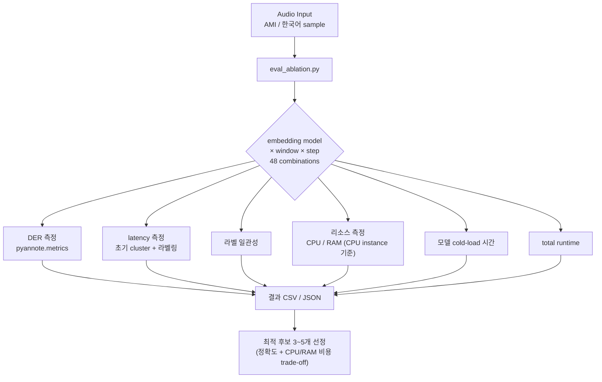
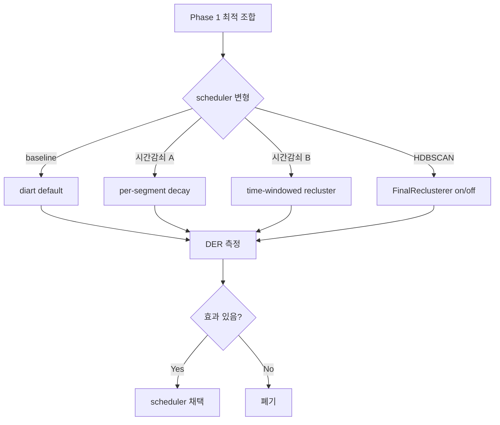

# PLAN-V02 — Embedding × Window × Scheduler Ablation Study

## 한 줄

한국어 회의/상담 도메인에서 화자 분리 정확도 최적화하는 (embedding model × window size × step × 시간감쇠 scheduler) 조합 도출.

## 배경

v0.1-demo (PLAN-001~006 STT-driven chain + speaker_engine wrapper) 폐기.  
근거: admin smoke v6~v11 측정으로 phrase-level embedding 의 본질 한계 (duration-dependent cluster, sliding window 정확도 한계) 확인.  
상세: `medi_docs/legacy/v0.1-demo/LEGACY_NOTE.md`

## 북극성

> "한국어 회의/상담 도메인에서 다인 화자 분리 정확도 (DER) ≤ 15% +  
> 초기 cluster 형성 latency ≤ 20s + 라벨링 지연 ≤ 3s"

---

## Phase 0 — 환경 준비

### 0.1 데이터셋

| 종류 | 설명 | 비고 |
|------|------|------|
| AMI corpus subset | 영어 baseline, 4 session | V-01 baseline 그대로 |
| 한국어 회의/상담 sample | record_1.wav 외 N개 | 사용자 제공 |

- 각 sample 의 ground truth annotation: RTTM 또는 동등

### 0.2 metric

| metric | 도구 | 설명 |
|--------|------|------|
| DER (Diarization Error Rate) | pyannote.metrics | 주 KPI |
| 초기 cluster 형성 latency | 자체 측정 | 첫 stable cluster 도달 시점 |
| 라벨링 지연 | 자체 측정 | PCM 입력 → labeled segment emit |
| 라벨 일관성 | 자체 측정 | 동일 화자 라벨 변동률 |
| **CPU 사용률** | `psutil` | per-second peak + average |
| **RAM 사용량** | `psutil` | peak + average (MB) |
| **모델 cold-load 시간** | 자체 측정 | embedding 모델 첫 로드 latency |
| **total runtime** | wall-clock | combination 1회 처리 시간 |

> **GPU 측정 제외**: Azure CPU instance 운영 가정. 모든 모델 `device="cpu"` 강제로 일관 측정. GPU instance 채택 결정 시 deployment 단계에서 별도 측정.

### 0.3 평가 스크립트

- 신설: `scripts/eval_ablation.py`
- 입력: `(embedding_model, window_s, step_s, scheduler_params, sample_audio)`
- 출력: DER + latency 측정값
- 결과 누적: CSV / JSON 결과 표

---

## Phase 1 — embedding × window ablation

### 1.1 embedding 후보 (3종)

| 모델 | dim | 권장 window | 비고 |
|------|-----|------------|------|
| pyannote/embedding | 512 | 3~5s | baseline |
| ECAPA-TDNN (SpeechBrain) | 192 | 1~2s | 경량 |
| WeSpeaker ResNet-221 (`voxceleb_resnet221_LM`) | 256 | 1s+ | 오픈소스 |
| ~~TitaNet-L (NeMo)~~ | ~~192~~ | ~~0.5~1s~~ | **폐기 (admin 2026-05-22)** — nemo_toolkit ↔ diart torch 버전 충돌 (nemo 2.7.3 requires torch>=2.6, 프로젝트 torch==2.1) |

### 1.2 window 후보 (4종)

- 1s / 2s / 3s / **5s** (baseline)

### 1.3 step 후보 (3종)

- 0.1s / 0.25s / **0.5s** (baseline)

### 1.4 grid size

```
3 embedding × 4 window × 3 step = 36 combinations
한국어 sample 2개 (record_1, record_3) — AMI 생략
총 measurement: 36 × 2 = 72 rows
추정 시간: ~45분 CPU (smoke 37s × 72)
```

### 1.5 결과 표

각 조합의 DER + latency + 라벨 일관성 → 최적 후보 3~5개 선정

---

## Phase 2 — 시간감쇠 scheduler ablation

### 2.1 scheduler 변형

| 변형 | 설명 |
|------|------|
| baseline | diart OnlineSpeakerClustering 기본 (감쇠 없음) |
| 시간감쇠 A | initial 매 segment → 점점 매 N segment |
| 시간감쇠 B | time-windowed recluster (5/15/30/60s 단위) |
| FinalReclusterer (HDBSCAN) | on / off |

### 2.2 적용 기반

Phase 1 최적 embedding × window 위에서 각 scheduler 조합 측정

### 2.3 결과

- 시간감쇠 실제 효과 검증 (PLAN-005 측정: finalize ≈ online 결과 재확인)
- 효과 있으면 채택, 없으면 폐기

---

## Phase 3 (선택, 후속 plan) — demo 구현

ablation 결과 기반 단순 demo (별도 plan 분리):

- diart + 선택 embedding + ElevenLabs STT
- segment ↔ STT overlap → labeled_phrase
- 4-패널 grid UI (v0.1 자산 활용)
- speaker_engine wrapper 폐기 또는 슬림화

> Phase 0~2 결과 보고 후 별도 plan 발주 결정

## Phase 4 (out of scope) — enrollment + 운영

별도 plan. v0.2 에선 제외.

---

## 작업 분해

| T | 작업 | 워커 | 상태 |
|---|------|------|------|
| T-003 | spec suite 작성 (spec-01~06) | architect | **done** (PLAN-V02-T-003) |
| T-004 | 실행 단위 plan 작성 (Phase 0/1/2) | architect | **done** (PLAN-V02-T-004) |
| Phase 0 | 환경 구축 — 모델 wrap + 데이터셋 + eval/render 구현 + e2e smoke | evaluator | → **[PLAN-V02-001](../plan/PLAN-V02-001-phase0-env-setup.md)** |
| Phase 1 | embedding × window grid 48조합 측정 + HTML report + 최적 선정 | evaluator + admin | → **[PLAN-V02-002](../plan/PLAN-V02-002-phase1-grid.md)** |
| Phase 2 | scheduler 4종 ablation + HTML report + 최종 결정 박제 | evaluator + admin | → **[PLAN-V02-003](../plan/PLAN-V02-003-phase2-scheduler.md)** |
| Phase 3 (선택) | demo 구현 plan 분리 | architect | Phase 2 결과 후 결정 |

---

## DoD (v0.2 plan 자체)

- [ ] Phase 0~2 결과 표 + 최적 조합 도출
- [ ] speaker_engine wrapper 폐기/슬림화 결정 (Phase 2 결과 후)
- [ ] 다음 plan (Phase 3 demo 또는 enrollment) 발주 준비

---

## 보존 자산 (legacy 참조 가능)

| 자산 | 위치 |
|------|------|
| ElevenLabs STT 어댑터 | server/stt/elevenlabs.py |
| ServerVAD | server/stt/vad.py |
| 4-패널 grid UI | web/index.html |
| AudioWorklet PCM capture | web/ |
| Docker compose | docker-compose.yml |
| AMI 데이터 + 한국어 sample | (사용자 보유) |

## 폐기 자산 (v0.1-demo)

- speaker_engine: OnlineSpeakerClusterer wrapper / AdaptiveScheduler / FinalReclusterer / identify_phrase / running average / threshold knobs
- PLAN-006 STT-driven chain: _flush_phrase / word gap / sentence split / segment lookup
- 모든 v0.1-demo plan/adr/spec/planning

> 코드 자체 삭제는 별도 task — 현재는 git history 로 보존

---

## 아키텍처 흐름 (Phase 1)



## 아키텍처 흐름 (Phase 2)


