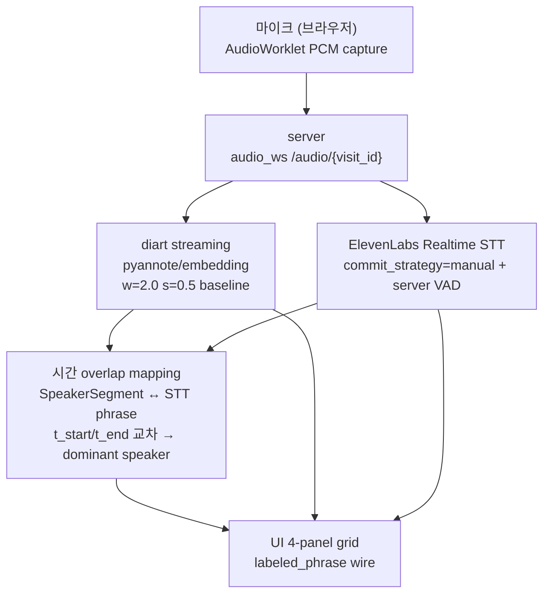

# PLAN-V03 — Phase 3 실시간 화자 분리 + STT Demo

## 한 줄

v0.2 ablation 최적 조합 기반 실시간 화자 분리 + ElevenLabs STT 자막 demo — 라이브 라벨링 latency 진짜 측정 포함.

## 배경

v0.2 ablation study 종결 (`retrospective/v02-final.md`):

- **최적 조합**: `pyannote/embedding × w=2.0 × s=0.5 × baseline` (DER 0.199, 16s/277s realtime)
- 8 scheduler variant 측정 → 어떤 variant도 baseline 못 이김 → adr-01 (wrapper 폐기) 실증 검증
- 북극성 (DER ≤ 0.15) 미달 — Phase 3 demo 진행 (정확도 ~80% 라이브 라벨링도 demo 로 의미 있음)

v0.2 ablation 은 **offline 재생 파일 기반 측정** 이었으므로, Phase 3 에서 처음으로 **진짜 라이브 측정** 수행.

## 북극성

| 지표 | 목표 | 측정 방법 |
|------|------|-----------|
| 라이브 라벨링 latency | ≤ **2초** | PCM 입력 → label emit (per-chunk emit timestamp) |
| DER (offline) | ≤ 0.20 | v0.2 baseline 수준 유지 |
| 자막 + 화자 라벨 동기화 | 시각 확인 | 시간 overlap mapping 정확도 |
| e2e smoke | WS open + 4-panel 표시 | 통합 검증 |

> v0.2 ablation 에서 측정한 초기 cluster latency 2.52s / 라벨링 p50 0.5s 는 offline 재생 기준. Phase 3 에서 라이브 PCM 스트리밍 기반 재측정.

---

## 구성 컴포넌트

### 컴포넌트 상세

| 컴포넌트 | 구현 방향 | 보존 자산 |
|----------|----------|-----------|
| **diart streaming** | `pyannote/embedding`, w=2.0, s=0.5, baseline scheduler | — (diart 0.9.2 + pyannote.audio 3.1.1) |
| **ElevenLabs Realtime STT** | legacy `server/stt/elevenlabs.py` 그대로 재활용 | `server/stt/elevenlabs.py`, `server/stt/vad.py` |
| **시간 overlap mapping** | legacy T-025 패턴 — `segment.t_start/t_end ↔ STT phrase.t_start/t_end overlap → dominant speaker` | legacy T-025 구현 참조 |
| **server WS audio_ws** | PCM fan-out (stt + diart 양쪽) | `server/audio/ringbuffer.py` (PcmRingBuffer) |
| **UI 4-panel** | legacy `web/index.html` 재활용 | `web/index.html`, `web/worklet-processor.js` |
| **AudioWorklet PCM capture** | legacy `web/worklet-processor.js` 재활용 | `web/worklet-processor.js` |
| **Docker compose** | legacy 재활용 | `docker-compose.yml` |

---

## 신규 측정 (Phase 3)

v0.2 ablation 에 없던 **라이브 측정**:

| 측정 항목 | 방법 |
|-----------|------|
| per-chunk emit timestamp | diart `StreamingInference` hook 활용 |
| online DER (시간별 누적 정확도) | 시간별 누적 DER vs final DER 비교 |
| 라벨링 latency (라이브) | PCM 입력 timestamp → label emit timestamp 차이 |

---

## 보존 / 폐기 자산

### 보존 (Phase 3 재활용)

| 자산 | 위치 |
|------|------|
| ElevenLabs STT 어댑터 | `server/stt/elevenlabs.py` |
| Server VAD | `server/stt/vad.py` |
| PcmRingBuffer | `server/audio/ringbuffer.py` |
| 4-panel UI | `web/index.html` |
| AudioWorklet PCM capture | `web/worklet-processor.js` |
| Docker compose | `docker-compose.yml` |
| 한국어 sample + RTTM | `eval/data/korean/` |
| diart + pyannote.audio 의존성 stack | `requirements*.txt` |

### 폐기 (v0.1 → v0.3 진입 시 확정)

| 자산 | 폐기 사유 |
|------|----------|
| `speaker_engine/` wrapper (OnlineSpeakerClusterer wrapper, AdaptiveScheduler, FinalReclusterer, identify_phrase) | adr-01 결정 + v0.2 Phase 2 실증 검증 |
| PLAN-006 STT-driven chain `_flush_phrase` 구두점/silence split 로직 | Phase 3 에서 diart segment 기반으로 재설계 |

> 코드 자체 삭제는 Phase 3 진입 시 별도 task — 현재는 git history 보존.

---

## 작업 분해 (Phase 3)

| plan | 작업 | 담당 | 상태 |
|------|------|------|------|
| [PLAN-V03-001](../plan/PLAN-V03-001-demo-env.md) | 환경 구축 + legacy 자산 통합 + e2e skeleton smoke | evaluator + realtime-api | 준비됨 |
| PLAN-V03-002 | server WS audio_ws chain 구현 (diart + STT + mapping) | realtime-api + engine-core | PLAN-V03-001 완료 후 |
| PLAN-V03-003 | UI 4-panel 통합 + 실시간 라벨링 latency 측정 | demo-ui + evaluator | PLAN-V03-002 완료 후 |
| PLAN-V03-004 (선택) | e2e admin smoke + 운영 환경 가정 측정 | admin + evaluator | 선택 |

---

## Phase 4 (out of scope)

enrollment + 운영 → 별도 plan. v0.3 에선 제외.

---

## DoD (Phase 3 전체)

- [ ] PLAN-V03-001 smoke — diart + STT + UI skeleton e2e 연결
- [ ] PLAN-V03-002 — labeled_phrase wire 라이브 동작
- [ ] PLAN-V03-003 — 라이브 라벨링 latency 진짜 측정 결과 박제
- [ ] 북극성 라이브 라벨링 latency ≤ 2초 달성 또는 미달 근거 박제
