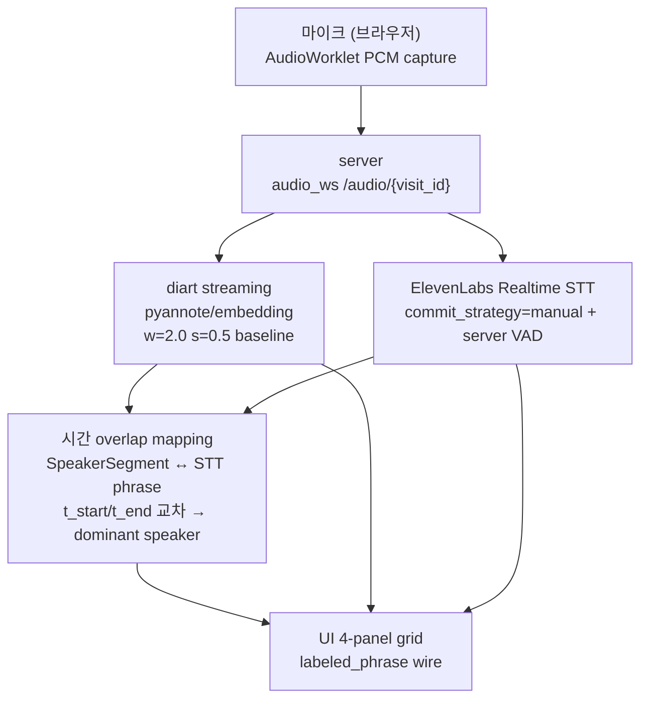

# PLAN-V03 — Phase 3 실시간 환경 Ablation 측정

## 한 줄

v0.2 offline ablation 의 후속 — **실시간 환경 (라이브 streaming + STT 매핑)** 에서 2 embedding 후보 (pyannote / ecapa-tdnn) 재측정 + 최종 운영 모델 결정 + 보고서.

## 정체성 (v0.2 와 동일 정체성)

Phase 3 = **demo 자체가 목적 X**. demo_v03 는 측정 도구. 본질 = **최적 설정값 라이브 환경에서 재검증 + 보고서**.

v0.2 와 차이:
- v0.2 offline = `StreamingInference` 가 audio 끝까지 처리 후 final Annotation 만 반환 → 라이브 latency 측정 X
- **v0.3 라이브 = per-chunk emit timestamp + online DER + STT 매핑 정확도 측정**

## 배경

v0.2 ablation study 종결 (`retrospective/v02-final.md`):

- **2 라이브 후보**: `pyannote/embedding` (1순위, offline DER 0.199, 16s realtime) + `ecapa-tdnn` (2순위, DER 0.205, 46s, sample 분산 최저)
- 8 scheduler variant 측정 → baseline 채택
- 북극성 (DER ≤ 0.15) 미달 — 라이브 측정 보강 + 운영 결정 필요

v0.2 ablation 은 **offline 재생 파일 기반 측정** — Phase 3 에서 **진짜 라이브 환경 ablation** 수행.

## 측정 grid

```
embedding  : pyannote/embedding | ecapa-tdnn   (v0.2 1순위 + 2순위)
window_s   : 2.0                              (v0.2 결정 고정)
step_s     : 0.5                              (v0.2 결정 고정)
scheduler  : baseline                          (v0.2 채택 고정)
sample     : record_1.wav | record_3.wav      (한국어, ground truth RTTM 있음)
mode       : live-streaming                    (per-chunk emit)
```

→ **2 embedding × 2 sample = 4 라이브 측정 rows** (단순 grid, v0.2 결정 위에서 라이브 환경 검증)

## metric (v0.2 + 라이브 신규)

| 지표 | 목표 | 측정 방법 |
|------|------|-----------|
| **라이브 emit latency p50/p95** | ≤ 2초 | PCM 입력 시점 → labeled_phrase emit 시점 |
| **online DER** | ≤ 0.20 | 시간별 누적 prediction vs ground truth |
| **final DER (offline 동치)** | v0.2 baseline 수준 유지 | streaming 끝난 후 최종 prediction |
| **매핑 정확도** | 시각 확인 | 시간 overlap (segment ↔ STT phrase) 결과 검토 |
| **CPU / RAM** | v0.2 수준 유지 | psutil 1초 폴링 |
| **STT phrase 개수** | — | ElevenLabs phrase commit 빈도 (라이브 매핑 단위) |

> v0.2 의 라벨링 p50 0.5s 는 offline placeholder. **본 Phase 3 가 진짜 라이브 latency 측정**.

---

## 구성 컴포넌트



### 컴포넌트 상세

| 컴포넌트 | 구현 방향 | 보존 자산 |
|----------|----------|-----------|
| **diart streaming** | `pyannote/embedding`, w=2.0, s=0.5, baseline scheduler | — (diart 0.9.2 + pyannote.audio 3.1.1) |
| **ElevenLabs Realtime STT** | legacy `server/stt/elevenlabs.py` 그대로 재활용 | `server/stt/elevenlabs.py`, `server/stt/vad.py` |
| **시간 overlap mapping** | legacy T-025 패턴 — `segment.t_start/t_end ↔ STT phrase.t_start/t_end overlap → dominant speaker` | legacy T-025 구현 참조 |
| **server WS audio_ws** | PCM fan-out (stt + diart 양쪽) | `server/audio/ringbuffer.py` (PcmRingBuffer) |
| **UI 4-panel** | legacy `web/index.html` 재활용 | `web/index.html`, `web/worklet-processor.js` |
| **AudioWorklet PCM capture** | legacy `web/worklet-processor.js` 재활용 | `web/worklet-processor.js` |
| **Docker compose** | legacy 재활용 | `docker-compose.yml` |

---

## 신규 측정 (Phase 3)

v0.2 ablation 에 없던 **라이브 측정**:

| 측정 항목 | 방법 |
|-----------|------|
| per-chunk emit timestamp | diart `StreamingInference` hook 활용 |
| online DER (시간별 누적 정확도) | 시간별 누적 DER vs final DER 비교 |
| 라벨링 latency (라이브) | PCM 입력 timestamp → label emit timestamp 차이 |

---

## 보존 / 폐기 자산

### 보존 (Phase 3 재활용)

| 자산 | 위치 |
|------|------|
| ElevenLabs STT 어댑터 | `server/stt/elevenlabs.py` |
| Server VAD | `server/stt/vad.py` |
| PcmRingBuffer | `server/audio/ringbuffer.py` |
| 4-panel UI | `web/index.html` |
| AudioWorklet PCM capture | `web/worklet-processor.js` |
| Docker compose | `docker-compose.yml` |
| 한국어 sample + RTTM | `eval/data/korean/` |
| diart + pyannote.audio 의존성 stack | `requirements*.txt` |

### 폐기 (v0.1 → v0.3 진입 시 확정)

| 자산 | 폐기 사유 |
|------|----------|
| `speaker_engine/` wrapper (OnlineSpeakerClusterer wrapper, AdaptiveScheduler, FinalReclusterer, identify_phrase) | adr-01 결정 + v0.2 Phase 2 실증 검증 |
| PLAN-006 STT-driven chain `_flush_phrase` 구두점/silence split 로직 | Phase 3 에서 diart segment 기반으로 재설계 |

> 코드 자체 삭제는 Phase 3 진입 시 별도 task — 현재는 git history 보존.

---

## 작업 분해 (Phase 3)

| plan | 작업 | 담당 | 상태 |
|------|------|------|------|
| [PLAN-V03-001](../plan/PLAN-V03-001-demo-env.md) | 환경 구축 + legacy 자산 통합 + e2e skeleton smoke | evaluator + realtime-api | 준비됨 |
| PLAN-V03-002 | server WS audio_ws chain 구현 (diart + STT + mapping) | realtime-api + engine-core | PLAN-V03-001 완료 후 |
| PLAN-V03-003 | UI 4-panel 통합 + 실시간 라벨링 latency 측정 | demo-ui + evaluator | PLAN-V03-002 완료 후 |
| PLAN-V03-004 (선택) | e2e admin smoke + 운영 환경 가정 측정 | admin + evaluator | 선택 |

---

## Phase 4 (out of scope)

enrollment + 운영 → 별도 plan. v0.3 에선 제외.

---

## DoD (Phase 3 전체)

- [ ] PLAN-V03-001 smoke — diart + STT + UI skeleton e2e 연결
- [ ] PLAN-V03-002 — labeled_phrase wire 라이브 동작
- [ ] PLAN-V03-003 — 라이브 라벨링 latency 진짜 측정 결과 박제
- [ ] 북극성 라이브 라벨링 latency ≤ 2초 달성 또는 미달 근거 박제
