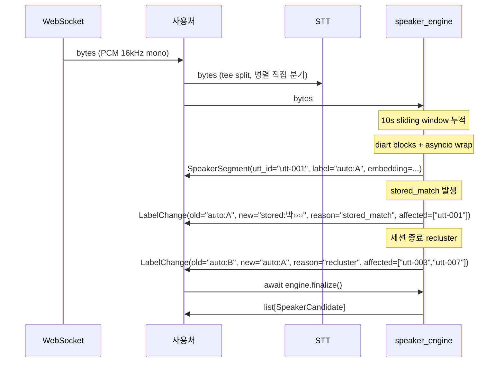
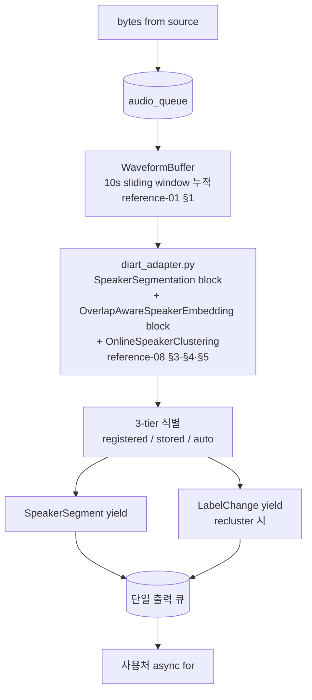
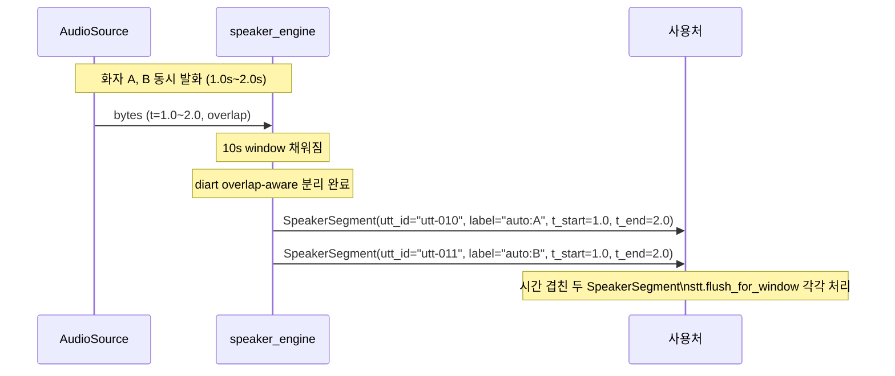
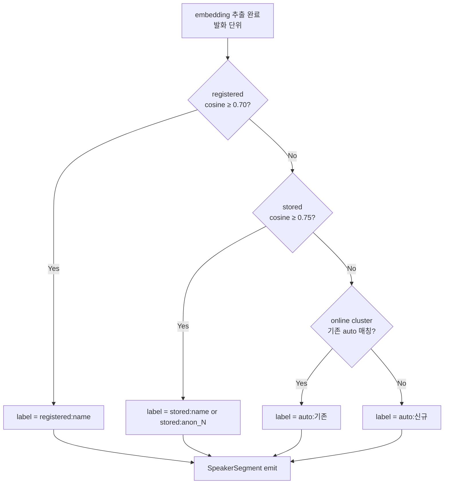
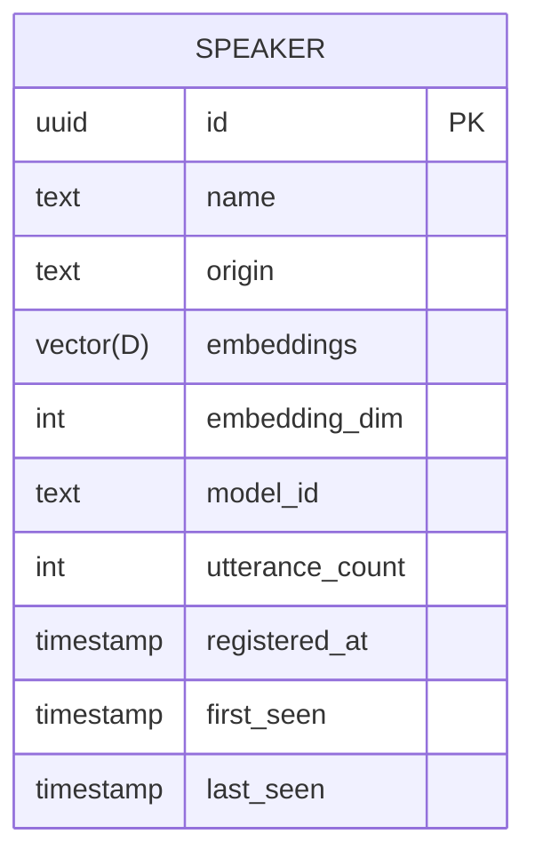
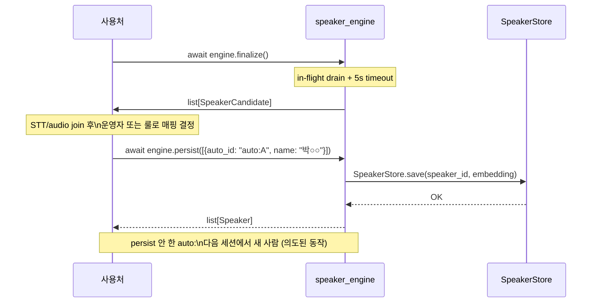
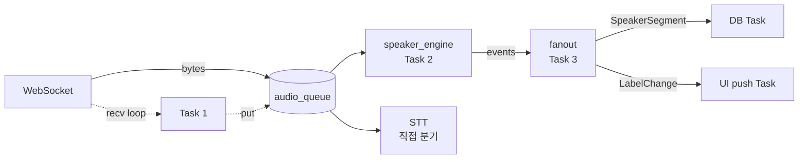

# 실시간 화자 분리 엔진 (speaker-engine) — 라이브러리 스코프

## Summary

오디오 스트림을 받아 **화자 라벨링된 이벤트** 를 yield 하는 pip 설치 가능한 Python 라이브러리. speaker 식별 + 온라인 클러스터링 + 세션 종료 시 HDBSCAN 정밀 재정렬까지 책임. STT·LLM·DB·UI 는 사용처 도메인 — 엔진은 audio in, labeled events out.

`planning-01` 은 풀스택 시스템의 아이디어 레퍼런스 (legacy, 참고용). 본 문서는 그중 **엔진 부분만** 의 정식 스코프 합의.

*문서 버전: v0.4 (diart 래핑 전략 + AudioChunk 제거 + 학습 사실 5건) | v0.3 결정 4 재정의 (ChunkLabeled 제거, AudioChunk/SpeakerSegment 도입)*

---

## §1 단일 책임

> **오디오 청크 스트림 → 화자 라벨링된 이벤트 스트림**

엔진은 다음만 책임:

1. **화자 분리** — diart + `pyannote/segmentation-3.0` (overlap-aware)
2. **임베딩 추출** — `pyannote/embedding` (D-dim, 모델 의존)
3. **Speaker 식별** — 등록된 speaker embedding 과 cosine 비교 (registered 0.70 / stored 0.75)
4. **온라인 클러스터링** — auto:A / auto:B / auto:C 라벨 부여 + 시간 감쇠 재클러스터링
5. **최종 재정렬** — 세션 종료 시 HDBSCAN 으로 누적 발화 정밀 재라벨
6. **SpeakerStore 관리** — env URL 로 backend 선택, 등록/조회/저장 책임

엔진 출력 = `SpeakerSegment | LabelChange` 2종 이벤트 스트림. 사용처가 그 스트림을 받아 DB·LLM 등으로 체인. STT 는 사용처가 WS 청크를 엔진과 병렬로 직접 분기.

도메인 어휘: **speaker** (등록/미등록 화자 통칭). `registered / stored / auto` 3-tier.

---

## §2 Out of Scope (사용처 책임)

엔진이 *책임지지 않는* 것을 명시 — 스코프 누수 방지.

| 영역 | 사유 |
|---|---|
| **STT** | 사용처가 WS 청크를 엔진과 병렬로 직접 STT 에 분기 (엔진 안 거침). `SpeakerSegment.audio` 는 화자별 분리 음성 (별도 활용 가능) |
| **DB 영속화** | `engine.persist([{auto_id, name}])` 호출 후 SpeakerStore 가 저장 — **스키마·마이그레이션은 사용처** |
| **LLM 추천** | 시술 추천·키워드 트리거·쿨다운은 도메인 로직 |
| **UI / WebSocket / 클라이언트** | 브라우저·MediaRecorder·팝업 — 엔진은 bytes in, events out |
| **Speaker 등록 스크립트 + 운영 가이드** | 엔진은 `SpeakerStore.register()` API 제공, 운영 워크플로우는 사용처 |
| **오디오 포맷 변환** | PCM 16kHz mono 는 **사용자 책임** (ffmpeg 등 의존성 엔진 외부) |

> SpeakerStore 의 **백엔드 선택** (postgresql/sqlite/memory) 은 `SPEAKER_ENGINE_STORAGE_URL` env 로 사용처가 결정. 엔진은 Protocol 구현체만 로드.

---

## §3 통합 방식 — 엔진 인터페이스 = output chain, audio 흐름 = 사용처 tee split (Pattern B 확정)

엔진과 사용처의 결합은 **이벤트 출력 chain** 으로 한정. **audio 입력은 사용처가 tee split — STT 와 engine 으로 fan-out**. 즉 "단일 체인 라이브러리" 가 아니라 **fan-out audio + chain events** 의 하이브리드. 의존성 주입 (DI) 방식 (planning-01 의 Pattern A) 은 **거부**.

### 2종 이벤트 (의사코드)

```python
@dataclass
class SpeakerSegment:
    """발화 단위 라벨 확정. overlap 시 시간 겹쳐 여러 개 yield."""
    utterance_id: str
    label: str                 # "registered:김원장" | "stored:박○○" | "auto:A"
    confidence: float
    embedding: np.ndarray      # D-dim (모델 의존, L2 normalized)
    audio: bytes               # 화자별 분리된 audio
    t_start: float
    t_end: float

@dataclass
class LabelChange:
    old_label: str
    new_label: str
    affected_utterance_ids: list[str]
    reason: Literal["recluster", "stored_match", "persist"]
```

### 정상 이벤트 시퀀스 (사용처 tee split + STT 병렬 + 엔진 라벨 흐름)



### 엔진 내부 구조 (10s sliding window + diart blocks + asyncio wrap)



### overlap 시나리오 (두 화자 동시 발화)



### 사용처 코드 골격 (FastAPI WS)

```python
async def audio_ws(ws: WebSocket, session_id: str):
    await ws.accept()
    engine = SpeakerEngine(registered_speakers=await load_reg(session_id))
    stt = WhisperStreamingSTT()  # 사용처가 선택 (streaming or batch)

    # ① tee generator — chunk 를 STT 와 engine 양쪽에 흘림 (fan-out)
    async def tee():
        async for chunk in from_websocket(ws):
            asyncio.create_task(stt.feed(chunk))   # fan-out: STT 비동기 (사용처 책임)
            yield chunk                             # engine 입력으로 yield

    # ② event chain — engine 출력만 단일 stream 으로 소비
    async with engine:
        async for event in engine.stream(tee()):
            match event:
                case SpeakerSegment():
                    text = await stt.flush_window(event.t_start, event.t_end)
                    await db.insert(event, text)
                    await ws.send_json({"type": "utt", **event.dict(), "text": text})
                case LabelChange():
                    await db.update_labels(event.affected_utterance_ids, event.new_label)
                    await ws.send_json({"type": "relabel", **event.dict()})

    candidates = await engine.finalize()
    await save_for_manual_mapping(session_id, candidates)
```

### Step-by-step 동작 메커니즘

1. **WS 연결** — 사용처가 핸들러 시작, `SpeakerEngine` 인스턴스화 (registered_speakers 로드)
2. **tee generator 정의** — 사용처가 ws chunk 받아서 `stt.feed` (fire-and-forget task) + `yield chunk` (engine 입력)
3. **chunk 도착 (~100ms 단위)** — tee 가 STT 분기 + engine 분기 모두 발사
4. **STT 흐름 (병렬)** — streaming STT 면 partial transcript 즉시 → 사용처가 `ws.send` 로 라이브 자막 (라벨 X)
5. **engine 내부 (백그라운드)** — `WaveformBuffer` 에 10s sliding window 누적
6. **10s window 채워짐** — `diart_adapter` 가 SpeakerSegmentation forward → embedding → OnlineSpeakerClustering → 3-tier 식별
7. **발화 종료 감지** — VAD/segmentation 결과로 발화 경계 결정 → `SpeakerSegment` yield (단일 출력 큐)
8. **사용처 수신** — `stt.flush_window(t_start, t_end)` 로 STT 의 해당 구간 transcript 받음 → DB INSERT + ws.send (자막에 라벨 retroactive 매핑)
9. **periodic recluster** — `AdaptiveScheduler` trigger → OnlineSpeakerClustering 재계산 → 라벨 변경 시 `LabelChange` yield → 사용처 DB UPDATE
10. **WS close** — tee 종료 → engine.stream 자연 종료 → `engine.finalize()` → candidates 반환 → 사용처가 매핑 UI/룰로 persist

### 결정 근거

- **chunk 라벨링 기술 불가**: overlap 시 단일 chunk 에 복수 화자 성분 혼재 → chunk 단위 라벨 부정확.
- **단일 스트림 2종**: SpeakerSegment(라벨 확정) + LabelChange 를 단일 출력 큐에서 yield — 사용처 `async for` 하나로 소비.
- **AudioChunk 제거 (단일 책임 회복)**: AudioChunk passthrough 는 엔진 단일 책임 위반. STT 는 사용처가 WS 청크를 직접 분기 (5~10줄 tee split) — 엔진 stream 안 거침.
- **STT 의 실시간성은 사용처가 보장** — streaming STT (Whisper-streaming/Clova streaming/Deepgram 등) 선택 시 청크 단위 partial 자막 가능. batch STT 면 발화 종료 후만. 엔진은 무관.
- **fan-out 동기화 보장 메커니즘** — STT 와 engine 이 같은 chunk 의 같은 시간축을 보장하는 근거:
  - ① **bytes identity**: tee 안 같은 변수 참조 — 양쪽 동일 PCM 객체
  - ② **순서 결정성**: `asyncio.create_task(stt.feed)` 발사 후 `yield chunk` — chunk 1→2→3 순서 양쪽 동일
  - ③ **시간축 자동 동기화**: 양쪽이 `bytes 길이 / (16000 × 2)` 로 audio offset 누적 → 별도 timestamp 전달 불필요. **PCM 16kHz mono 강제 (§7) + R1 backpressure (§8, chunk drop 방지)** 가 있어야 성립.
- 결합도: STT 인터페이스를 엔진 공개 API 로 두면 versioning·에러 propagation·timeout 정책이 엔진 책임으로 흘러옴.
- 테스트: STT mock 불필요. 화자 분리 정확도만 단독 검증 가능.

---

## §3.5 diart 래핑 전략

diart 의 RxPY pipeline 전체를 의존하지 않고, **알고리즘만 import + asyncio wrap** 하는 전략. `diart_adapter.py` 가 단일 종속점.

| 부분 | diart 활용 | 우리가 짬 |
|---|---|---|
| `SpeakerSegmentation` block | ✅ (단 duration=10 강제) [reference-08 §3] | — |
| `OverlapAwareSpeakerEmbedding` block | ✅ [reference-08 §4] | — |
| `OnlineSpeakerClustering` 알고리즘 | ✅ (임계 우리 정책) [reference-08 §5] | — |
| `AudioSource` / RxPY | ❌ | `from_*` 헬퍼 + asyncio buffer |
| 3-tier 라벨 / SpeakerStore / FinalReclusterer / Scheduler | ❌ | 우리 |

**diart_adapter.py 책임**:
- `SpeakerSegmentation`, `OverlapAwareSpeakerEmbedding`, `OnlineSpeakerClustering` import
- RxPY (`Observable`, `Subject`) 가 우리 라이브러리 외부에 노출되지 않도록 격리
- diart 의 `AudioSource` 는 사용 안 함 — 우리 `from_websocket / from_file / from_microphone` 헬퍼 유지
- `asyncio.Queue` 기반 비동기 buffer 로 diart 블록 호출 (RxPY pipeline 대체)

**Why (결정 9)**:
diart 의 `OnlineSpeakerClustering`, `OverlapAwareSpeakerEmbedding` 는 streaming-친화 검증된 알고리즘 [reference-08 §5]. 자체 wrap 시 ~1000줄 추가 + 검증 부담. 동시에 diart 의 RxPY pipeline 은 asyncio 와 충돌이라 격리.

**Alternatives**:
- (a) diart 통째 의존 — RxPY 가 외부에 새어나옴
- (b) 자체 pyannote 래핑 (v0.3 의 결정, 취소) — 알고리즘 재구현 비용

**Consequences**:
- `pyproject.toml` 의존성: `diart>=0.9`, `pyannote-audio>=4.0`, `torch`
- diart 의 RxPY 가 외부 노출 X
- diart `AudioSource` 사용 X

---

## §4 라벨 흐름 (3-tier 식별)

### 3-tier 라벨 체계

> **청크 단위 라벨링 불가**: overlap 시 단일 chunk 에 복수 화자 성분이 혼재하므로 chunk 레벨 라벨 부정확. **라벨 확정은 발화 단위 (`SpeakerSegment`) 에서만 보장**.

> **embedding 차원 D 는 모델 의존**: legacy `pyannote/embedding` (XVectorSincNet) default D=512, community-1 WeSpeaker ResNet34 D=256. 런타임 `model.dimension` 으로 결정 — 하드코드 금지 [reference-07 §7].

| 라벨 형식 | 의미 | 예시 |
|---|---|---|
| `registered:<name>` | 사전 등록된 speaker (고정 이름) | `registered:김원장` |
| `stored:<name>` | 세션 내 저장 + 별칭 부여됨 | `stored:박○○` |
| `stored:anon_001` | 저장되었으나 별칭 미부여 | `stored:anon_001` |
| `auto:A` | 자동 클러스터 (세션 내 임시) | `auto:A`, `auto:B` |

### 식별 우선순위 flowchart



임계값은 default; `engine.stream()` 호출 시 인자로 override 가능.

---

## §5 SpeakerStore

### env URL 스킴

| `SPEAKER_ENGINE_STORAGE_URL` 값 | 백엔드 | 비고 |
|---|---|---|
| `postgresql://user:pw@host/db` | pgvector | 프로덕션 |
| `sqlite:///path/to/db.sqlite` | SQLite (sqlite-vec) | 로컬 개발 |
| `memory://` | in-memory dict | default, 테스트 |

### 데이터 모델



- `origin`: `"registered"` | `"stored"`
- `registered_at IS NULL` → stored (세션 내 발견)
- `embeddings`: D-dim vector 목록 (복수 샘플 허용, D = `embedding_dim` 으로 동적 결정)
- `model_id`: embedding 모델 식별자 — 같은 `model_id` 끼리만 cosine 매칭 (모델 교체 시 매칭 거절 / 마이그레이션 기준)
- `embedding_dim`: 저장 시 embedding D 를 함께 박아 D 변화 감지

### SpeakerStore Protocol (의사코드)

```python
class SpeakerStore(Protocol):
    async def register(
        self, name: str, embeddings: list[np.ndarray]
    ) -> Speaker: ...

    async def find_match(
        self,
        embedding: np.ndarray,
        model_id: str,
        registered_threshold: float = 0.70,
        stored_threshold: float = 0.75,
    ) -> Speaker | None: ...

    async def save(
        self, speaker_id: uuid.UUID, embedding: np.ndarray
    ) -> None: ...

    async def list(
        self, origin: Literal["registered", "stored"] | None = None
    ) -> list[Speaker]: ...

    async def promote(
        self, speaker_id: uuid.UUID, name: str
    ) -> Speaker: ...

    async def merge(
        self, source_id: uuid.UUID, target_id: uuid.UUID
    ) -> Speaker: ...

    async def delete(self, speaker_id: uuid.UUID) -> None: ...
```

---

## §6 Persist 흐름 (D3-b 수동 매핑)

### 흐름 시퀀스



### SpeakerCandidate (의사코드)

```python
@dataclass
class SpeakerCandidate:
    auto_id: str               # "auto:A" 등 세션 내 임시 라벨
    utterance_ids: list[str]   # SpeakerSegment.utterance_id 목록 (이 cluster 에 속한 발화)
    representative_embedding: np.ndarray  # D-dim (모델 의존)
    total_duration: float      # 총 발화 시간 (초)
    utterance_count: int
```

### 규칙

- `persist([{auto_id, name}])` 는 `finalize()` 호출 후에만 유효.
- `auto:*` persist 를 하지 않으면 다음 세션에서 해당 speaker 는 **새 사람** 으로 인식 — 의도된 동작.
- `stored:*` 로 이미 저장된 speaker 는 임계값 이상 유사도이면 자동 재인식.

---

## §7 입력 인터페이스

### Engine API (의사코드)

```python
class SpeakerEngine:
    def __init__(
        self,
        storage_url: str | None = None,       # 없으면 env SPEAKER_ENGINE_STORAGE_URL
        hf_token: str | None = None,           # 없으면 env HF_TOKEN
        registered_threshold: float = 0.70,
        stored_threshold: float = 0.75,
        max_speakers: int = 8,
    ): ...

    async def stream(
        self, source: AsyncIterator[bytes]
    ) -> AsyncIterator[SpeakerSegment | LabelChange]: ...

    async def finalize(self) -> list[SpeakerCandidate]: ...

    async def persist(
        self, mappings: list[dict[str, str]]
    ) -> list[Speaker]: ...

    async def __aenter__(self) -> "SpeakerEngine": ...
    async def __aexit__(self, *args) -> None: ...   # finalize 자동 호출
```

### 헬퍼 소스

| 헬퍼 함수 | 설명 | 비고 |
|---|---|---|
| `from_websocket(ws)` | FastAPI/Starlette WebSocket → `AsyncIterator[bytes]` | WS recv loop |
| `from_file(path)` | 파일 경로 → `AsyncIterator[bytes]` | 테스트/배치 |
| `from_microphone(device=None)` | sounddevice → `AsyncIterator[bytes]` | 로컬 데모 |

### PCM 포맷 강제

- **16kHz mono, 16-bit signed PCM** 만 수락.
- 다른 포맷 → 사용처가 변환 책임 (ffmpeg, pydub 등).
- 엔진 내부 자동 변환 X — dependency 증가 + 실시간 jitter 원인 제거.

### 멀티 채널 / 다중 마이크 환경 — v1 정책

> **v1 = engine 입력 mono 1ch only 강제. 멀티 채널 audio 는 사용처가 mono 로 변환해서 입력.**
> 멀티 채널 모델 직접 도입은 v2 (reference-01 §1 mono 학습 한계 + pretrained open-weight 부재).

#### 시나리오 분리

| 시나리오 | WS 수 | engine 수 | 사용처가 하는 일 |
|---|---|---|---|
| **단일 디바이스 멀티채널** (회의실 천장 어레이, USB 4ch 마이크 등) | 1 | 1 | WS 1개에 멀티 채널 multiplexed → 사용처가 demux → **mono mixdown** 또는 **beamforming** → mono 1ch → engine |
| **다중 디바이스 멀티 세션** (자리별 헤드셋, 콜센터 N석) | N | N | 디바이스/자리마다 WS+engine 분리. SpeakerStore 공유로 cross-device embedding 매칭 |
| 단일 디바이스 mono | 1 | 1 | 그대로 engine 입력 |

#### 단일 디바이스 멀티채널 처리 패턴 (사용처 선택)

| 패턴 | 사용처 처리 | 적합 |
|---|---|---|
| **mono mixdown** | 채널 평균/합산 → mono 1ch | 채널 차이 작은 환경 (홈 회의실 등), 가장 단순 |
| **beamforming → mono** | DSP (delay-and-sum/MVDR/GEV) → mono. `pyroomacoustics` 등 라이브러리 활용 | 회의실 천장 어레이, in-car, 노이즈 환경. 정확도 ↑ |
| **채널 선택** | 가장 SNR 높은 채널 1개만 선택 → mono | 마이크 1개가 화자에 가깝고 나머지는 배경 |

#### v2 후속 검토

- Multi-Channel Diarization 모델 도입 (TS-VAD / EEND-multich / NeMo 등 pretrained 검토)
- beamforming layer 를 엔진 내부 옵션으로 (`SpeakerEngine(input_channels=4, beamforming="mvdr")`)
- 멀티 디바이스 통합 헬퍼 (`speaker_engine.multi.MergedStream`)
- 시점: v1 안정화 + pretrained open-weight multi-channel 모델 검증 후

---

## §8 WS Race 정책

### 5종 Race 결정

| 번호 | 상황 | 정책 | 이유 |
|---|---|---|---|
| R1 | audio_queue overflow | **backpressure** (`queue.put` await) | 데이터 손실보다 흐름 제어 우선 |
| R2 | `engine.stream()` 2회 진입 | **RuntimeError** 즉시 raise | engine 1 = session 1 |
| R3 | recluster 발생 시점 | **동기 inline** (process loop 내) | 비동기 분기 대신 yield 지연으로 단순화 |
| R4 | `finalize()` 도중 in-flight | **drain + 5s timeout** | 데이터 유실 방지, timeout 초과 시 경고 후 강제 반환 |
| R5 | `LabelChange` 순서 | **엔진 보장** (엔진 내부 단일 출력 큐로 자연 동기화) | 사용처가 정렬 불필요 |

### 사용처 권장 패턴 (WS tee split + 엔진 병렬)



- Task 1: WS recv → queue.put (backpressure)
- Task 2: queue.get → engine.stream → event yield
- Task 3: event → fanout (asyncio.gather 또는 내부 채널)
- STT 는 Task 1 이 put 할 때 사용처가 별도 tee split — 엔진과 완전 병렬 (엔진 stream 안 거침)

---

## §9 디렉토리 + 패키징

### 확정 디렉토리 구조

```
speaker_engine/
├── __init__.py
├── types.py                    # SpeakerSegment / LabelChange / SpeakerCandidate
├── diart_adapter.py            # ★ diart blocks 단일 종속점 (RxPY 격리)
├── engine.py                   # SpeakerEngine (stream / finalize / persist)
├── audio/
│   ├── format.py               # PCM 검증
│   └── chunker.py              # 청크 분할
├── speaker/
│   ├── identifier.py           # registered/stored 매칭 + L2 normalize
│   ├── online.py               # diart OnlineSpeakerClustering 활용 wrapper
│   ├── final.py                # FinalReclusterer (HDBSCAN, 우리)
│   └── scheduler.py            # AdaptiveReclusterScheduler (우리)
├── storage/
│   ├── base.py                 # SpeakerStore Protocol
│   ├── pgvector.py
│   ├── sqlite.py
│   ├── memory.py
│   └── url.py                  # env URL → 구현체 선택
├── sources/
│   ├── websocket.py            # from_websocket()
│   ├── file.py                 # from_file()
│   └── microphone.py           # from_microphone()
└── _config.py
examples/
├── basic_chunk_stream.py
├── persist_workflow.py
└── fastapi_ws_demo.py
tests/
├── unit/
├── integration/
└── live/
pyproject.toml                  # extras: [pgvector] [sqlite] [microphone]
```

### 코어 의존성

| 패키지 | 버전 | 용도 |
|---|---|---|
| `diart` | `>=0.9` | SpeakerSegmentation / OverlapAwareSpeakerEmbedding / OnlineSpeakerClustering blocks |
| `pyannote-audio` | `>=4.0` | 화자 분리·임베딩 모델 |
| `torch` | — | 모델 런타임 |
| `numpy` | — | 배열 연산 |
| `scipy` | — | 거리 계산 |
| `scikit-learn` | — | 클러스터링 유틸 |
| `hdbscan` | — | FinalReclusterer |

### 패키지 extras

| extra | 포함 의존성 |
|---|---|
| `[pgvector]` | `asyncpg`, `pgvector` |
| `[sqlite]` | `aiosqlite`, `sqlite-vec` |
| `[microphone]` | `sounddevice` |

### 배포 전략

- **시작**: `git+ssh` (사내 비공개 repo)
- **안정화 후**: PyPI 배포 검토 (별 decision)

### 라이브러리 이름

- 확정: **`speaker_engine`**
- 데모: `examples/` 안 (별 repo X)

---

## §10 비기능 요구

| 항목 | 목표 |
|---|---|
| 실시간 지연 (audio in → event out) | < 1.5초 |
| 화자 분리 정확도 (DER) | < 15% (오프라인 검증 셋) — **V-01 결과 (2026-05-19 [[runbook-01-engine-tuning]])**: AMI 4 session corpus avg = 19.95% ±7.73%p. AMI ≠ 의료 도메인. SLA 평가는 도메인 audio 측정으로 가능. v1.1+ 도메인 측정 + 구조 fix 검토 필요. |
| Speaker 식별 정확도 (registered) | > 95% |
| 동시 세션 지원 | 1 process = 1 세션 (스레드 안전 의무 없음, MVP) |
| 메모리 풋프린트 | 세션당 < 500MB (모델 + embedding 버퍼) |
| Python 버전 | 3.10+ |
| 입력 채널 (v1) | **mono 1ch 강제** (segmentation-3.0 mono 학습). 멀티 채널은 사용처 전처리 또는 v2 후속 |
| sliding window | **10초** (segmentation-3.0 학습값) [reference-01 §1] |
| frame rate | **~17ms (~59 fps)** (PyanNet SincNet stride) [reference-04 §7] |
| embedding 차원 D | **모델 의존** — legacy `pyannote/embedding` 512 / community-1 WeSpeaker ResNet34 256 [reference-07 §7] |
| **chunk 당 동시 화자 수** | **chunk(10s) 당 3명, frame 당 2명** (segmentation-3.0 powerset 한계) [reference-01 §2, reference-06] |
| **세션 누적 화자 수** | **default 20명** (diart `OnlineSpeakerClustering.max_speakers=20`), 인자로 조정 가능 [reference-08 §5, line 319] |

> **chunk 한도 ≠ 세션 한도**:
> - chunk 한도 = **한 10초 window 안에서 동시 active** 화자 수. powerset 모델 학습 제약.
> - 세션 한도 = **전체 세션 누적** 화자 수. embedding clustering 으로 chunk 간 매칭.
> - 둘은 독립. 12명 순차 회의 = 한 chunk 에는 1~2명만 active 인데 누적으로 12명 추적. chunk 한도 무관.

> **시나리오별 동작**:
> - **12명 회의, 돌아가면서 발화** (시간 분산) → ✅ 완전 OK. chunk 마다 1~2명 active, embedding clustering 이 chunk 간 같은 사람 매칭. default 20 안에 들어옴.
> - 5명이 **시간 분산 발화** (한 10s 안에 3명 이하 active) → ✅ 자동 처리. sliding window 다음 chunk 에서 나머지 잡힘.
> - **3명이 동시 cross-talk** → ⚠️ frame 당 2명 max 라 3명 동시 frame 일부 누락.
> - **5명+ 모두 동시 cross-talk** → ❌ 모델 한계로 누락. max_speakers 큰 모델 재학습은 **엔진 범위 밖**.
> - **20명+ 회의** → `SpeakerEngine(max_session_speakers=N)` 인자로 조정. 단 메모리 풋프린트 ↑ (centroid 행렬 `(N, D)`).

> **12명 회의 정확도 영향 요인**:
> - 각자 **충분한 발화 시간** (1분+) → centroid 안정, 매칭 정확도 ↑
> - 목소리 다양성 (성별/연령 다양) → 매칭 쉬움
> - 마이크 환경 (거리/노이즈) → embedding 신뢰도 영향
> - stored 임계 0.75 tuning → false-negative vs false-positive 균형

---

## §11 검증 전략

1. **오프라인 검증** — 사전 라벨링된 다인 대화 녹음으로 DER 측정.
2. **단위 테스트** — `identifier`, `online`, `final` 각각 독립 테스트 (mock embedding 입력).
3. **통합 테스트** — diart_adapter → online clusterer → final recluster 체인을 실제 audio fixture 로 검증.
4. **STT 와 무관** — 엔진 테스트는 STT 통합 없이 완결되어야 함 (결합도 검증).
5. **WS Race 테스트** — R1~R5 각 race 조건을 asyncio 단위 테스트로 재현.

세부 테스트 케이스는 후속 `test-NN-speaker-engine` 에서 확정.

---

## §12 결정 박힘 (v0.1 미결 6건 → 전부 결정 + v0.3 결정 4 재정의 + v0.4 결정 3건 추가)

| 항목 | 결정 | 비고 |
|---|---|---|
| HuggingFace 토큰 | **env `HF_TOKEN` 우선 + 생성자 인자 override** | 양쪽 지원 |
| `audio_stream` 인터페이스 | **`engine.stream(AsyncIterator[bytes])`** | 헬퍼(`from_websocket` 등) 별도 제공 |
| PCM 포맷 | **16kHz mono 강제, 자동 변환 X** | ffmpeg 의존 제거 |
| `finalize()` 호출 | **명시 `await engine.finalize()` + `async with engine:` 양쪽** | context manager = 자동 finalize |
| 라이브러리 이름 | **`speaker_engine`** | 확정 |
| 패키지 배포 채널 | **git+ssh 시작 → 안정화 후 PyPI 검토** | MVP 단계 git+ssh |
| **이벤트 모델 (v0.2 → v0.3 재정의)** | **`ChunkLabeled` 제거 → `AudioChunk`(passthrough) + `SpeakerSegment`(발화 단위 라벨) 로 분리** | v0.2 의 `ChunkLabeled` 는 overlap 시 chunk 라벨 부정확으로 기술 불가 판명. `UtteranceClose` 는 `SpeakerSegment` 로 개명. 단일 출력 큐로 3종 이벤트 동기화 보장. |
| **diart 의존 정책 (v0.3 → v0.4 번복)** | **diart blocks 알고리즘만 import + asyncio wrap** | v0.3 의 "자체 pyannote 래핑" 결정 번복. Why: 학습 결과 [reference-08] — `OnlineSpeakerClustering`, `OverlapAwareSpeakerEmbedding` 가 streaming-친화 검증 알고리즘. 자체 재구현 비용 높음. diart RxPY 는 `diart_adapter.py` 에서 격리. |
| **AudioChunk 이벤트 (v0.3 → v0.4 제거)** | **엔진 출력 2종 (`SpeakerSegment \| LabelChange`)** | AudioChunk passthrough 는 엔진 단일 책임 위반. STT 는 사용처가 WS 청크를 직접 분기 (엔진 stream 안 거침). |
| **학습 사실 5건 박제 (v0.4)** | **L1~L5 표 — 추정 값을 코드 확인값으로 교체** | L1: sliding window **10초** [reference-01, reference-08]; L2: frame rate **~17ms** [reference-04]; L3: D **모델 의존** (legacy 512 / community-1 256) [reference-07]; L4: **L2 정규화 우리 명시 책임** — pyannote 안 함, diart `EmbeddingNormalization` 가 함 [reference-07]; L5: `OnlineSpeakerClustering` **알고리즘 차용** (centroid 누적 + τ/ρ/δ) [reference-08] |

---

## §13 후속 문서 (admin 승인 시 분기)

본 planning 이 approved 되면 다음으로 분화:

| 문서 ID | 카테고리 | 내용 | Status |
|---|---|---|---|
| `spec-01-speaker-engine-api` | spec | SpeakerEngine Public API + 2종 이벤트 + 헬퍼 소스 함수 전체 시그니처 (헬퍼 3종 + device + 예외 처리 확정) | **ready** (PLAN-002-T-007) |
| `spec-02-speaker-store-schema` | spec | SpeakerStore Protocol + SPEAKER 테이블 DDL + 3 백엔드 + 마이그레이션 전략 | **draft** (PLAN-002-T-005) |
| `spec-03-diart-adapter` | spec | DiartAdapter asyncio 인터페이스 + RxPY 격리 + WaveformBuffer 명세 (device 정합 + 오류 처리 확정) | **ready** (PLAN-002-T-007) |
| `adr-02-pattern-b-fanout-chain` | adr | Pattern B fan-out + 2종 이벤트 + AudioChunk 제거 박제 | **accepted** (PLAN-002-T-004) |
| `adr-03-storage-via-env-url` | adr | SpeakerStore Protocol + env URL backend 선택 박제 | **accepted** (PLAN-002-T-004) |
| `adr-04-manual-persist-flow` | adr | D3-b 수동 매핑 흐름 박제 | **accepted** (PLAN-002-T-004) |
| `adr-01-diart-wrapping-strategy` | adr | diart 래핑 전략 (알고리즘만 import + asyncio wrap) 박제 | **accepted** (PLAN-002-T-004) |
| `adr-05-ws-race-defaults` | adr | WS race 5종 default 정책 (R1~R5) 박제 | **accepted** (PLAN-002-T-006) |
| `adr-06-mono-only-v1-multichannel-v2` | adr | v1 mono 1ch 강제 + multi-channel v2 트리거 조건 박제 | **accepted** (PLAN-002-T-006) |
| `adr-07-helper-scope` | adr | v1 오디오 입력 헬퍼 3종 채택 (mixdown / MultiDeviceMerge / beamforming) + 의존성 분리 박제 | **accepted** (PLAN-002-T-007) |
| `plan-01-speaker-engine` | plan | WBS 26개 + 마일스톤 M1~M5 + 발주 Wave 1~8 | **draft** (PLAN-002-T-008) |
| `test-NN-speaker-engine` | test | DER 검증 셋 + 단위·통합 테스트 케이스 | todo |
| `runbook-NN-engine-tuning` | runbook | 임계값 튜닝·재등록 주기·모델 업데이트 절차 | todo |

---

## §14 학습 자료 lineage

reference-01~08 의 확인 사항과 이 문서에 미친 영향.

| reference | 답한 미확인 사항 | 이 문서 반영 |
|---|---|---|
| [reference-01-pyannote-segmentation-3] | sliding window = **10초** 고정 (L1) | §10 비기능, §3 엔진 내부 다이어그램 |
| [reference-02-pyannote-embedding] | D-dim 모델 의존 (추정 확인), cosine metric 확정 | §4 D-dim 언급 |
| [reference-03-pyannote-audio-overview] | pyannote 전체 구조 + 우리 위치 확정 | §1 스택 확인 |
| [reference-04-pyannote-audio-inference] | frame rate **~17ms (~59 fps)** (L2), step=1s default, hamming aggregation | §10 비기능, §3.5 diart window 기준 |
| [reference-05-pyannote-pipeline-flow] | segmentation→embedding→clustering 골격, VBxClustering batch-only | §3.5 streaming 차이 명시 |
| [reference-06-powerset-decoder] | 7-class powerset→multilabel, numpy 구현 가능 | 설계 참고 (diart_adapter 구현 시) |
| [reference-07-pyannote-embedding-code] | D=512 (legacy XVector) / D=256 (community-1 WeSpeaker) (L3), **pyannote L2 정규화 없음** (L4) | §4 D-dim 언급, §5 model_id+embedding_dim 컬럼, §12 L4 학습 사실 |
| [reference-08-diart-streaming-structure] | `OnlineSpeakerClustering` 알고리즘 (L5), `OverlapAwareSpeakerEmbedding`, duration=10 강제 필요, asyncio 없음 | §3.5 diart 래핑 전략, §9 diart_adapter.py, §12 결정 9 |

### 남은 미확인 (학습 3단계 후보)

- GPU/CPU 실측 latency (segmentation + embedding 각 chunk 당 ms)
- `min_num_samples` 실측 (최소 발화 길이 — forward 성공 최소치)
- `VBxClustering` 내부 알고리즘 (현재 streaming 에 쓰지 않으니 후순위)
- community-1 ONNX embedding dimension 실측 (코드 상 256, checkpoint 확인 필요)
