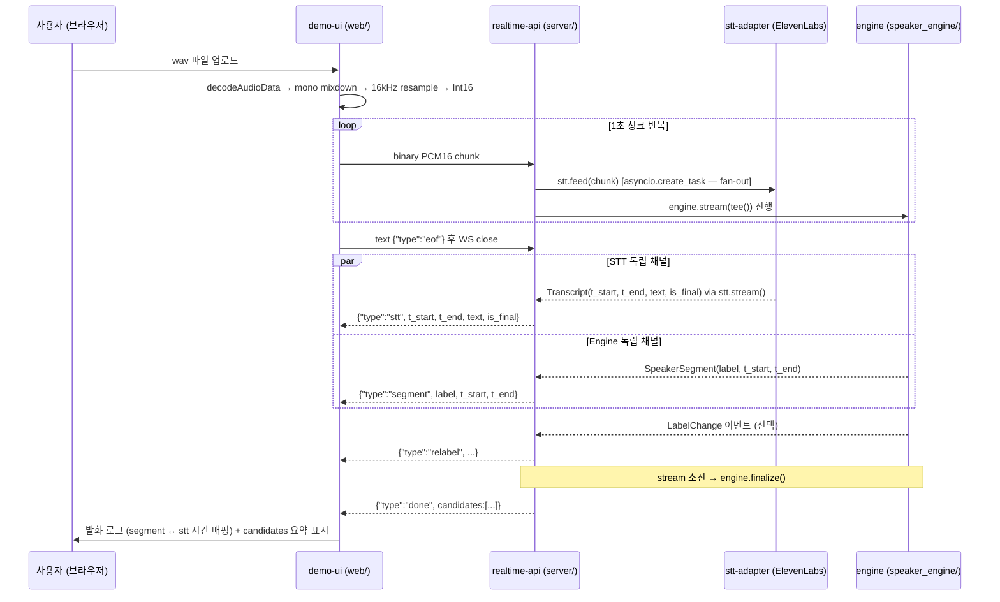

# V-04 데모 시나리오 — 회의 음성 end-to-end 시연 (git tag v0.1.0)

## §1 목적 / 한 줄

회의 음성 wav 파일 → 화자 분리 + 한국어 STT → 브라우저 라이브 표시. `git tag v0.1.0` 의 시연 자산. STT 는 ElevenLabs streaming STT (Scribe 모델, 실시간 독립 채널).

---

## §2 범위 (In / Out)

### In scope

| 항목 | 상세 |
|---|---|
| 파일 업로드 | 브라우저에서 wav 파일 선택 → PCM16 변환 후 WS 전송 |
| STT (ElevenLabs streaming) | ElevenLabs streaming WS, 한국어 (`language="ko"`), `ELEVENLABS_API_KEY` 필요 |
| WS json 스트림 | 5종 이벤트 (`segment`, `stt`, `relabel`, `done`, `error`) |
| 라이브 UI | 발화 로그 (화자별 색상·시간, STT 텍스트) + relabel 소급 업데이트 + 종료 시 candidates 요약 |
| 오디오 포맷 | PCM 16-bit signed LE, 16kHz, mono — 브라우저 resample 책임 (spec-03 §2, adr-06) |
| Docker / docker-compose | 단일 server 컨테이너 + env_file. spec-08 참조 |

### Out of scope (v0.2+ 예정)

| 항목 | 이유 |
|---|---|
| 마이크 실시간 입력 | AudioWorklet 패턴 — v0.2 |
| 다채널 오디오 | mono only (adr-06-mono-only-v1-multichannel-v2) |
| 인증 / 세션 영속화 | DB 영속화는 사용처 도메인 — 데모는 memory:// 스토어 |
| LLM 추천 표시 | 의료 도메인 (planning-01) 과 무관 |
| STT ↔ segment 서버 매핑 | v0.2 검토 (spec-07 §OQ-07-1) |

---

## §3 시나리오 — 파일 업로드 end-to-end

---

## §4 KPI (V-04 통과 기준)

CLAUDE.md 의 핵심 KPI 중 v0.1.0 에서 측정 가능한 것만 명시.

| 지표 | 목표 | v0.1.0 측정 방법 |
|---|---|---|
| 화자 분리 정확도 (DER) | < 15% | `pytest tests/eval/ -m eval` (AMI 기준 파일) — V-01 baseline 20.89% → 추가 튜닝 진행 중 |
| STT 정확도 (WER, 한국어) | < 15% | ElevenLabs Scribe 한국어 응답 기준 — `ko_sample.wav` 로 integration 테스트 (spec-06 §6) |
| 실시간 지연 (mic → UI) | < 2초 | 파일 업로드 데모에서는 미측정 (마이크는 v0.2) — **측정 제외** |
| 상담사 식별 정확도 | > 95% | 등록 speaker 없는 데모에서는 미측정 — **측정 제외** |
| 추천 적중률 | > 70% | LLM 미포함 — **측정 제외** |
| LLM 비용 / 세션 | < 1,500원 | LLM 미포함 — **측정 제외** |

> DER 목표 미달 (현재 20.89%) 은 V-01 runbook 에서 deferred 처리. v0.1.0 데모는 회귀 없음 확인으로 통과 기준 완화.

---

## §5 컴포넌트 경계

CLAUDE.md 모듈 경계 테이블 기반, V-04 데모 시 각 모듈 구체 책임.

| 모듈 | 에이전트 | 위치 | V-04 데모 시 구체 책임 |
|---|---|---|---|
| `engine` | `engine-core` | `speaker_engine/` | 화자 분리 + 클러스터링 + `SpeakerSegment` / `LabelChange` yield |
| `stt-adapter` | (사용처, `realtime-api` 범주) | `server/stt/elevenlabs.py` | ElevenLabs streaming STT 래핑 + `feed` / `stream` / `close` 인터페이스 구현 (spec-06) |
| `realtime-api` | `realtime-api` | `server/` | FastAPI WS 핸들러 + Pattern B tee split + json 이벤트 직렬화 (spec-07) |
| `demo-ui` | `demo-ui` | `web/` | 파일 업로드 + PCM16 변환 + WS 연결 + 라이브 발화 로그 표시 (spec-07 §4·§5) |
| `engine` ↔ `stt-adapter` | 횡단 | — | 독립 채널: PCM fan-out. 시간 결합은 UI 책임 (spec-06 §2, spec-07 §4) |

**인터페이스 원칙**: `engine` 은 STT 에 의존하지 않는다. 반대도 동일. PCM 만 공유, 시간 좌표로만 결합 (adr-02, spec-06 §5).

---

## §6 V-04 DoD

`tag v0.1.0` 종료 조건 체크리스트. 부모: PLAN-004 plan.

- [ ] `examples/basic_chunk_stream.py /tmp/meeting.wav` 가 에러 없이 완주 + `auto:A/B/C` 라벨링 표시 + finalize candidates 출력
- [ ] `examples/fastapi_ws_demo.py` uvicorn 기동 + WS 클라이언트 1회 연결 + `segment` / `stt` 이벤트 수신 통합 테스트 통과
- [ ] t_start 가 session-relative (예: 0.0 ~ 120.0s) 임을 통합 테스트로 확인
- [ ] MemoryStore.init_schema(embedding_dim=512) 가 박히는지 통합 테스트로 확인
- [ ] 기존 V-01 DER baseline 회귀 없음 (`pytest tests/eval/ -m eval` 통과)
- [ ] demo-ui 에서 wav 파일 업로드 → `done` 이벤트 수신 → candidates 요약 브라우저 표시 확인
- [ ] stt-adapter ElevenLabs Scribe 한국어 WER 초기 측정값 기록 (integration 테스트 결과)
- [ ] `ELEVENLABS_API_KEY` 환경변수 없으면 서버 기동 시 즉시 예외 확인
- [ ] `docker-compose up` 으로 e2e 통과 (WS 연결 + AMI 2분 wav → `done` 수신)
- [ ] `git tag v0.1.0` push
