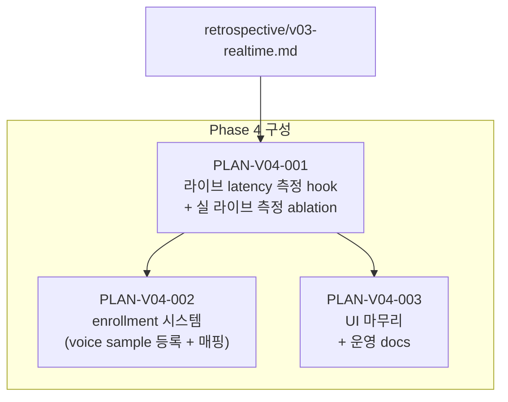

# PLAN-V04 — Phase 4 운영 수준 완성

## 한 줄

v0.3 demo 라이브 매핑 검증 완료 → 운영 환경 핵심 가치 4항목 마무리: **등록 화자 식별(enrollment) + 라이브 latency 진짜 측정 + UI 마무리 + 운영 docs**.

## 배경

v0.3 라이브 검증 결과 (`retrospective/v03-realtime.md`):

- demo_v03 라이브 매핑 동작 확인 (시간 overlap mapping, segment ↔ STT phrase)
- pyannote/embedding 1순위 확정 (live DER avg 0.224, 38× faster than real-time)
- 초기 50초 cluster 형성 단계 외 안정
- 운영 가능 수준이나 미완 항목 4개 확인

미완 항목:
1. **enrollment** — 등록 직원 voice sample → `registered:이름` 매핑 (운영 환경 핵심 가치)
2. **라이브 latency 진짜 측정** — PCM 입력 ↔ labeled_phrase emit wall-clock 실측 (v0.3 ablation 측정 공식 한계 노출)
3. **UI 마무리** — 에러 표시 / WS 재연결 / done 화면 / 에러 처리
4. **운영 docs** — runbook + 사용자 가이드

## 북극성

- 운영 환경에서 **등록 직원 화자 식별** (`registered:김상담` 등) 작동
- 라이브 라벨링 latency **진짜 측정** 박제 (PCM ↔ emit wall-clock 기준)
- **사용자 가이드** (`runbook/demo-v03.md`) 작성 완료
- **에러 처리 + 운영 안정성** 확보

## 구성

## 작업 분해

| plan | 담당 | 내용 | 순서 |
|------|------|------|------|
| [PLAN-V04-001](../plan/PLAN-V04-001-live-latency.md) | evaluator + realtime-api | 라이브 latency hook + 실 라이브 측정 4 rows + HTML report | 1번 |
| PLAN-V04-002 | evaluator + realtime-api + admin | enrollment 시스템 — voice sample 등록 → embedding 저장 → 라이브 매칭 | PLAN-V04-001 완료 후 |
| PLAN-V04-003 | demo-ui + admin | UI 마무리 + 운영 docs (runbook + 사용자 가이드) | PLAN-V04-002 병행 가능 |

## 보존 자산 (v0.1–v0.3 전체)

| 자산 | 위치 | 역할 |
|------|------|------|
| demo_v03.py | `examples/demo_v03.py` | Phase 4 base — 모든 plan 의 출발점 |
| embedding wrap | `eval/embeddings/pyannote_emb.py` | enrollment embedding 후보 |
| ElevenLabs STT | `server/stt/elevenlabs.py`, `server/stt/vad.py` | STT 재활용 |
| audio buffer | `server/audio/ringbuffer.py` | PCM 수신 재활용 |
| UI | `web/index.html`, `web/worklet-processor.js` | UI 마무리 기반 |
| legacy storage | `legacy/speaker_engine/storage/` | enrollment DB 후보 (Identifier 패턴 참조) |

## 폐기 / 비결정

- `legacy/speaker_engine/` wrapper (OnlineSpeakerClusterer, AdaptiveScheduler, FinalReclusterer): adr-01 폐기 결정 유지 (v0.2 Phase 2 실증 확인)
- Phase 5 (Azure 배포, GPU 인스턴스): v0.4 scope 외

## DoD (Phase 4 전체)

- [ ] PLAN-V04-001 — 라이브 latency 진짜 측정 4 rows + HTML report 박제
- [ ] PLAN-V04-002 — enrollment 시스템 동작 (registered:이름 매핑)
- [ ] PLAN-V04-003 — UI 에러 처리 + WS 재연결 + 운영 docs 완성
- [ ] retrospective/v04-closure.md 작성 (Phase 4 전체 종결)
