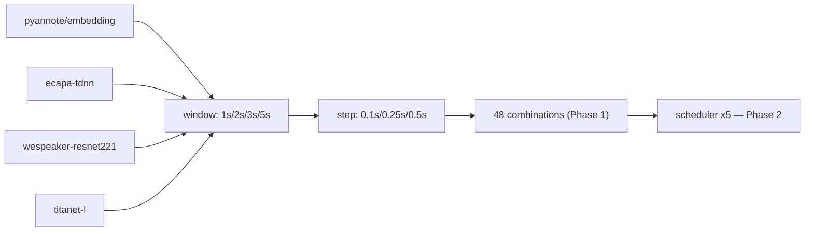

# spec-01 — Ablation Grid + Result Schema

## Summary

Phase 1~2 ablation 실험 전체 조합 정의 + 측정 결과를 담는 JSON row schema 및 CSV 매핑 명세. evaluator 가 `eval_ablation.py` 구현 시 이 스키마를 준수한다.

---

## Grid 정의

### Phase 1: embedding × window × step

```
embedding  : pyannote/embedding | ecapa-tdnn | wespeaker-resnet221 | titanet-l
window_s   : 1.0 | 2.0 | 3.0 | 5.0
step_s     : 0.1 | 0.25 | 0.5
```

**총 48 combinations** (4 × 4 × 3)

### Phase 2: scheduler 변형 (Phase 1 최적 조합 위에서)

```
scheduler  : baseline | decay-A | decay-B | hdbscan-on | hdbscan-off
```

| 변형 | 설명 |
|------|------|
| `baseline` | diart OnlineSpeakerClustering 기본 — 감쇠 없음 |
| `decay-A` | 초기엔 매 segment update, 이후 점감 (per-segment decay) |
| `decay-B` | time-windowed recluster (5 / 15 / 30 / 60s 단위) |
| `hdbscan-on` | FinalReclusterer (HDBSCAN) 활성 |
| `hdbscan-off` | FinalReclusterer 비활성 |

---

## JSON Result Schema

결과 1행 (1 combination × 1 sample) 의 JSON row:

```json
{
  "embedding": "pyannote/embedding | ecapa-tdnn | wespeaker-resnet221 | titanet-l",
  "window_s": 1.0,
  "step_s": 0.1,
  "sample": "record_1.wav",
  "scheduler": "baseline | decay-A | decay-B | hdbscan-on | hdbscan-off",
  "metrics": {
    "der": 0.0,
    "initial_cluster_latency_s": 0.0,
    "labeling_latency_p50_s": 0.0,
    "labeling_latency_p95_s": 0.0,
    "label_consistency": 0.0,
    "cpu_peak_pct": 0.0,
    "cpu_avg_pct": 0.0,
    "ram_peak_mb": 0.0,
    "ram_avg_mb": 0.0,
    "cold_load_s": 0.0,
    "total_runtime_s": 0.0
  },
  "error": null,
  "timestamp": "2026-05-22T00:00:00Z",
  "env": {
    "device": "cpu",
    "python": "3.11.x",
    "diart": "0.x.x"
  }
}

> **GPU 필드 제외** (2026-05-22): Azure CPU instance 운영 가정. spec-06 §7 참조.
```

**필드 설명**

| 필드 | 타입 | 설명 |
|------|------|------|
| `embedding` | str | 임베딩 모델 식별자 |
| `window_s` | float | 슬라이딩 윈도우 크기 (초) |
| `step_s` | float | 윈도우 이동 보폭 (초) |
| `sample` | str | 오디오 파일명 |
| `scheduler` | str | Phase 2 scheduler 변형 식별자 |
| `metrics.der` | float | Diarization Error Rate (0~1) |
| `metrics.initial_cluster_latency_s` | float | 첫 stable cluster (≥2개) 도달 시점 (초) |
| `metrics.labeling_latency_p50_s` | float | PCM 입력 → label emit 지연 중앙값 (초) |
| `metrics.labeling_latency_p95_s` | float | 동 95-percentile (초) |
| `metrics.label_consistency` | float | 동일 화자 라벨 일관성 (0~1, 높을수록 좋음) |
| `metrics.cpu_peak_pct` | float | CPU 사용률 최고값 (%) |
| `metrics.cpu_avg_pct` | float | CPU 사용률 평균 (%) |
| `metrics.ram_peak_mb` | float | RAM 최대 사용량 (MB) |
| `metrics.ram_avg_mb` | float | RAM 평균 사용량 (MB) |
| `metrics.gpu_peak_pct` | float | GPU 사용률 최고값 (%, GPU 없으면 0) |
| `metrics.gpu_avg_pct` | float | GPU 사용률 평균 (%) |
| `metrics.gpu_mem_peak_mb` | float | GPU 메모리 최고 사용량 (MB) |
| `metrics.cold_load_s` | float | 임베딩 모델 cold-load 시간 (초) |
| `metrics.total_runtime_s` | float | 해당 combination 전체 wall-clock (초) |
| `error` | str \| null | 실패 시 오류 메시지, 성공 시 null |
| `timestamp` | str | ISO-8601 UTC |
| `env.gpu` | str | 실행 환경 GPU 식별자 |

---

## 결과 저장 위치

```
eval/ablation/results/
  YYYYMMDD_HHMMSS.json   # 단일 실행 결과 (JSON array of rows)
  all.csv                # 누적 결과 (모든 실행 append)
```

- 단일 실행 JSON: 해당 실행의 모든 combination rows
- `all.csv`: 스키마 필드 평탄화 (metrics 하위 필드를 최상위 컬럼으로 flatten)

## CSV Column 매핑

`all.csv` 컬럼 순서:

```
embedding, window_s, step_s, sample, scheduler,
der, initial_cluster_latency_s, labeling_latency_p50_s, labeling_latency_p95_s,
label_consistency, cpu_peak_pct, cpu_avg_pct, ram_peak_mb, ram_avg_mb,
gpu_peak_pct, gpu_avg_pct, gpu_mem_peak_mb, cold_load_s, total_runtime_s,
error, timestamp, gpu, cuda, python, diart
```

---

## Combination 시각화


