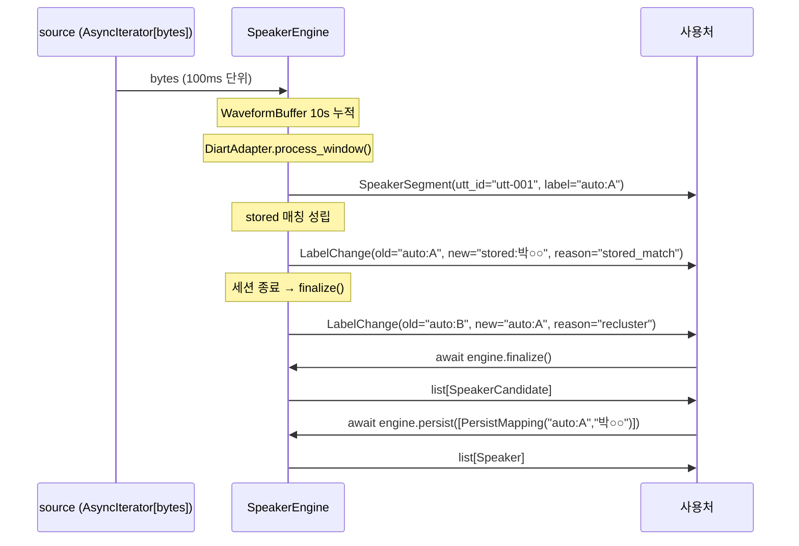

# SpeakerEngine Public API 명세

## Summary

`speaker_engine` 패키지의 공개 인터페이스 완전 명세. 사용처가 import 해서 사용하는 모든 클래스·함수·타입을 시그니처 수준으로 정의한다. 결정 기록은 [[adr-02-pattern-b-fanout-chain]], [[adr-04-manual-persist-flow]] 참조 — 이 문서는 구현 가능한 인터페이스 모양만 박는다.

---

## §1 Scope

이 SPEC 이 명세하는 대상:

- `speaker_engine` 패키지 최상위 `__init__.py` 에서 re-export 되는 모든 public 심볼
- `SpeakerEngine` 클래스의 전체 메서드 시그니처 + 파라미터 의미
- 헬퍼 소스 함수 (`from_websocket`, `from_file`, `from_microphone`)
- 패키지 공개 타입 (`SpeakerSegment`, `LabelChange`, `SpeakerCandidate`, `Speaker`, `PersistMapping`)
- 에러 조건 + 발생 예외 타입

이 SPEC 에서 명세하지 않는 것:
- 내부 구현 모듈 (`diart_adapter.py`, `identifier.py`, `scheduler.py` 등) — [[spec-03-diart-adapter]] 참조
- SpeakerStore Protocol + DDL — [[spec-02-speaker-store-schema]] 참조
- 통합 패턴 결정 근거 — [[adr-02-pattern-b-fanout-chain]] 참조

---

## §2 Public Interface

### 2-1. `SpeakerEngine`

```python
from uuid import UUID
from typing import AsyncIterator
import numpy as np

class SpeakerEngine:
    def __init__(
        self,
        storage_url: str | None = None,
        # None → env SPEAKER_ENGINE_STORAGE_URL 사용
        hf_token: str | None = None,
        # None → env HF_TOKEN 사용
        registered_speakers: dict[str, np.ndarray] | None = None,
        # key=이름, value=D-dim embedding (L2 normalized)
        # 세션 시작 시 SpeakerStore 에 origin=registered 로 upsert
        registered_threshold: float = 0.70,
        stored_threshold: float = 0.75,
        max_speakers: int = 20,
        # 세션 누적 최대 화자 수 (OnlineSpeakerClustering max_speakers)
        finalize_drain_timeout: float = 5.0,
        # finalize() drain 대기 최대 시간 (초)
        audio_queue_maxsize: int = 100,
        segmentation_model: str = "pyannote/segmentation-3.0",
        embedding_model: str = "pyannote/embedding",
        device: str | None = None,
        # None → cuda 사용 가능하면 cuda, 아니면 cpu (자동 감지)
        # "cuda" / "cpu" / "mps" 명시 → 그대로 사용
        # "cuda" 명시 + unavailable → RuntimeError (silent fallback X)
    ) -> None: ...

    async def stream(
        self,
        source: AsyncIterator[bytes],
    ) -> AsyncIterator[SpeakerSegment | LabelChange]:
        """
        PCM 16kHz mono 16-bit bytes 스트림을 받아
        SpeakerSegment | LabelChange 이벤트를 yield.
        한 인스턴스에 2회 진입 시 RuntimeError.
        """
        ...

    async def finalize(
        self,
        timeout: float | None = None,
    ) -> list[SpeakerCandidate]:
        """
        in-flight 처리를 drain 후 세션 내 화자 후보 목록 반환.
        timeout=None 이면 self.finalize_drain_timeout 사용.
        drain 초과 시 TimeoutError.
        stream() 이 완전히 소진된 후 호출해야 의미 있음.
        """
        ...

    async def persist(
        self,
        mappings: list[PersistMapping],
    ) -> list[Speaker]:
        """
        finalize() 이후에만 유효.
        auto:* 화자에 이름을 매핑 → SpeakerStore.save 호출 → list[Speaker] 반환.
        PersistMapping.name=None 이면 anon_NNN 자동 부여.
        """
        ...

    async def set_alias(
        self,
        speaker_id: UUID,
        name: str,
    ) -> Speaker:
        """저장된 speaker 의 name 변경 → SpeakerStore.set_alias 위임."""
        ...

    async def merge_speakers(
        self,
        source_id: UUID,
        target_id: UUID,
    ) -> Speaker:
        """
        source 화자를 target 으로 합산.
        source 행 제거, target 의 utterance_count + 총 발화 시간 합산.
        SpeakerStore.merge 위임.
        """
        ...

    async def delete_speaker(
        self,
        speaker_id: UUID,
    ) -> None:
        """SpeakerStore.delete 위임."""
        ...

    async def __aenter__(self) -> "SpeakerEngine": ...

    async def __aexit__(
        self,
        exc_type: type[BaseException] | None,
        exc: BaseException | None,
        tb: object,
    ) -> None:
        """async with 종료 시 finalize() 자동 호출."""
        ...
```

### 2-2. 헬퍼 소스 함수

```python
from pathlib import Path
from starlette.websockets import WebSocket  # 사용처 의존 — type hint 전용

async def from_websocket(ws: WebSocket) -> AsyncIterator[bytes]:
    """FastAPI/Starlette WebSocket recv loop → PCM bytes 스트림."""
    ...

async def from_file(path: str | Path) -> AsyncIterator[bytes]:
    """로컬 파일 (PCM raw 또는 WAV) → bytes 스트림. 테스트/배치 용."""
    ...

async def from_microphone(
    device: int | str | None = None,
) -> AsyncIterator[bytes]:
    """sounddevice 마이크 → bytes 스트림. 로컬 데모 용."""
    ...
```

### 2-3. 멀티채널 / 다중 디바이스 헬퍼 (결정: [[adr-07-helper-scope]])

```python
from dataclasses import dataclass, field
import numpy as np

# ── 1. from_multichannel_mixdown ────────────────────────────────────────────
async def from_multichannel_mixdown(
    stream: AsyncIterator[bytes],
    channels: int,
    method: str = "mean",
) -> AsyncIterator[bytes]:
    """
    멀티채널 인터리브드 PCM raw 스트림을 mono 16kHz PCM 으로 변환.

    Parameters
    ----------
    stream   : multi-channel raw PCM bytes (channels 채널 인터리브드, 16kHz, 16-bit signed)
    channels : 입력 채널 수 (e.g. 2, 4)
    method   : "mean" (채널 평균) | "sum" (채널 합산, clipping 주의)

    Returns
    -------
    AsyncIterator[bytes] — mono 16kHz 16-bit signed PCM

    Notes
    -----
    의존성: numpy (코어 포함).
    채널 차이가 작은 환경(홈 회의실, 고정 어레이)에 적합.
    """
    ...


# ── 2. MultiDeviceMerge ─────────────────────────────────────────────────────
class MultiDeviceMerge:
    """
    N 개의 독립 SpeakerEngine 인스턴스 출력을 시간 기준으로 merge.

    각 engine 의 SpeakerSegment.label 에 디바이스 prefix 를 붙여
    namespace 충돌을 방지한다.
    (예: engine 0 의 "auto:A" → "dev0:auto:A")

    Parameters
    ----------
    engines : list[SpeakerEngine]
        각각 독립 실행 중인 SpeakerEngine 인스턴스 목록.
        SpeakerStore 공유는 사용처 책임
        (cross-device embedding 매칭을 원하면 동일 store 주입).

    Notes
    -----
    의존성: 없음 (코어 내부, asyncio 만).
    """

    def __init__(self, engines: list["SpeakerEngine"]) -> None: ...

    async def stream(self) -> AsyncIterator["SpeakerSegment | LabelChange"]:
        """
        모든 engine 의 이벤트를 t_start 오름차순으로 merge yield.
        한 인스턴스에 2회 진입 시 RuntimeError.
        """
        ...


# ── 3. from_beamforming ─────────────────────────────────────────────────────
@dataclass
class MicrophoneGeometry:
    """마이크 어레이 물리 배치. pyroomacoustics geometry 포맷."""
    positions: np.ndarray
    # shape: (channels, 3) — 각 마이크의 (x, y, z) 좌표 (미터 단위)
    reference_channel: int = 0
    # beamforming 결과를 어느 채널 좌표계로 normalize 할지


@dataclass
class BeamformingConfig:
    """beamforming 알고리즘 설정."""
    method: str = "mvdr"
    # "mvdr" (Minimum Variance Distortionless Response) | "ds" (delay-and-sum)
    sample_rate: int = 16000
    n_fft: int = 512


async def from_beamforming(
    stream: AsyncIterator[bytes],
    channels: int,
    geometry: MicrophoneGeometry,
    method: str = "mvdr",
    config: BeamformingConfig | None = None,
) -> AsyncIterator[bytes]:
    """
    멀티채널 인터리브드 PCM raw 스트림에 beamforming 적용 후 mono 출력.

    Parameters
    ----------
    stream   : multi-channel raw PCM bytes (channels 채널 인터리브드, 16kHz, 16-bit signed)
    channels : 입력 채널 수
    geometry : 마이크 물리 배치 (MicrophoneGeometry)
    method   : beamforming 알고리즘 — "mvdr" | "ds" (config.method 보다 우선)
    config   : BeamformingConfig (None → default 사용)

    Returns
    -------
    AsyncIterator[bytes] — mono 16kHz 16-bit signed PCM

    Notes
    -----
    의존성: extras [beamforming] → pyroomacoustics.
    회의실 천장 어레이 / in-car / 노이즈 환경에 적합.
    geometry (마이크 배치) 입력 필요 — 환경별 캘리브레이션 사용처 책임.

    Raises
    ------
    ImportError  : extras [beamforming] 미설치 시
    ValueError   : channels 와 geometry.positions.shape[0] 불일치 시
    """
    ...
```

---

## §3 Data Model / Dataclass

모든 타입은 `speaker_engine.types` 에 정의되고 `speaker_engine.__init__` 에서 re-export.

`MicrophoneGeometry`, `BeamformingConfig` 는 `speaker_engine.audio.helpers` 에 정의되고 `speaker_engine.__init__` 에서 re-export (extras `[beamforming]` 설치 여부와 무관하게 dataclass 자체는 import 가능).

```python
from dataclasses import dataclass, field
from typing import Literal
from uuid import UUID
import numpy as np

# 타입 alias
LabelReason = Literal["recluster", "stored_match", "persist"]

# 라벨 형식: ^(registered:|stored:|auto:)[\w가-힣:]+$
# 예: "registered:김원장", "stored:박○○", "stored:anon_001", "auto:A"


@dataclass
class SpeakerSegment:
    """발화 단위 라벨 확정 이벤트. overlap 시 시간 겹쳐 여러 개 yield."""
    utterance_id: str          # 세션 내 전역 고유 ID (e.g. "utt-001")
    label: str                 # 라벨 형식 참조
    confidence: float          # segmentation activity probability (0.0~1.0)
    embedding: np.ndarray      # D-dim L2 normalized (D = 모델 의존)
    audio: bytes               # 화자별 overlap-aware mask 가중 audio (PCM 16kHz mono)
    t_start: float             # 세션 내 절대 시작 시간 (초)
    t_end: float               # 세션 내 절대 종료 시간 (초)


@dataclass
class LabelChange:
    """클러스터 재계산 또는 persist 후 라벨 소급 변경 이벤트."""
    old_label: str
    new_label: str
    affected_utterance_ids: list[str]   # 이 라벨 변경이 소급 적용되는 utterance_id 목록
    reason: LabelReason


@dataclass
class SpeakerCandidate:
    """finalize() 반환 — 세션 내 auto:* 화자 후보."""
    auto_id: str                          # e.g. "auto:A"
    utterance_ids: list[str]              # 해당 cluster 의 발화 ID 목록
    representative_embedding: np.ndarray  # D-dim centroid (L2 normalized)
    total_duration: float                 # 총 발화 시간 (초)
    utterance_count: int


@dataclass
class Speaker:
    """SpeakerStore 영속 화자 레코드. persist() / set_alias() 반환."""
    id: UUID
    name: str                # alias 또는 등록명. 미부여 시 anon_NNN
    origin: Literal["registered", "stored"]
    embedding_dim: int       # D
    model_id: str            # e.g. "pyannote/embedding"
    registered_at: float | None  # epoch seconds. stored=None, registered=NOT NULL
    first_seen: float        # epoch seconds
    last_seen: float         # epoch seconds
    utterance_count: int


@dataclass
class PersistMapping:
    """persist() 호출 시 auto:* → name 매핑 단위."""
    auto_id: str             # e.g. "auto:A"
    name: str | None = None  # None 이면 anon_NNN 자동 부여
```

---

## §4 동작 명세

### 4-1. `stream()` 이벤트 발행 순서

1. `source` 에서 bytes 수신 → `audio_queue` 에 put (backpressure — R1).
2. `WaveformBuffer` 가 10초 sliding window 누적 (reference-01 §1 기준).
3. 10초 window 채워지면 `DiartAdapter.process_window()` 호출 → `RawSpeakerEvent` 목록.
4. 각 `RawSpeakerEvent` 에 대해 3-tier 식별:
   - `registered` cosine ≥ `registered_threshold` (0.70) → `registered:<name>`
   - `stored` cosine ≥ `stored_threshold` (0.75) → `stored:<name>`
   - else → `OnlineSpeakerClustering` centroid 매칭 → `auto:<label>`
5. 발화 경계 감지 시 `SpeakerSegment` yield.
6. `AdaptiveReclusterScheduler` 트리거 시 `OnlineSpeakerClustering` 재계산 → 라벨 변경이 있으면 `LabelChange(reason="recluster")` yield.
7. stored 매칭이 새로 성립하면 `LabelChange(reason="stored_match")` yield.
8. `persist()` 호출 후 해당 auto:* 의 발화에 `LabelChange(reason="persist")` yield.



### 4-2. `registered_speakers` 인자 처리

- `dict[str, np.ndarray]` 형태. key=이름, value=D-dim embedding (L2 normalized 가정).
- `__init__` 시점에 `SpeakerStore.register(name, embedding, model_id)` 를 upsert 호출.
- 이미 동일 name+model_id 레코드가 있으면 embedding 갱신.

### 4-3. `finalize()` drain 정책

- `source` 가 소진되고 `audio_queue` 가 비워질 때까지 최대 `finalize_drain_timeout` 초 대기.
- timeout 초과 시 `TimeoutError` raise, 처리된 발화만 candidates 에 포함.
- `FinalReclusterer` (HDBSCAN) 로 누적 발화 재라벨 → 최종 `SpeakerCandidate` 목록 반환.

### 4-4. `persist()` SpeakerStore 호출 흐름

```mermaid
flowchart LR
    A["persist([PersistMapping])"] --> B[auto_id 검증\n(finalize 결과에 존재?)]
    B -->|없으면| E[ValueError]
    B -->|있으면| C["SpeakerStore.save(name, embedding, model_id)"]
    C --> D["list[Speaker] 반환"]
    D --> F["LabelChange(reason=persist) yield\n(영향 utterance 소급)"]
```

### 4-5. `LabelChange.reason` 별 트리거 시점

| reason | 트리거 시점 |
|---|---|
| `"recluster"` | `AdaptiveReclusterScheduler` 트리거 — `OnlineSpeakerClustering` 재계산 후 라벨 변경 시 |
| `"stored_match"` | 신규 발화의 embedding 이 `stored` threshold 통과 시 — 해당 세션 내 기존 auto:* 발화 소급 |
| `"persist"` | `engine.persist()` 호출 후 — auto:* → stored/registered 전환 소급 |

---

## §5 오류 / 예외

| 예외 클래스 | 발생 상황 | 처리 |
|---|---|---|
| `EnvironmentError` | `HF_TOKEN` 또는 `SPEAKER_ENGINE_STORAGE_URL` env 누락 (인자도 없을 때) | 초기화(`__init__`) 시 즉시 raise |
| `ModelLoadError` | pyannote 모델 다운로드·로드 실패 (HF hub 오류, 네트워크 단절 등) | 초기화 시 raise. retry X — cache 사용처 책임 |
| `StorageError` | SpeakerStore 연결 실패 | 초기화 시 raise. **런타임 일시 단절은 3회 exponential backoff** 후 raise |
| `RuntimeError` | `engine.stream()` 동일 인스턴스에서 2회 진입 (R2) | 즉시 raise |
| `TimeoutError` | `finalize()` drain timeout (`finalize_drain_timeout`) 초과 (R4) | 경고 로그 + 일부 발화 누락 표시 후 finalize 완료 (stream 결과 부분 반환) |
| `ValueError` | PCM 포맷 위반 (16kHz mono 16-bit 아님), 또는 `persist()` 의 `auto_id` 가 `finalize()` 결과에 없음 | 해당 메서드 호출 시 raise |
| (소프트 에러) | diart inference 단일 chunk 실패 | **1회 retry** → 실패 시 chunk skip + `WARN` 로그 (stream 계속, 예외 미전파) |

**retry 정책 요약**:
- `StorageError` 런타임 단절: 3회 exponential backoff (1s → 2s → 4s) 후 raise.
- diart 단일 chunk 실패: 1회 retry → skip + WARN. stream 중단 없음.
- `ModelLoadError`: retry 없음. 호출자가 재시도 책임 (모델 캐시 확인 후 재시도 권장).

`asyncio.QueueFull` 은 **사용처에 노출 안 함** — backpressure (R1, [[adr-05-ws-race-defaults]]) 로 흡수. `queue.put` await 방식으로 처리.

---

## §6 테스트 케이스 (high-level 시나리오)

| # | 시나리오 | 검증 포인트 |
|---|---|---|
| T01 | 합성 audio fixture → stream | `SpeakerSegment` 발행 순서 + utterance_id 고유성 |
| T02 | registered_speakers 인식 | mock embedding 로 cosine ≥ 0.70 → `registered:*` 라벨 |
| T03 | `LabelChange` 순서 보장 | 단일 출력 큐 기반 — 사용처 재정렬 불필요 (R5) |
| T04 | finalize → persist → SpeakerStore 영속화 | `SpeakerStore.save` 호출 여부 + 반환 Speaker 구조 |
| T05 | 재진입 RuntimeError | 동일 인스턴스에 `stream()` 2회 호출 → RuntimeError |
| T06 | HF_TOKEN env 누락 | 인자 없음 + env 없음 → EnvironmentError |
| T07 | STORAGE_URL env 누락 | 인자 없음 + env 없음 → EnvironmentError |
| T08 | `async with engine:` | `__aexit__` 시 `finalize()` 자동 호출 확인 |
| T09 | finalize drain timeout | 5초 초과 시 TimeoutError |
| T10 | overlap 발화 | 시간 겹친 SpeakerSegment 2개 동시 yield |

---

## §7 참조

- [[planning-02-speaker-engine]] §3 통합 방식, §7 입력 인터페이스, §8 WS Race 정책, §12 결정
- [[adr-02-pattern-b-fanout-chain]] — Pattern B 채택, 2종 이벤트 확정
- [[adr-04-manual-persist-flow]] — D3-b 수동 매핑, finalize/persist 2-step 흐름
- [[adr-05-ws-race-defaults]] — R1~R5 race 정책 (backpressure / RuntimeError / inline recluster / drain timeout / 단일 출력 큐)
- [[adr-06-mono-only-v1-multichannel-v2]] — v1 mono 강제 + 사용처 전처리 위임 결정
- [[adr-07-helper-scope]] — 오디오 입력 헬퍼 3종 채택 결정 (mixdown / MultiDeviceMerge / beamforming)
- [[spec-02-speaker-store-schema]] — SpeakerStore Protocol + DDL (persist 호출 대상)
- [[spec-03-diart-adapter]] — DiartAdapter (stream 내부 호출 대상)
