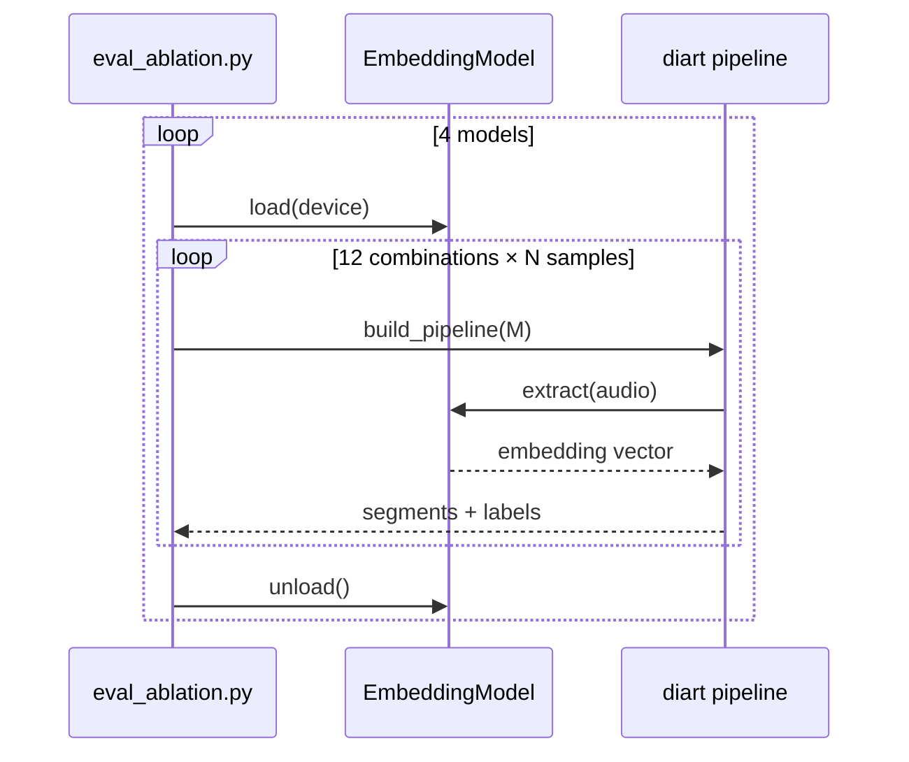

# spec-02 — Embedding Model Interface

## Summary

4가지 임베딩 모델(pyannote, ECAPA-TDNN, WeSpeaker, TitaNet-L)을 통일된 Python Protocol로 추상화한다. diart 의 embedding 파라미터에 주입 가능하도록 wrap 한다.

---

## 통일 인터페이스

```python
from typing import Protocol
import numpy as np

class EmbeddingModel(Protocol):
    name: str    # 모델 식별자 (spec-01 grid embedding 값과 일치)
    dim: int     # 임베딩 벡터 차원

    def load(self, device: str = "auto") -> None:
        """Cold-load: 모델 가중치 로드 + 디바이스 이동."""
        ...

    def extract(self, audio: np.ndarray, sr: int) -> np.ndarray:
        """오디오 → 임베딩 벡터 (shape: (dim,))."""
        ...

    def unload(self) -> None:
        """모델을 메모리에서 해제 (다음 모델 로드 전 호출)."""
        ...
```

**규칙**:
- `extract()` 입력: PCM float32, shape `(samples,)` 또는 `(channels, samples)`
- `extract()` 출력: L2-normalized float32 벡터 `(dim,)`
- `load()` 호출 전 `extract()` 호출 시 `RuntimeError` 발생

---

## 구현 위치

```
eval/embeddings/
  __init__.py
  protocol.py          # EmbeddingModel Protocol 정의
  pyannote_emb.py      # PyannoteEmbedding
  ecapa_tdnn.py        # EcapaTdnnEmbedding
  wespeaker_emb.py     # WeSpeakerEmbedding
  titanet_l.py         # TitaNetLEmbedding
```

---

## 4 모델 Wrap 명세

### PyannoteEmbedding

```python
class PyannoteEmbedding:
    name = "pyannote/embedding"
    dim = 512

    # 내부: pyannote.audio.Model.from_pretrained("pyannote/embedding")
    # HF token 필요 (환경 변수 HF_TOKEN 또는 ~/.huggingface/token)
    # download cache: ~/.cache/huggingface/
```

### EcapaTdnnEmbedding

```python
class EcapaTdnnEmbedding:
    name = "ecapa-tdnn"
    dim = 192

    # 내부: speechbrain.pretrained.EncoderClassifier
    #   source="speechbrain/spkrec-ecapa-voxceleb"
    # download cache: ~/.cache/speechbrain/
```

### WeSpeakerEmbedding

```python
class WeSpeakerEmbedding:
    name = "wespeaker-resnet152"
    dim = 256

    # 내부: wespeaker pretrained ResNet152
    #   model_name="wespeaker/wespeaker-resnet152-voxblink-voxceleb"
    # download cache: ~/.cache/wespeaker/
```

### TitaNetLEmbedding

```python
class TitaNetLEmbedding:
    name = "titanet-l"
    dim = 192

    # 내부: nemo_toolkit SpeakerVerification
    #   model_name="nvidia/speakerverification_en_titanet_large"
    # NeMo 설치 필요 (nemo_toolkit[asr])
    # download cache: ~/.cache/nemo/
```

---

## Device 선택 로직

`load(device="auto")` 시 우선순위:

```python
def _resolve_device(device: str) -> str:
    if device != "auto":
        return device
    if torch.cuda.is_available():
        return "cuda"
    if torch.backends.mps.is_available():
        return "mps"
    return "cpu"
```

MPS (Apple Silicon) 지원 여부는 모델별로 상이할 수 있음 → 실패 시 CPU fallback 허용.

---

## diart 통합 Wrap

diart `OnlineSpeakerDiarization` 의 `embedding` 파라미터는 `SegmentationModel` / callable 을 받는다.

```python
def as_diart_embedding(model: EmbeddingModel):
    """EmbeddingModel → diart 호환 callable."""
    def _emb(waveform: torch.Tensor) -> torch.Tensor:
        audio = waveform.squeeze(0).numpy()
        vec = model.extract(audio, sr=16000)
        return torch.from_numpy(vec).unsqueeze(0)
    return _emb
```

`eval_ablation.py` 에서 pipeline 구성 시 이 함수로 주입한다.

---

## 호출 예시

```python
from eval.embeddings.pyannote_emb import PyannoteEmbedding

model = PyannoteEmbedding()
model.load(device="auto")

audio = np.zeros(16000, dtype=np.float32)  # 1초 silence
vec = model.extract(audio, sr=16000)
assert vec.shape == (512,)

model.unload()
```

---

## 변경 영향

| 컴포넌트 | 영향 |
|----------|------|
| `eval_ablation.py` | 이 인터페이스에 의존 — [[spec-03-eval-ablation-script]] |
| diart pipeline | `as_diart_embedding()` wrap 경유 |
| Phase 3 demo (미래) | 동일 Protocol 재사용 가능 |

---

## 모델 batch 순회 원칙

모델별로 한 번에 load → 전체 조합 측정 → unload. 동시 로드 금지 (VRAM/RAM 충돌 방지).


