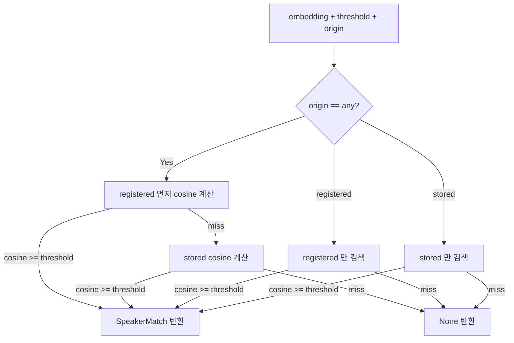

# SpeakerStore 데이터 스키마 + Protocol 명세

## Summary

`SpeakerStore` 의 Protocol 추상 인터페이스 + PostgreSQL(pgvector) / SQLite(sqlite-vec) / Memory 3종 백엔드 DDL + 마이그레이션 전략을 완전 명세한다. 백엔드 선택 결정 근거는 [[adr-03-storage-via-env-url]] 참조.

---

## §1 Scope

이 SPEC 이 명세하는 대상:

- `SpeakerStore` Protocol 전체 시그니처 + 각 메서드 의미
- `SpeakerMatch` 타입 (find_match 반환)
- PostgreSQL + pgvector DDL (speakers 테이블 + speaker_centroids 보조 테이블 + 인덱스)
- SQLite + sqlite-vec 유사 스키마
- MemoryStore 동작 명세
- embedding 차원 D 가변 처리 옵션 비교 및 결정
- centroid 캐시 갱신 정책
- 마이그레이션 v1

이 SPEC 에서 명세하지 않는 것:
- 백엔드 선택 방식 (env URL) — [[adr-03-storage-via-env-url]] 참조
- `engine.persist()` 호출 흐름 — [[spec-01-speaker-engine-api]] §4-4 참조

---

## §2 SpeakerStore Protocol

```python
from typing import AsyncIterator, Literal, Protocol
from uuid import UUID
import numpy as np
from speaker_engine.types import Speaker


class SpeakerMatch:
    speaker: Speaker
    cosine_similarity: float
    origin: Literal["registered", "stored"]


class SpeakerStore(Protocol):

    async def init_schema(
        self,
        embedding_dim: int,
        model_id: str,
    ) -> None:
        """
        DDL 실행 + 마이그레이션 v1 적용.
        `engine.init_storage()` 에서 호출 — 세션 시작 전 1회.
        embedding_dim = D (모델 의존, runtime 결정).
        model_id = e.g. "pyannote/embedding".
        """
        ...

    async def register(
        self,
        name: str,
        embedding: np.ndarray,   # D-dim, L2 normalized
        model_id: str,
    ) -> Speaker:
        """
        origin=registered 로 저장.
        동일 (name, model_id) 존재 시 embedding 갱신 (upsert).
        centroid 재계산.
        """
        ...

    async def find_match(
        self,
        embedding: np.ndarray,   # D-dim, L2 normalized
        model_id: str,
        threshold: float,
        origin: Literal["registered", "stored", "any"] = "any",
    ) -> SpeakerMatch | None:
        """
        cosine 유사도 기준 가장 유사한 speaker 반환.
        threshold 미만이면 None.
        origin 파라미터로 검색 범위 제한 가능.
        같은 model_id 끼리만 매칭 (교차 불가).
        """
        ...

    async def save(
        self,
        name: str | None,        # None 이면 anon_NNN 자동 생성
        embedding: np.ndarray,   # D-dim, L2 normalized
        model_id: str,
    ) -> Speaker:
        """
        origin=stored 로 저장. persist() 가 내부 호출.
        name=None 이면 anon_NNN (단조 증가 카운터).
        centroid 재계산.
        """
        ...

    async def list_all(
        self,
        model_id: str | None = None,
    ) -> AsyncIterator[Speaker]:
        """
        model_id=None 이면 전체. 지정 시 해당 model_id 만.
        페이지네이션 없음 (MVP).
        """
        ...

    async def set_alias(
        self,
        speaker_id: UUID,
        name: str,
    ) -> Speaker:
        """speaker.name 갱신. 동일 (name, model_id) 이미 존재 시 IntegrityError."""
        ...

    async def merge(
        self,
        source_id: UUID,
        target_id: UUID,
    ) -> Speaker:
        """
        source → target 합산.
        target.utterance_count += source.utterance_count.
        target.embeddings = target.embeddings + source.embeddings (모두 보존).
        source 행 DELETE.
        centroid 재계산 (target).
        """
        ...

    async def delete(
        self,
        speaker_id: UUID,
    ) -> None:
        """speakers 행 + speaker_centroids 행 삭제."""
        ...
```

---

## §3 Data Model / DDL

### 3-1. embedding 차원 D 가변 처리 — 옵션 비교

embedding 차원 D 는 모델에 의존한다 (legacy `pyannote/embedding` D=512, community-1 WeSpeaker D=256 — [[reference-07-pyannote-embedding-code]] §7 확인값).

pgvector 는 `VECTOR(D)` 에서 D 를 컬럼 정의 시 고정해야 한다. 가변 D 를 어떻게 수용할지 3가지 옵션:

| 옵션 | 방식 | 장점 | 단점 |
|---|---|---|---|
| **A. model_id 별 테이블 분리** | `speakers_512`, `speakers_256` 등 | D 정확, HNSW 최적 | 테이블 수 = 모델 수, 쿼리 분기 |
| **B. MAX_D 고정 + model_id 격리** | `VECTOR(512)` 고정, D<512 이면 zero-pad | 단일 테이블, 단순 | HNSW 정확도 저하 (padding), D 낭비 |
| **C. JSONB 저장** | `embedding JSONB` (float 배열) | 완전 가변 | pgvector HNSW 사용 불가, 쿼리 느림 |

**결정: 옵션 A (model_id 별 테이블 분리) — admin 확정 (PLAN-002-T-006, 2026-05-14)**

> Why: D 정확성 + HNSW 성능이 핵심. model_id 는 현재 2종 (legacy/community-1) 이고 자주 바뀌지 않음. 테이블 수 증가 부담 < 정확도 저하 리스크.
>
> 단, MVP 에서는 단일 model_id 를 default 로 사용하여 `speakers` 테이블 하나로 시작. 추가 model_id 는 `speakers_{model_suffix}` 파생 테이블로 확장.
>
> Alternatives 거부: B (MAX_D zero-pad) — HNSW 정확도 ↓. C (JSONB) — pgvector HNSW 미지원, brute-force 느림. MVP 운영 부담은 A/B/C 동일 (단일 model_id), 미래 다른 D 모델 도입 시 A 가 안전.

### 3-2. DDL — PostgreSQL + pgvector

아래 DDL 은 default model_id = `"pyannote/embedding"` (D=512) 기준. 다른 D 는 동일 구조 파생 테이블.

```sql
CREATE EXTENSION IF NOT EXISTS vector;

-- 화자 주 테이블 (model_id = "pyannote/embedding", D=512 기준)
CREATE TABLE IF NOT EXISTS speakers (
    id              UUID PRIMARY KEY DEFAULT gen_random_uuid(),
    name            TEXT NOT NULL,
    -- alias 또는 등록명. persist 시 anon_NNN 자동 생성 가능
    origin          TEXT NOT NULL CHECK (origin IN ('registered', 'stored')),
    embeddings      VECTOR(512)[]  NOT NULL,
    -- 가변 개수 embedding 목록 (복수 샘플 보존)
    embedding_dim   INTEGER NOT NULL DEFAULT 512,
    model_id        TEXT NOT NULL DEFAULT 'pyannote/embedding',
    registered_at   TIMESTAMPTZ,
    -- NULL = stored. NOT NULL = registered.
    first_seen      TIMESTAMPTZ NOT NULL DEFAULT NOW(),
    last_seen       TIMESTAMPTZ NOT NULL DEFAULT NOW(),
    utterance_count INTEGER NOT NULL DEFAULT 0,
    CONSTRAINT uq_name_per_model UNIQUE (name, model_id)
);

CREATE INDEX IF NOT EXISTS idx_speakers_origin_model
    ON speakers (origin, model_id);

CREATE INDEX IF NOT EXISTS idx_speakers_last_seen
    ON speakers (last_seen);

-- centroid 캐시 보조 테이블
CREATE TABLE IF NOT EXISTS speaker_centroids (
    speaker_id  UUID PRIMARY KEY REFERENCES speakers(id) ON DELETE CASCADE,
    centroid    VECTOR(512) NOT NULL,
    -- embeddings 의 평균 → L2 정규화
    model_id    TEXT NOT NULL,
    updated_at  TIMESTAMPTZ NOT NULL DEFAULT NOW()
);

-- HNSW 인덱스 (cosine 유사도 기반 nearest neighbor)
-- model_id 별 partial index — 현재 단일 모델 MVP
CREATE INDEX IF NOT EXISTS idx_centroid_hnsw_default
    ON speaker_centroids
    USING hnsw (centroid vector_cosine_ops)
    WHERE model_id = 'pyannote/embedding';
```

### 3-3. DDL — SQLite + sqlite-vec

```sql
-- sqlite-vec extension 필요 (LOAD_EXTENSION 또는 .load)

CREATE TABLE IF NOT EXISTS speakers (
    id              TEXT PRIMARY KEY,          -- UUID string
    name            TEXT NOT NULL,
    origin          TEXT NOT NULL CHECK (origin IN ('registered', 'stored')),
    embedding_dim   INTEGER NOT NULL,
    model_id        TEXT NOT NULL,
    registered_at   REAL,                      -- epoch seconds. NULL=stored
    first_seen      REAL NOT NULL,
    last_seen       REAL NOT NULL,
    utterance_count INTEGER NOT NULL DEFAULT 0,
    CONSTRAINT uq_name_per_model UNIQUE (name, model_id)
);

-- sqlite-vec 가상 테이블 (HNSW 또는 brute-force)
-- 소규모 (수백 명 이하): brute-force 충분
CREATE VIRTUAL TABLE IF NOT EXISTS speaker_vss
    USING vec0 (
        speaker_id TEXT PARTITION KEY,
        centroid    FLOAT[512]         -- D=512 기준, 다른 D 는 별도 가상 테이블
    );

-- sqlite-vec 가 HNSW 를 지원하는 버전에서는 USING hnsw(centroid) 추가 가능
```

> SQLite backend 는 소규모 개발/테스트 용도. 임베딩 D 는 가상 테이블 정의 시 고정 필요. 프로덕션은 pgvector 권장.

### 3-4. MemoryStore 구조 (의사코드)

```python
class MemoryStore:
    """in-process dict + numpy 행렬. 영속화 X — process 종료 시 휘발."""

    _speakers: dict[UUID, Speaker]
    _embeddings: dict[UUID, list[np.ndarray]]  # 복수 샘플
    _centroids: dict[UUID, np.ndarray]          # mean + L2 norm
    _anon_counter: int                          # anon_NNN 카운터

    # init_schema: no-op (인메모리 초기화만)
    # find_match: numpy 행렬 brute-force cosine
    # centroid 갱신: register/save/merge 후 즉시 재계산
```

---

## §4 동작 명세

### 4-1. `find_match` 우선순위



- `origin=any` 일 때 `registered` 를 먼저 시도 — 동일 threshold 면 registered 우선.
- `model_id` 불일치 speaker 는 검색 대상 제외 (교차 매칭 금지).
- centroid (embeddings 평균) 로 1-NN 계산. centroid_cache 가 핵심 — 매번 모든 embeddings 재평균 X.

### 4-2. model_id 격리

- 서로 다른 `model_id` 의 embedding 끼리 cosine 비교 금지.
- `find_match(embedding, model_id="pyannote/embedding")` 호출 시 `model_id != "pyannote/embedding"` 인 행은 검색 제외.
- 모델 교체 시 기존 stored speaker 는 신규 model_id 로 재등록 필요.

### 4-3. centroid 갱신 정책

| 트리거 | 갱신 대상 |
|---|---|
| `register(name, embedding, model_id)` | 해당 speaker centroid 재계산 |
| `save(name, embedding, model_id)` | 신규 speaker → 최초 centroid = embedding 자체 |
| `merge(source_id, target_id)` | target speaker centroid 재계산 (source 포함) |
| `delete(speaker_id)` | speaker_centroids 행 CASCADE DELETE |

재계산: `centroid = L2_normalize(mean(embeddings))`

### 4-4. anon_NNN 자동 생성

- `save(name=None, ...)` 호출 시 `anon_{_anon_counter:03d}` 형식 (e.g. `anon_001`).
- `_anon_counter` 는 스토어 인스턴스 생명주기 동안 단조 증가.
- DB 재시작 시 기존 max 값 기반으로 초기화 (SELECT MAX 또는 sequence).

---

## §5 오류 / 예외

| 예외 타입 | 발생 조건 |
|---|---|
| `ValueError` | `embedding.shape[0] != embedding_dim` (D 불일치) |
| `ValueError` | `model_id` mismatch (find_match 호출 시 저장 D 와 입력 D 불일치) |
| `IntegrityError` | `UNIQUE(name, model_id)` 위반 — 동일 이름/모델 중복 등록 |
| `ValueError` | `merge(source_id, target_id)` — source_id 없음 |
| `ValueError` | `delete(speaker_id)` — speaker_id 없음 |

---

## §6 마이그레이션 v1

- `engine.init_storage()` 호출 시 `SpeakerStore.init_schema(embedding_dim, model_id)` 실행.
- `init_schema` 는 `CREATE TABLE IF NOT EXISTS` + `CREATE INDEX IF NOT EXISTS` — 멱등 (중복 실행 안전).
- 기본 `model_id` = embedding 모델 이름 + 버전 (예: `"pyannote/embedding"`).
- 마이그레이션 버전 테이블 (`schema_versions`) 은 v2 에서 추가 예정 (MVP 에서는 IF NOT EXISTS 로 충분).

---

## §7 참조

- [[planning-02-speaker-engine]] §5 SpeakerStore, §9 디렉토리 구조
- [[adr-03-storage-via-env-url]] — Protocol 추상 + env URL backend 선택 결정
- [[reference-07-pyannote-embedding-code]] — D=512/256 모델 의존 확인, L2 정규화 책임
- [[spec-01-speaker-engine-api]] — `engine.persist()` 가 `SpeakerStore.save` 호출하는 흐름
- [[spec-03-diart-adapter]] — embedding 생성 후 find_match 호출 의존
