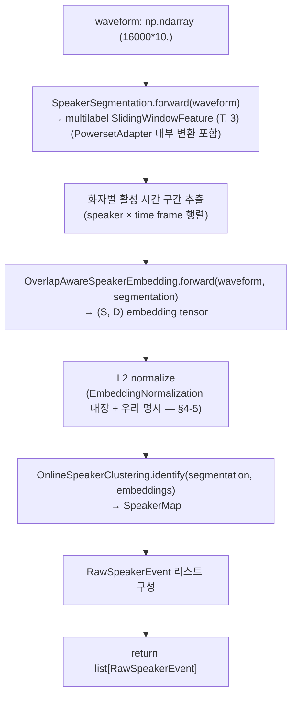
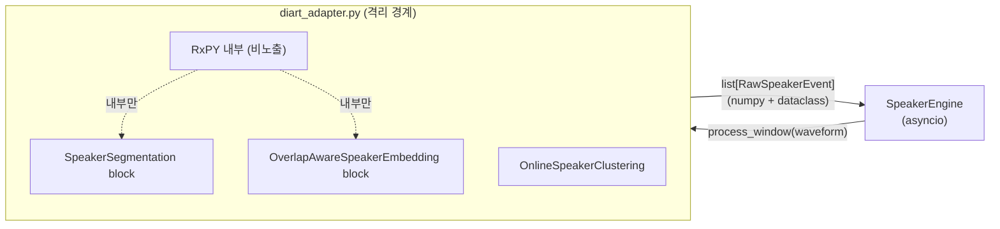

# DiartAdapter asyncio 인터페이스 + RxPY 격리 명세

## Summary

`diart_adapter.py` 의 asyncio 공개 인터페이스 + diart blocks 활용 방식 + RxPY 격리 메커니즘을 완전 명세한다. 래핑 전략 결정 근거는 [[adr-01-diart-wrapping-strategy]] 참조 — 이 문서는 시그니처와 동작 흐름만 박는다.

---

## §1 Scope

이 SPEC 이 명세하는 대상:

- `DiartAdapter` 클래스 전체 시그니처 + 파라미터 의미
- `RawSpeakerEvent` 타입 (DiartAdapter 출력)
- `WaveformBuffer` 명세 (10초 sliding window)
- `process_window()` 내부 흐름 (step-by-step)
- RxPY 격리 보장 규칙
- embedding L2 정규화 책임 위치
- 의존성 목록

이 SPEC 에서 명세하지 않는 것:
- diart 내부 알고리즘 상세 — [[reference-08-diart-streaming-structure]] 참조
- 3-tier 라벨 판별 로직 (registered/stored/auto) — [[spec-01-speaker-engine-api]] §4
- SpeakerStore Protocol — [[spec-02-speaker-store-schema]] 참조

---

## §2 Public Interface

### 2-1. `DiartAdapter`

```python
import numpy as np
from dataclasses import dataclass

class DiartAdapter:
    def __init__(
        self,
        hf_token: str,
        clusterer: "OnlineSpeakerClusterer",
        # DI: OnlineSpeakerClusterer 인스턴스 외부 주입 — spec-04 §2-2 에 박힌
        # "centroid state 는 online.py 만 보유" 정책 준수.
        # SpeakerEngine 이 1 instance 생성 후 DiartAdapter / AdaptiveScheduler /
        # FinalReclusterer / Identifier 가 공유.
        segmentation_model: str = "pyannote/segmentation-3.0",
        embedding_model: str = "pyannote/embedding",
        device: str | None = None,
        # None → cuda 가용하면 cuda, 아니면 cpu (SpeakerEngine.device 에서 결정된 값 전달)
        # "cuda" / "cpu" / "mps" 명시 전달 → torch.device 로 변환
        # SpeakerEngine.__init__ 에서 device 결정 후 주입 — DiartAdapter 자체는 auto-detect 없음
        max_speakers: int | None = None,
        # DEPRECATED — clusterer 가 max_speakers 보유.
        # 본 인자 사용 시 DeprecationWarning + 무시. v2 에 제거 예정.
    ) -> None:
        """
        diart 0.9.2 API 로 blocks 인스턴스화:
          - SegmentationModel.from_pyannote(segmentation_model, use_hf_token=hf_token)
          - EmbeddingModel.from_pyannote(embedding_model, use_hf_token=hf_token)
          - SpeakerSegmentation(seg_model, device=device_obj)
            ⚠️ duration 인자 없음 (diart 0.9.2 확인) — 모델 자체에 duration 내장.
          - OverlapAwareSpeakerEmbedding(model=emb_model, device=device_obj)
          - OnlineSpeakerClustering 은 외부 `clusterer` 의 인스턴스 사용 (DI)
        HF 모델 로드 (hf_token 사용).
        RxPY Subject/Observable 외부 노출 금지 — 내부 변수로만 유지.

        Raises
        ------
        ModelLoadError : HF 모델 다운로드·로드 실패 시 (retry X)
        """
        ...

    @property
    def embedding_dim(self) -> int:
        """
        embedding 모델의 출력 차원 D 동적 반환.
        legacy pyannote/embedding (XVectorSincNet): D=512
        community-1 WeSpeaker ResNet34: D=256
        model.dimension 속성으로 런타임 결정 — 하드코드 금지.
        [[reference-07-pyannote-embedding-code]] §7 확인값.
        """
        ...

    async def process_window(
        self,
        waveform: np.ndarray,
        # shape: (16000 * 10,) = 10초 mono PCM, float32, [-1, 1] 정규화
    ) -> list["RawSpeakerEvent"]:
        """
        10초 sliding window waveform 입력.
        diart blocks 순차 forward → RawSpeakerEvent 목록 반환.
        RxPY Observable/Subject 외부 노출 금지.
        내부적으로 numpy/torch 연산만 사용.
        빈 발화 구간이면 빈 목록 반환 (에러 X).
        """
        ...

    async def close(self) -> None:
        """diart 모델 참조 해제, GPU 메모리 반환."""
        ...
```

### 2-2. `WaveformBuffer`

```python
import asyncio

class WaveformBuffer:
    """
    asyncio.Queue 기반 10초 sliding window 누적기.
    음원 bytes → float32 numpy 배열로 변환 후 버퍼 누적.
    window_size = 16000 * 10 (10초 × 16kHz).
    hop_size = 16000 * 1 (1초 hop).
    window 가 채워지면 DiartAdapter.process_window() 호출 결과를 내부 큐에 push.
    SpeakerEngine.stream() 이 `drain_queue()` 로 이벤트 회수.
    """

    def __init__(
        self,
        adapter: DiartAdapter,
        queue_maxsize: int = 100,
    ) -> None: ...

    async def feed(self, chunk: bytes) -> None:
        """
        PCM bytes → float32 변환 후 내부 버퍼 append.
        window 채워지면 process_window 호출 → 결과를 내부 asyncio.Queue 에 put.
        backpressure (R1) — queue full 시 await put.
        """
        ...

    def drain_queue(self) -> list[RawSpeakerEvent]:
        """
        내부 큐에 누적된 이벤트를 한번에 회수.
        SpeakerEngine.stream() 이 chunk feed 후 호출 — 신규 이벤트 yield 직전.
        큐 비어있으면 빈 list.
        non-blocking — 큐 대기 X.
        """
        ...

    async def flush(self) -> list[RawSpeakerEvent]:
        """버퍼 잔량을 zero-pad 후 process_window 호출. finalize() 시 사용."""
        ...
```

---

## §3 Data Model

```python
from dataclasses import dataclass
import numpy as np

@dataclass
class RawSpeakerEvent:
    """
    DiartAdapter.process_window() 의 raw 출력.
    3-tier 라벨 판별 전 단계 — 화자별 분리 embedding + audio 만 담음.
    SpeakerEngine 이 이 데이터로 SpeakerStore.find_match → 라벨 결정.
    """
    local_speaker_id: int
    # 0 ~ max_speakers-1 범위.
    # OnlineSpeakerClustering 의 global cluster ID.
    # 세션 내 유지 (동일 화자면 동일 ID 유지 가능, recluster 시 변경).

    embedding: np.ndarray
    # shape: (D,), L2 normalized.
    # D = DiartAdapter.embedding_dim (런타임 결정).
    # OverlapAwareSpeakerEmbedding block 출력 → EmbeddingNormalization 적용.
    # L2 정규화는 diart EmbeddingNormalization 또는 우리 명시 책임 — §4-5 참조.

    audio: bytes
    # 화자별 overlap-aware mask 가중 audio (PCM 16kHz mono, 16-bit signed).
    # 사용처가 별도 STT 에 활용 가능.

    t_start: float
    # 해당 window 내 상대 시작 시간 (초). 절대 시간으로 변환은 SpeakerEngine 책임.

    t_end: float
    # 해당 window 내 상대 종료 시간 (초).

    confidence: float
    # segmentation activity probability (0.0~1.0).
    # SpeakerSegmentation block powerset 출력에서 추출.
```

---

## §4 동작 명세

### 4-1. `process_window(waveform)` 내부 흐름



step 상세:

1. `SpeakerSegmentation(seg_model, device=device)` forward — diart 0.9.2 의 `PowersetAdapter` 가 내부에서 powerset → multilabel 변환. 출력: `SlidingWindowFeature` (T, 3 speakers).
2. multilabel 데이터 추출 (`SlidingWindowFeature.data`). powerset 7-class 를 직접 받는 경우 `_powerset_to_multilabel()` fallback.
3. 화자별 활성 프레임 추출 → `(t_start, t_end)` 계산.
4. `OverlapAwareSpeakerEmbedding.forward(waveform, segmentation)` → `(S, D)` tensor. ⚠️ segmentation 도 인자로 전달 (diart 0.9.2 시그니처).
5. embedding L2 normalize (§4-5 참조).
6. `OnlineSpeakerClustering.identify(seg_swf, emb_tensor)` → `SpeakerMap`. `seg_swf` 는 `SlidingWindowFeature` 필수.
7. `SpeakerMap.valid_assignments()` → `(local_spks, global_spks)`.
8. `RawSpeakerEvent` 구성 후 목록에 append.

### 4-2. WaveformBuffer 10초 sliding window

```
window_size = 16000 * 10 = 160,000 samples
hop_size    = 16000 * 1  = 16,000 samples

feed(chunk):
  buffer.extend(chunk_as_float32)
  while len(buffer) >= window_size:
      window = buffer[:window_size]
      events = await adapter.process_window(window)
      buffer = buffer[hop_size:]   # 1초 slide
      yield events
```

- `chunk` 단위는 사용처 의존 (~100ms, 1600 samples).
- window 가 채워지기 전까지는 발화 없음 → 최초 발화는 최소 10초 후.
- `finalize()` 시 잔여 buffer 를 zero-pad 후 마지막 `process_window` 1회 실행.

### 4-3. 발화 경계 감지

diart `SpeakerSegmentation` 의 powerset 출력에서 `non-speech` 클래스 (class 0) 가 활성 프레임 경계를 결정한다:

- frame 에서 모든 화자 activity = 0 → non-speech.
- 연속 non-speech 프레임이 일정 수 이상 → 발화 종료 경계.
- 경계 감지 후 `SpeakerEngine` 이 `SpeakerSegment` yield.

> 별도 VAD 모듈 추가 없음 — segmentation 결과의 non-speech 활용으로 충분 (MVP 결정).

### 4-4. `local_speaker_id` 안정성

- `OnlineSpeakerClustering` 은 세션 내 누적 centroid 를 유지한다 ([[reference-08-diart-streaming-structure]] §5).
- 동일 화자는 대부분 동일 `local_speaker_id` 유지 (centroid 수렴 후).
- recluster 트리거 시 일부 ID 재배정 가능 → `SpeakerEngine` 이 `LabelChange` 로 소급.
- `local_speaker_id` ↔ `auto:*` 매핑은 `SpeakerEngine` 내부 dict 로 관리.

### 4-5. L2 정규화 책임

[[reference-07-pyannote-embedding-code]] 확인 결과:
- `pyannote/embedding` 자체는 L2 정규화를 하지 않음 (출력이 raw 임).
- diart 의 `EmbeddingNormalization` block 이 정규화를 수행.

**우리 책임**: `EmbeddingNormalization` block 을 명시 사용하거나, 직접 `embedding / np.linalg.norm(embedding)` 적용. 어느 방식이든 `RawSpeakerEvent.embedding` 은 반드시 L2 normalized 로 반환.

---

## §5 RxPY 격리 보장

| 규칙 | 내용 |
|---|---|
| **diart Observable / Subject 외부 노출 금지** | `DiartAdapter` 의 공개 인터페이스에 RxPY 타입 절대 노출 X |
| **내부 사용도 최소화** | diart blocks 을 `forward()` 메서드 직접 호출. RxPY pipeline 구성 X |
| **외부 인터페이스 = numpy + asyncio 만** | 반환 타입: `list[RawSpeakerEvent]` (dataclass + numpy). coroutine. |
| **diart AudioSource 사용 금지** | `from_websocket`, `from_file`, `from_microphone` 헬퍼가 대체 ([[spec-01-speaker-engine-api]] §2-2) |
| **단일 종속점** | `diart_adapter.py` 만 diart 를 import. 나머지 모듈에서 직접 import 금지 |



---

## §5-b 오류 / 예외

| 예외 클래스 | 발생 상황 | 처리 |
|---|---|---|
| `ModelLoadError` | HF 모델 다운로드·로드 실패 (`hf_token` 오류, 네트워크 단절, HF hub 장애 등) | `__init__` 시 raise. retry X — 호출자가 캐시 확인 후 재시도 책임 |
| `RuntimeError` | `close()` 이후 `process_window()` 호출 | raise (구현 정의 — no-op 허용 가능, 테스트 케이스 T09 참조) |
| (소프트 에러) | diart inference 단일 chunk 실패 (torch RuntimeError 등) | **1회 retry** → 실패 시 chunk skip + `WARN` 로그. `process_window()` 빈 목록 반환 (스트림 계속) |

- `ModelLoadError` 는 `speaker_engine.exceptions` 에 정의 (Python 표준 예외 미해당).
- diart inference retry 정책은 R3 동기 inline ([[adr-05-ws-race-defaults]]) 과 충돌 없음 — retry 자체가 동기 inline 처리.
- 단일 chunk skip 이 누적되면 `SpeakerEngine` 레벨에서 WARN 집계 (구현 결정은 engine.py 담당).

## §6 테스트 케이스 (high-level 시나리오)

| # | 시나리오 | 검증 포인트 |
|---|---|---|
| T01 | 합성 waveform (sin wave) → `process_window` | `RawSpeakerEvent` 발행, 빈 배열 아님 |
| T02 | 화자 2인 동시 발화 (overlap) | 두 `RawSpeakerEvent` 반환, t_start/t_end 겹침 |
| T03 | D 동적 결정 — legacy 모델 | `embedding_dim == 512` |
| T04 | D 동적 결정 — community-1 모델 | `embedding_dim == 256` |
| T05 | L2 정규화 검증 | `np.linalg.norm(event.embedding) ≈ 1.0` |
| T06 | HF_TOKEN 없음 | `EnvironmentError` |
| T07 | max_speakers 한도 초과 | 21번째 화자 cluster 재배정 (새 ID 미생성) |
| T08 | 빈 audio (무음 waveform) | 빈 목록 반환, 에러 없음 |
| T09 | close() 후 process_window 호출 | `RuntimeError` 또는 no-op (구현 정의) |
| T10 | RxPY Observable 외부 노출 없음 | `DiartAdapter` 공개 속성에 RxPY 타입 없음 검증 |

---

## §7 의존성

```toml
# pyproject.toml 코어 의존성 (diart_adapter.py 기준)
[tool.poetry.dependencies]
diart = ">=0.9"              # SpeakerSegmentation, OverlapAwareSpeakerEmbedding, OnlineSpeakerClustering blocks
pyannote-audio = ">=4.0"    # 모델 허브 + embedding 로드
torch = "*"                  # 모델 런타임
numpy = "*"                  # 배열 연산
```

| 패키지 | 최소 버전 | 용도 |
|---|---|---|
| `diart` | `>=0.9` | 3개 blocks (SpeakerSegmentation, OverlapAwareSpeakerEmbedding, OnlineSpeakerClustering) |
| `pyannote-audio` | `>=4.0` | segmentation-3.0 / embedding 모델 로드, HF hub 인증 |
| `torch` | — | 모델 forward pass 런타임 |
| `numpy` | — | waveform 배열, embedding 연산 |

> `diart>=0.9` 은 내부 RxPY 를 포함하나, 우리는 blocks forward() 만 사용 — RxPY 는 격리.
> diart 버전 pin (`diart~=0.9`) 권장 — 내부 API 변경 시 `diart_adapter.py` 만 수정.

---

## §OQ 후속 박제 대상 (Open Questions)

| ID | 질문 | 발견 시점 | 해결 시점 |
|---|---|---|---|
| OQ-03-1 | `DiartAdapter.__init__` 의 `max_speakers` 인자 deprecated 처리 — v2 에 완전 제거 시점 | 2026-05-17 E-03 DI 리팩토링 | v2 |
| OQ-03-2 | Python 3.14 + torchaudio 비호환 (`list_audio_backends` AttributeError) — `_DIART_OK` flag 로 graceful degradation. torchaudio 또는 pyannote 업스트림 픽스 대기 | 2026-05-17 E-01 구현 | upstream fix 후 |
| OQ-03-3 | `RawSpeakerEvent` 의 위치 — `diart_adapter.py` 내부 (현재) vs `types.py` 통합. SpeakerEngine 내부 전용이라 현재 위치 유지. v2 사용처 직접 호출 시 재검토 | 2026-05-17 E-01 구현 | v2 |
| OQ-03-4 | `reference-08-diart-streaming-structure` 의 diart 분석은 더 옛 버전 기준 — diart 0.9.2 와 시그니처 mismatch 5건 확인 (PLAN-003-T-022): `SpeakerSegmentation` duration 인자 제거, `OverlapAwareSpeakerEmbedding` segmentation 인자 추가, `OnlineSpeakerClustering` n→max_speakers, `PowersetAdapter` 내부 변환 유무, SlidingWindowFeature 필수 여부. reference-08 갱신 또는 outdated 표기 검토 | 2026-05-18 T-022 | reference-08 재분석 task |

---

## §8 참조

- [[planning-02-speaker-engine]] §3.5 diart 래핑 전략, §9 디렉토리 구조
- [[adr-01-diart-wrapping-strategy]] — diart blocks 만 import + asyncio wrap 결정
- [[adr-05-ws-race-defaults]] — R3 동기 inline (recluster), R5 단일 출력 큐 (DiartAdapter 출력 단일 큐 전제)
- [[reference-04-pyannote-audio-inference]] — frame rate ~17ms, step=1s, hamming aggregation
- [[reference-08-diart-streaming-structure]] — OnlineSpeakerClustering 알고리즘, OverlapAwareSpeakerEmbedding, duration=10 강제
- [[reference-06-powerset-decoder]] — powerset → multilabel decode 구현
- [[reference-07-pyannote-embedding-code]] — D=512/256, L2 정규화 미적용 확인
- [[spec-01-speaker-engine-api]] — DiartAdapter 를 호출하는 SpeakerEngine stream 흐름
- [[spec-02-speaker-store-schema]] — embedding find_match 에 전달되는 RawSpeakerEvent.embedding
- [[spec-04-clustering-algorithms]] §2-2 — `clusterer` DI 정책 (centroid state 단일 owner)
