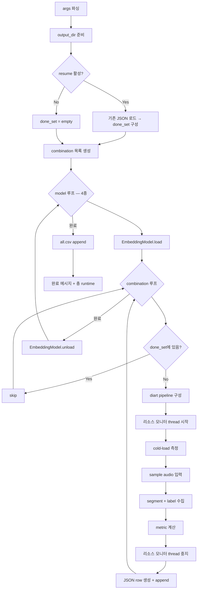

# spec-03 — eval_ablation.py 스크립트 명세

## Summary

Phase 1~2 ablation 실험을 자동화하는 `scripts/eval_ablation.py` 의 CLI 인터페이스, 실행 흐름, 측정 방법, 에러 처리, resume 동작을 명세한다.

---

## 스크립트 위치

```
scripts/eval_ablation.py
```

---

## CLI 인터페이스

```
python scripts/eval_ablation.py [options]
```

| 인자 | 기본값 | 설명 |
|------|--------|------|
| `--embeddings` | 4종 전체 | 실행할 임베딩 모델 리스트 |
| `--windows` | `1.0 2.0 3.0 5.0` | window_s 후보 (float list) |
| `--steps` | `0.1 0.25 0.5` | step_s 후보 (float list) |
| `--schedulers` | `baseline` | scheduler 변형 리스트 (Phase 2 시 확장) |
| `--samples` | 필수 | 오디오 파일 경로 리스트 |
| `--gt-rttm` | 필수 | `sample_name:rttm_path` 형태 (반복 지정) |
| `--output-dir` | `eval/ablation/results/` | 결과 저장 디렉토리 |
| `--device` | `auto` | `auto \| cuda \| mps \| cpu` |
| `--resume` | `True` | 기존 결과 존재 시 완료된 combination skip |

**예시**:
```bash
python scripts/eval_ablation.py \
  --embeddings pyannote/embedding ecapa-tdnn \
  --windows 1.0 3.0 5.0 \
  --steps 0.25 0.5 \
  --schedulers baseline \
  --samples eval/data/ami/ES2002a.wav eval/data/korean/record_1.wav \
  --gt-rttm ES2002a.wav:eval/data/ami/ES2002a.rttm \
  --gt-rttm record_1.wav:eval/data/korean/record_1.rttm \
  --output-dir eval/ablation/results/ \
  --device auto
```

---

## 실행 흐름



---

## 모델별 Batch 순회

메모리 충돌 방지를 위해 **모델 1개 완전 처리 후 unload**:

```
for embedding_model in embeddings:
    model.load(device)
    for (window, step, scheduler, sample) in combinations_for_model:
        run_combination(model, window, step, scheduler, sample)
    model.unload()
```

---

## per-combination 측정 절차

각 combination 에 대해:

1. **cold-load 시간**: `time.perf_counter()` — `model.load()` 시작~종료
   - 모델이 이미 로드된 경우 0 으로 기록 (배치 내 첫 번째만 측정)
2. **diart pipeline 구성**: `OnlineSpeakerDiarization(embedding=as_diart_embedding(model), duration=window_s, step=step_s)`
3. **sample 입력**: 오디오 파일 → 청크 단위 스트림 emit
4. **라벨링 지연 측정**: PCM chunk 입력 타임스탬프 vs label emit 타임스탬프 → 전체 list 수집
5. **DER 계산**: `pyannote.metrics.diarization.DiarizationErrorRate` (tolerance 0.25s)
6. **초기 cluster latency**: 첫 stable cluster (distinct speaker ≥ 2) emit 시점
7. **라벨 일관성**: 동일 화자 ground truth 내 predicted label 최빈값 비율
8. **total_runtime_s**: combination 전체 wall-clock

---

## 리소스 측정 Thread

별도 daemon thread 가 1초 간격으로 폴링:

```python
import psutil, threading, time

class ResourceMonitor:
    def __init__(self, pid: int):
        self.pid = pid
        self._samples = {"cpu": [], "ram": [], "gpu_pct": [], "gpu_mem": []}
        self._stop = threading.Event()

    def start(self): ...
    def stop(self) -> dict: ...  # peak + avg 반환
```

- **CPU**: `psutil.Process(pid).cpu_percent(interval=None)` — 1초 간격
- **RAM**: `psutil.Process(pid).memory_info().rss / 1e6` (MB)
- **GPU**: `pynvml.nvmlDeviceGetUtilizationRates()` + `nvmlDeviceGetMemoryInfo()` — GPU 없으면 0

---

## 에러 처리

개별 combination 실패 시:
- row 의 `error` 필드에 traceback 요약 박제
- `metrics` 필드는 모두 0 또는 null
- **실행 중단 없이 다음 combination 계속**

---

## Resume 동작

`--resume True` (기본):
- `output_dir` 의 최신 JSON 파일 로드
- `(embedding, window_s, step_s, scheduler, sample)` tuple 이 done_set 에 있으면 skip
- 새 결과는 동일 JSON 파일에 append

---

## 로그 출력

```
[eval_ablation] 총 48 combinations × 5 samples = 240 measurements
[1/240] pyannote/embedding | w=1.0 | s=0.1 | ES2002a.wav ... done (DER=0.142, 23.4s)
[2/240] pyannote/embedding | w=1.0 | s=0.1 | record_1.wav ... done (DER=0.198, 21.1s)
...
[ETA] 예상 남은 시간: 1h 23m
```

---

## 의존성

```
diart>=0.x
pyannote.audio>=3.x
pyannote.metrics>=3.x
speechbrain>=1.x
wespeaker
nemo_toolkit[asr]  # TitaNet-L 전용
psutil
pynvml  # GPU 환경 시
numpy
torch
```
