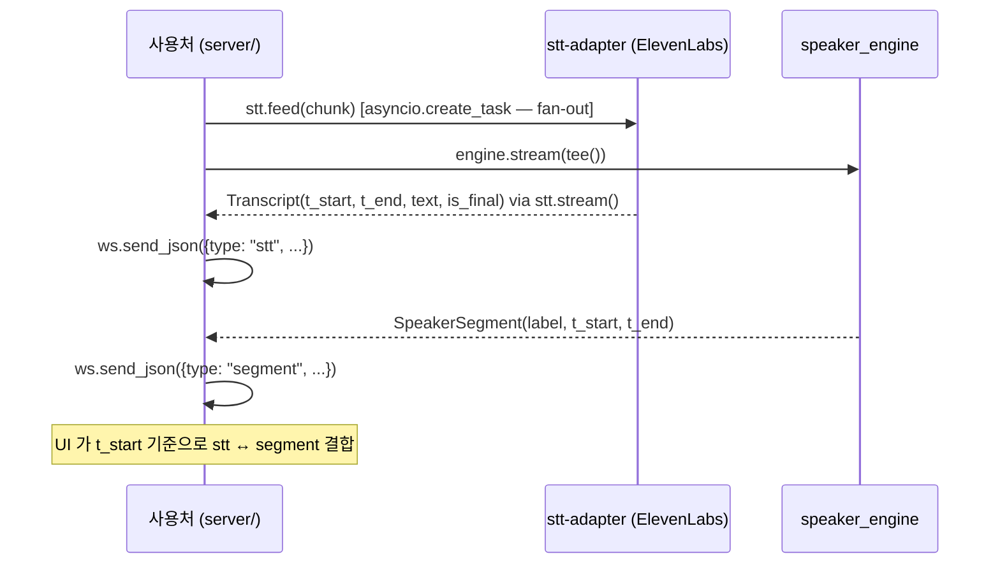

# STT streaming 어댑터 계약 — ElevenLabs streaming WS 1차 구현

## Summary

`stt-adapter` 모듈의 공개 인터페이스 (duck-type 프로토콜) + ElevenLabs streaming STT WS 1차 구현 제약. `speaker_engine` 은 STT 에 의존하지 않는다 — PCM 만 공유하고 시간 좌표만으로 결합 (adr-02). batch `flush_window` 패턴 폐기 (§OQ-06-1). STT 가 자체 시간축으로 partial/final transcript 를 독립 emit.

---

## §1 STT 인터페이스 (duck-type 프로토콜)

```python
@dataclass
class Transcript:
    t_start:  float   # session-relative (초), ElevenLabs 기준
    t_end:    float
    text:     str
    is_final: bool

async def feed(self, chunk: bytes) -> None:
    """PCM16 bytes 를 ElevenLabs WS 로 전송. 반환값 없음."""
    ...

async def stream(self) -> AsyncIterator[Transcript]:
    """STT 자체 출구 — partial/final Transcript 를 독립적으로 emit."""
    ...

async def close(self) -> None:
    """graceful 종료 — ElevenLabs WS 닫기."""
    ...
```

**flush_window 폐기**: `flush_window(t_start, t_end) -> str` 는 v0.1.0 에서 명시 폐기 (§OQ-06-1). 구현 시 이 시그니처를 포함하지 않는다.

사용처 호출 패턴 (Pattern B fan-out, adr-02):

```python
async def tee():
    async for chunk in from_websocket(ws):
        asyncio.create_task(stt.feed(chunk))   # fan-out: STT 비동기
        yield chunk                             # engine 입력

async def forward_stt_stream(stt, ws):
    async for transcript in stt.stream():
        await ws.send_json({
            "type": "stt",
            "t_start": transcript.t_start,
            "t_end": transcript.t_end,
            "text": transcript.text,
            "is_final": transcript.is_final,
        })

# 두 채널 독립 실행
asyncio.create_task(forward_stt_stream(stt, ws))
async for event in engine.stream(tee()):
    if isinstance(event, SpeakerSegment):
        await ws.send_json({
            "type": "segment",
            "label": event.label,
            "t_start": event.t_start,
            "t_end": event.t_end,
        })
```

---

## §2 시간 정렬 정책

STT 가 자기 시간축으로 timestamp 를 책임진다. `engine` 의 `SpeakerSegment` 와는 독립.

- STT 는 `Transcript.t_start / t_end` 를 ElevenLabs 응답의 word-level timestamps 기준으로 채운다.
- Engine 은 `SpeakerSegment.t_start / t_end` 를 자기 sliding window 기준으로 채운다.
- **결합**: 클라이언트(UI) 책임 — `stt.t_start` 가 `segment` 구간 `[t_start, t_end]` 에 포함되면 같은 발화로 매핑 (spec-07 §4).
- **v0.2 서버 매핑 layer**: spec-07 §OQ-07-1 에 박제.

---

## §3 ElevenLabs streaming STT 구현 제약

v0.1.0 1차 구현 기준.

| 항목 | 값 | 근거 |
|---|---|---|
| 서비스 | ElevenLabs streaming STT (Scribe 모델) | admin 결정 2026-05-20 |
| endpoint | ElevenLabs streaming STT WebSocket (정확한 URL/파라미터는 구현 시 ElevenLabs 공식 문서 확인) | 워커 확정 사항 |
| 인증 | `xi-api-key` 헤더 / `ELEVENLABS_API_KEY` 환경변수 | ElevenLabs 표준 |
| 언어 | `ko` (한국어 회의 음성) | 데모 요구사항 |
| PCM 입력 | 16kHz mono 16-bit (engine 과 동일 청크 그대로 fan-out) | spec-03 §2 |
| 출력 형식 | partial + final transcript with word-level timestamps | ElevenLabs streaming WS |
| 구현 위치 | `server/stt/elevenlabs.py` | planning-03 §5 |
| pyproject extras | `elevenlabs` 관련 의존성 신설 — 워커 결정 | |

---

## §4 에러 정책

| 케이스 | 응답 |
|---|---|
| API 키 부재 (`ELEVENLABS_API_KEY` 없음) | 서버 기동 시 즉시 예외 — uvicorn 종료 |
| ElevenLabs WS 연결 끊김 | 재연결 또는 fail-fast — §OQ-06-2 워커 결정 대상 |
| rate limit | 로그 경고 + skip (해당 구간 transcript 없음) |
| WS 응답 타임아웃 | 구현 시 워커가 `asyncio.wait_for` 등 적절한 timeout 설정 |

---

## §5 Pattern B 결합 의무 (adr-02 인스턴스화)



**의존성 방향**: `App → STT`, `App → Eng`. STT 와 Eng 는 서로 모른다. UI 가 시간 좌표로 결합. (adr-02 §Why #1)

---

## §6 테스트 카테고리

| 카테고리 | 대상 | marker |
|---|---|---|
| unit | PCM feed 로직, ElevenLabs WS 클라이언트 mock, Transcript 파싱 | (기본) |
| integration | 실 `ELEVENLABS_API_KEY` + 한국어 sample (`ko_sample.wav`) → WER 측정 | `pytest -m integration` |

integration 테스트는 `ELEVENLABS_API_KEY` 환경변수 존재 확인 후 skip 처리.

---

## §7 Out of Scope

| 항목 | 책임 |
|---|---|
| 화자 분리 | `speaker_engine` (engine) 책임 |
| STT ↔ segment 시간 결합 | 클라이언트(UI) 책임 (v0.1). v0.2 서버 mapping layer 검토 (spec-07 §OQ-07-1) |
| 다국어 / 언어 자동 감지 | 한국어 고정 (`language="ko"`) — 변경은 사용처 설정 |
| STT 결과 DB 저장 | 사용처 (`realtime-api`) 책임 |

---

## §OQ-06-1 — flush_window 패턴 + A안 (폐기 확정, 2026-05-20)

> **Decision**: **flush_window 전면 폐기**. batch slice 방식 및 이전 A안 단순 즉시 슬라이스 결정 모두 **무효화**.
>
> `flush_window(t_start, t_end) -> str` 시그니처는 구현 금지.
>
> **근거**: engine ↔ STT 독립 두 채널 원칙 (adr-02) 위반. faster-whisper local mac CPU 실시간 부적합 판정과 맞물려 STT streaming 재설계로 대체.
>
> **재검토 트리거**: 없음 (결정 확정).

---

## §OQ-06-2 — ElevenLabs WS 재연결 정책 + partial/final 노출 (결정 확정, 2026-05-20)

> **Status**: **결정 확정** — stt-adapter 워커 (PLAN-004-T-008), 2026-05-20.
>
> **항목 1 — WS 재연결**: **A) fail-fast** (세션 에러 처리). 지수 백오프 재연결 미채택.
> 근거: 데모는 단일 세션 (파일 업로드 1회). 재연결 중 누락된 PCM 구간 복구가 불가능하므로 세션 에러로 즉시 처리하는 것이 정직한 동작. `stream()` 메서드에서 WS 연결 끊김 시 예외 전파 (fail-fast).
>
> **항목 2 — partial vs final 노출**: **둘 다 emit** (partial + final). final 만 전달 미채택.
> 근거: `spec-07 §4` UI 요구사항 — "우-상 STT 자막: `is_final=false` 이면 partial 갱신, `true` 이면 확정". partial 을 실시간 표시해야 UX 가 자연스러움. `Transcript.is_final` 로 구분 가능하므로 소비자 선택권 보장.
>
> **구현 반영**: `server/stt/elevenlabs.py` `_parse_message()` — `partial_transcript` → `is_final=False`, `committed_transcript_with_timestamps` → `is_final=True` 둘 다 yield.

---

## §X WhisperSTT (faster-whisper local) 폐기 명시

v0.1.0 에서 `server/stt/adapter.py` 의 `WhisperSTT` (faster-whisper local) 는 **mac CPU 실시간 부적합** 판정으로 폐기.

- **폐기 결정**: admin, 2026-05-20
- **코드 삭제**: 다음 stt-adapter 워커 task 에서 처리 (본 task 는 spec 폐기 명시만)
- **v0.2 GPU 환경 재도입**: 별도 spec 으로 검토
