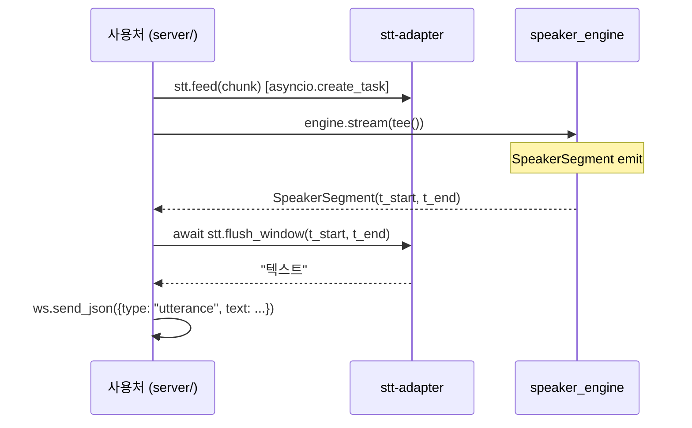

# STT 어댑터 계약 — faster-whisper 1차 구현 (Pattern B 결합)

## Summary

`stt-adapter` 모듈의 공개 인터페이스 (duck-type 프로토콜) + faster-whisper 1차 구현 제약. `speaker_engine` 은 STT 에 의존하지 않는다 — 시간 축(t_start, t_end)만 공유 (adr-02).

anchor: `examples/fastapi_ws_demo.py` 의 `_MockSTT` (lines 40-47) 가 이 인터페이스의 사실상 참조 구현.

---

## §1 STT 인터페이스 (duck-type 프로토콜)

신규 클래스명을 발명하지 않는다. 인터페이스는 `_MockSTT` 시그니처 그대로 — 구현체가 이 메서드를 갖추면 사용처 호환.

```python
# examples/fastapi_ws_demo.py 의 _MockSTT 시그니처 (정식화)
async def feed(self, chunk: bytes) -> None:
    """PCM16 bytes 를 누적. 반환값 없음."""
    ...

async def flush_window(self, t_start: float, t_end: float) -> str:
    """
    누적된 PCM 에서 [t_start, t_end] 구간을 슬라이스 → ASR → 텍스트 반환.
    t_start / t_end 는 session-relative (초). SpeakerSegment 와 동일 좌표계.
    빈 발화 (묵음 / 인식 불가) 는 빈 문자열 "" 반환 (예외 X).
    """
    ...
```

사용처 호출 패턴 (planning-02 §3, fastapi_ws_demo.py):

```python
async def tee():
    async for chunk in from_websocket(ws):
        asyncio.create_task(stt.feed(chunk))   # fan-out: STT 비동기
        yield chunk                             # engine 입력

async for event in engine.stream(tee()):
    if isinstance(event, SpeakerSegment):
        text = await stt.flush_window(event.t_start, event.t_end)
```

---

## §2 시간 정렬 정책

engine 이 `SpeakerSegment(t_start, t_end)` 를 emit 한 직후 `stt.flush_window(t_start, t_end)` 를 호출한다.

STT 구현체는 누적 PCM 에서 해당 구간에 대응하는 바이트를 슬라이스한 뒤 ASR 를 수행한다.

**슬라이스 계산**: 16kHz, 16-bit (2 bytes/sample) 기준

```
byte_offset = int(t_start * 16000) * 2
byte_end    = int(t_end   * 16000) * 2
pcm_slice   = accumulated_pcm[byte_offset:byte_end]
```

**정렬 오차**: engine 의 10s sliding window 처리 지연으로 `flush_window` 호출 시점에 STT 가 아직 해당 구간 PCM 을 충분히 수신하지 못할 수 있다. 정책은 §OQ-06-1 에서 옵션 A (단순 슬라이스) 로 확정.

### §OQ-06-1 — 정렬 오차 허용 한계 및 구현 방식 (resolved 2026-05-20)

> **Decision (admin, 2026-05-20)**: **A) 단순 즉시 슬라이스**.
>
> `flush_window` 는 호출 시점의 누적 PCM 을 그대로 슬라이스하여 ASR 한다. `t_end` 가 누적 PCM 길이를 초과하면 가용 PCM 까지만 사용 (§4 에러 정책의 "구간 PCM 부족" 케이스).
>
> **근거**: 데모 v0.1.0 우선. 짧은 발화 말단 미수신 위험은 WER 초기 측정에서 확인. 문제 확인 시 옵션 B (대기) 또는 별도 adr-09 박제로 escalate.
>
> **재검토 트리거**: 데모 WER > 20% 이거나 사용자 보고 "끝 단어 잘림" 패턴 반복 시.

---

## §3 faster-whisper 구현 제약

v0.1.0 1차 구현 기준.

| 항목 | 값 | 근거 |
|---|---|---|
| 모델 | `medium` (기본) / 필요 시 `large-v3` | 속도·정확도 균형. mac CPU 에서 `large-v3` 는 지연 증가 |
| 언어 | `language="ko"` | 한국어 회의 음성 시연 |
| `beam_size` | 5 (기본) | faster-whisper 기본값 |
| `compute_type` | `"int8"` (mac CPU/MPS) / `"float16"` (CUDA) | mac CPU int8 권장 — 속도 ↑, 품질 미미한 차이 |
| 워밍업 | 서버 기동 시 모델 로드 완료 후 더미 audio 1회 forward | 첫 요청 지연 방지 |
| 결과 후처리 | `text.strip()` + 빈 문자열 pass-through | faster-whisper 가 종종 공백만 반환 |
| 최소 구간 | `t_end - t_start < 0.2s` 이면 `""` 즉시 반환 | ASR 인식 불가 구간 처리 비용 절감 |

---

## §4 에러 정책

| 케이스 | 응답 |
|---|---|
| 모델 로드 실패 (파일 없음 / 네트워크) | 서버 기동 시 즉시 예외 — uvicorn 종료. 데모는 헬스체크 필요 X |
| GPU / MPS 부재 + `compute_type` 불일치 | `faster_whisper.WhisperModel` 내부에서 `ValueError` — 로그 + fallback CPU int8 |
| `flush_window` 구간 PCM 부족 (t_end 초과) | 가용 PCM 까지만 슬라이스 후 ASR — 에러 아님. `""` 가능 |
| 타임아웃 (ASR 장시간 응답 없음) | `asyncio.wait_for` 로 5s 제한 — 초과 시 `""` 반환, 로그 경고 |
| 매우 짧은 구간 (`< 0.2s`) | `""` 즉시 반환 (§3 참조) |

---

## §5 Pattern B 결합 의무 (adr-02 인스턴스화)



**의존성 방향**: `App → STT`, `App → Eng`. STT 와 Eng 는 서로 모른다. 시간 좌표(t_start, t_end)만 App 에서 연결. (adr-02 §Why #1)

---

## §6 테스트 카테고리

| 카테고리 | 대상 | marker |
|---|---|---|
| unit | PCM 누적 슬라이스 로직 (byte offset 계산), 빈 구간 처리, mock faster-whisper model | (기본) |
| integration | 실 faster-whisper 로드 + 한국어 sample (`ko_sample.wav`) → WER 측정 | `pytest -m integration` |

integration 테스트는 faster-whisper 설치 + `ko_sample.wav` 존재 확인 후 skip 처리.

---

## §7 Out of Scope

| 항목 | 책임 |
|---|---|
| 화자 분리 | `speaker_engine` (engine) 책임 |
| 스트리밍 STT (partial 자막) | v0.2 검토 — 현재 `flush_window` 는 구간 확정 후 일괄 반환 |
| 다국어 / 언어 자동 감지 | 한국어 고정 (`language="ko"`) — 변경은 사용처 설정 |
| STT 결과 DB 저장 | 사용처 (`realtime-api`) 책임 |
