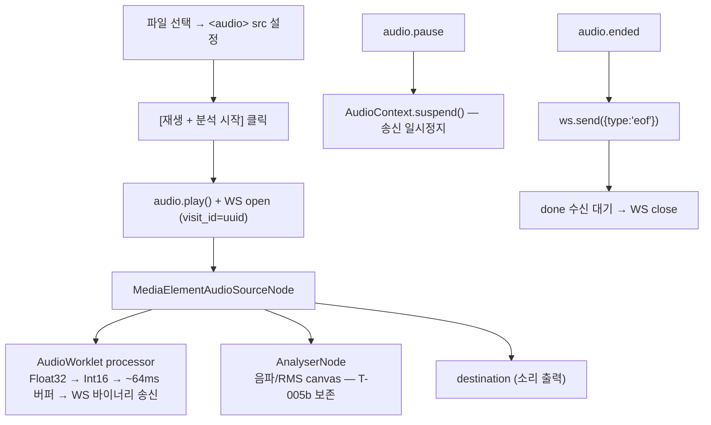

# 데모 UI WS 프로토콜 — json 이벤트 스키마 + 클라이언트 책임

## Summary

`examples/fastapi_ws_demo.py` 의 WS 핸들러(lines 50-121)를 정식화한 문서. 바이너리 입력(PCM16) / 텍스트 출력(JSON) 계약 + 클라이언트 PCM 변환 가이드 + 종료 프로토콜.

---

## §1 WS Endpoint 계약

```
ws://host/audio/{visit_id}
```

| 방향 | 포맷 | 내용 |
|---|---|---|
| 클라이언트 → 서버 | 바이너리 | PCM 16-bit signed LE, 16kHz, mono |
| 클라이언트 → 서버 | 텍스트 JSON | `{"type":"eof"}` — 종료 시그널 (선택, 권장) |
| 서버 → 클라이언트 | 텍스트 JSON | 5종 이벤트 (`segment`, `stt`, `relabel`, `done`, `error`) |

`{visit_id}` — 세션 식별자 (임의 문자열, URL-safe). 현재 데모는 영속화하지 않음 (`memory://` 스토어).

---

## §2 클라이언트 → 서버 (오디오 전송)

### PCM 포맷 요구사항

| 항목 | 값 | 근거 |
|---|---|---|
| 샘플 포맷 | PCM 16-bit signed LE | spec-03 §2 + engine 입력 계약 |
| 샘플레이트 | 16kHz | spec-03 §2 (diart 입력 제약) |
| 채널 | mono (1ch) | adr-06-mono-only-v1-multichannel-v2 |
| 청크 크기 | 1초 권장 (16,000 samples = 32,000 bytes) | 서버는 다른 청크 크기도 수용 — window 처리는 server-side |

**브라우저 resample 책임**: 서버는 원본 포맷을 변환하지 않는다. 클라이언트가 PCM16 16kHz mono 를 보장 (§5 참조).

### 종료 시그널

- **권장**: 텍스트 프레임으로 `{"type":"eof"}` 송신 후 WS close
  - 재생 master clock 패턴 (§5): `audio.ended` 이벤트가 `eof` 송신 트리거 — 재생 완료 시 자동 종료
- **허용**: WS graceful close 만 (현재 데모 동작 방식) — §7 의 race 조건 주의

---

## §3 서버 → 클라이언트 (JSON 이벤트)

### segment (신규 — v0.1.0)

화자 분리 단위 이벤트. `SpeakerSegment` 직접 직렬화. STT 텍스트 없음 — 클라이언트가 `stt` 이벤트와 시간 좌표로 결합 (§4).

```json
{
  "type": "segment",
  "utterance_id": "string",
  "label": "string",
  "t_start": 0.0,
  "t_end": 0.0,
  "confidence": 0.0
}
```

| 필드 | 타입 | 단위 / 범위 | 설명 |
|---|---|---|---|
| `type` | string | `"segment"` | 고정값 |
| `utterance_id` | string | UUID4 형식 | 발화 단위 식별자 (relabel 과 연결) |
| `label` | string | `"registered:이름"` / `"stored:이름"` / `"auto:A"` | 화자 라벨 — relabel 로 소급 변경 가능 |
| `t_start` | float | 초, session-relative (0.0~) | 발화 시작 시각 |
| `t_end` | float | 초, session-relative | 발화 종료 시각 |
| `confidence` | float | 0.0~1.0 | 클러스터 할당 신뢰도 |

### stt (신규 — v0.1.0)

ElevenLabs streaming STT 결과 이벤트. 화자 라벨 없음 — 클라이언트가 `segment` 이벤트와 시간 좌표로 결합 (§4).

```json
{
  "type": "stt",
  "t_start": 0.0,
  "t_end": 0.0,
  "text": "string",
  "is_final": false
}
```

| 필드 | 타입 | 단위 / 범위 | 설명 |
|---|---|---|---|
| `type` | string | `"stt"` | 고정값 |
| `t_start` | float | 초, session-relative | STT 자체 timestamp (ElevenLabs word-level 기준) |
| `t_end` | float | 초, session-relative | STT 자체 timestamp |
| `text` | string | 한국어 텍스트 | 인식 텍스트. `is_final=false` 이면 partial (갱신 가능) |
| `is_final` | boolean | | `false`: partial (실시간 갱신), `true`: 확정 텍스트 |

### utterance _(deprecated v0.1.0)_

> **폐기 (2026-05-20)**: `utterance` 는 STT batch `flush_window` 방식의 종속 모델. `segment` + `stt` 분리 이벤트로 대체. 구현 코드 제거는 다음 stt-adapter 워커 task.

### relabel

클러스터 재계산 후 화자 라벨 변경 이벤트. `LabelChange` 기반.

anchor: `fastapi_ws_demo.py:80-90`

```json
{
  "type": "relabel",
  "old_label": "string",
  "new_label": "string",
  "reason": "string",
  "affected_count": 0,
  "affected_utterance_ids": ["string"]
}
```

| 필드 | 타입 | 설명 |
|---|---|---|
| `type` | string | `"relabel"` |
| `old_label` | string | 변경 전 라벨 |
| `new_label` | string | 변경 후 라벨 |
| `reason` | string | `"recluster"` / `"stored_match"` / `"persist"` |
| `affected_count` | integer | 영향 받는 발화 수 |
| `affected_utterance_ids` | array[string] | 소급 업데이트해야 할 utterance_id 목록 |

클라이언트는 수신 시 `affected_utterance_ids` 에 해당하는 기존 발화 로그의 라벨을 `new_label` 로 시각 업데이트해야 한다.

### done

세션 종료 + 최종 화자 후보 목록.

anchor: `fastapi_ws_demo.py:93-107`

```json
{
  "type": "done",
  "visit_id": "string",
  "speaker_count": 0,
  "candidates": [
    {
      "auto_id": "string",
      "utterance_count": 0,
      "total_duration": 0.0
    }
  ]
}
```

| 필드 | 타입 | 설명 |
|---|---|---|
| `type` | string | `"done"` |
| `visit_id` | string | 요청 시 path param 으로 받은 visit_id 반향 |
| `speaker_count` | integer | 세션 내 화자 후보 수 |
| `candidates[].auto_id` | string | `"auto:A"` 형식의 화자 식별자 |
| `candidates[].utterance_count` | integer | 해당 화자의 발화 횟수 |
| `candidates[].total_duration` | float | 해당 화자의 총 발화 시간 (초) |

### error

WS 핸들러 내 미처리 예외 발생 시.

anchor: `fastapi_ws_demo.py:114`

```json
{
  "type": "error",
  "message": "string"
}
```

`error` 이벤트 후 서버는 WS를 close 한다.

---

## §4 라이브 UI 요구사항

| 기능 | 상세 |
|---|---|
| 파일 업로드 인풋 | `<input type="file" accept=".wav,.mp3,.m4a">` |
| 재생 컨트롤 | `<audio>` 재생 **master clock — 필수**. `play` → WS 송신 시작 / `pause` → WS 송신 일시정지 / `ended` → `eof` 송신 + done 수신 대기 → WS close (§5 참조) |
| 우-상 STT 자막 | `stt` 이벤트 실시간 표시 — `is_final=false` 이면 partial 갱신, `true` 이면 확정 |
| 우-중 발화 로그 | `segment` 이벤트 기반 — 화자별 색상 구분 + 시간(t_start-t_end) |
| 우-하 최종 매핑 결과 | 클라이언트가 `stt.t_start` 가 `segment` 구간 `[t_start, t_end]` 에 포함되면 같은 행에 결합 |
| relabel 소급 업데이트 | `relabel` 이벤트 수신 시 기존 발화 로그의 라벨·색상 즉시 갱신 (`utterance_id` 기준) |
| 종료 시 candidates 요약 | `done` 이벤트 수신 시 화자별 발화 수 + 총 시간 표 표시 |
| 에러 표시 | `error` 이벤트 또는 WS 끊김 시 사용자에게 메시지 표시 |

---

## §5 재생 master clock + AudioWorklet capture (v0.1 신규)

> **즉시 송신 패턴 _(deprecated 2026-05-20)_**: 파일 업로드 → `decodeAudioData` → 1초 청크 즉시 WS 전송 패턴 폐기. 재생 master clock 패턴으로 대체. 구현은 T-014 (demo-ui).

### 아키텍처 구조



### 노드 연결 원칙

| 노드 | 역할 |
|---|---|
| `MediaElementAudioSourceNode` | `<audio>` 재생 오디오를 Web Audio 그래프 진입점으로 연결 |
| `AudioWorklet processor` | Float32 frame 수신 → Int16 변환 → ~64ms 버퍼 누적 → WS 바이너리 송신 |
| `AnalyserNode` | 음파/RMS 시각화 (T-005b — 변경 없음) |
| `destination` | 스피커 출력 (사용자가 오디오를 들을 수 있음) |

> `AudioContext.sampleRate` ≠ 16000 처리 + 청크 단위 → §OQ-07-2 워커 결정 대상.

### play / pause / ended 동기화

| 오디오 이벤트 | WS 동작 |
|---|---|
| `audio.play` | `AudioContext.resume()` + WS open (visit_id = uuid) |
| `audio.pause` | `AudioContext.suspend()` — AudioWorklet 송신 일시정지 |
| `audio.ended` | `ws.send({"type":"eof"})` → `done` 수신 대기 → WS close |

> **구현은 `demo-ui` 워커 책임** (T-014). 서버 (`fastapi_ws_demo.py`) 는 PCM 바이너리 수신 계약 불변 — §1 계약 변경 없음.

---

## §6 마이크 실시간 입력 (v0.2 보류)

마이크 입력은 **out of scope** (planning-03 §2). v0.2 검토 방향만 메모:

- `AudioWorklet` + `SharedArrayBuffer` 로 실시간 PCM16 추출
- `MediaRecorder` API 는 WebM/Ogg 로 인코딩되어 PCM 직접 추출 불가 — AudioWorklet 필요
- 16kHz resample 은 `AudioContext.sampleRate` 와 다를 수 있으므로 `OfflineAudioContext` resample 유지

> **v0.2 전환 비용 낮음**: v0.1 재생 capture 패턴 (`MediaElementAudioSourceNode` + AudioWorklet) 이 마이크 입력과 동일 구조. capture source 를 `MediaStreamAudioSourceNode` 로 교체하는 것이 전부 — AudioWorklet processor 재사용 가능.

---

## §7 Graceful Close 프로토콜

### 현재 데모의 한계 (fastapi_ws_demo.py)

클라이언트가 WS 를 바로 close 하는 경우, 서버의 `from_websocket` generator 가 중단되어 `engine.finalize()` → `ws.send_json({"type":"done",...})` 을 전송하려는 순간 WebSocketDisconnect 가 발생한다. 결과적으로 `done` 이벤트가 전달되지 않을 수 있다.

```
클라이언트 close
  ↓
from_websocket StopAsyncIteration
  ↓
async for event in engine.stream(tee()): 루프 종료
  ↓
candidates = await engine.finalize()   ← 이 시점 WS 이미 closed
  ↓
await ws.send_json({type:"done"})      ← WebSocketDisconnect 또는 무시
```

### 권장 Fix

**클라이언트가 `{"type":"eof"}` 텍스트 프레임을 전송한 뒤 WS close 를 대기**한다. 서버는 `eof` 수신 시 `from_websocket` 에서 generator 를 정상 종료 → `done` 전송 후 서버 측 close.

서버 구현 변경 방향 (구현은 `realtime-api` 워커):
1. `from_websocket` 또는 WS 핸들러에서 텍스트 프레임 `{"type":"eof"}` 를 catch → generator stop
2. `done` 전송 완료 후 `await ws.close()`
3. 클라이언트는 `done` 수신 후 WS close

이 변경 전까지 클라이언트는 `done` 수신을 보장받지 못한다.

---

## §OQ-07-1 — STT ↔ segment 서버 매핑 layer (미결, v0.2 검토)

> **Status**: 미결 — v0.1.0 은 클라이언트 책임으로 확정. v0.2 에서 재검토.
>
> **현재 결정 (v0.1)**: 클라이언트가 `stt.t_start` 가 `segment` 구간에 포함되는지 직접 판단 (§4 우-하 매핑).
>
> **v0.2 서버 매핑 layer 검토 안**: 서버가 `segment` emit 시점에 현재까지 수신한 `stt` 결과를 매핑하여 단일 이벤트로 결합. 지연 vs 클라이언트 단순화 trade-off.
>
> **재검토 트리거**: 클라이언트 매핑 구현 복잡도가 허용 한계 초과 시, 또는 v0.2 기능 기획 시.

---

## §OQ-07-2 — 재생 capture 미결 사항 (신규, 2026-05-20)

### A. AudioContext sampleRate ≠ 16000 처리 방식

> **Status**: 미결 — **워커(T-014) 결정** 대상.
>
> **재검토 트리거**: T-014 구현 착수 시 워커가 실기기 sampleRate 확인 후 결정.

| 옵션 | 설명 | trade-off |
|---|---|---|
| A) AudioBuffer 미리 resample | 재생 전 `OfflineAudioContext`(16kHz)로 resample → 새 `<audio>` src 교체 | 정확, 재생 전 변환 시간 발생 |
| B) AudioWorklet 내 software resample | processor 안에서 실시간 resample | 구현 복잡도 높음 |
| C) 16kHz wav 업로드 강제 | 사용자에게 변환 책임 | UX 나쁨 — 권장 X |

> **architect 제안**: A — `OfflineAudioContext` 패턴이 §5 이전 구현에 이미 존재, 재사용 비용 낮음.

### B. AudioWorklet 청크 송신 단위

> **Status**: 미결 — **워커(T-014) 결정** 대상.
>
> **재검토 트리거**: T-014 구현 시 실측 latency 확인 후 결정.

| 옵션 | samples | 약 ms | 비고 |
|---|---|---|---|
| ~64ms | 1,024 | 64 | 표준 Web Audio 블록(128 samples)의 8배, latency 우선 |
| ~100ms | 1,600 | 100 | 라운드 넘버 |
| 동적 | — | — | 누적 버퍼 크기 기준 flush — 복잡도 높음 |

> **architect 제안**: ~64ms (1,024 samples) — 지연 최소화, 표준 블록 배수.
