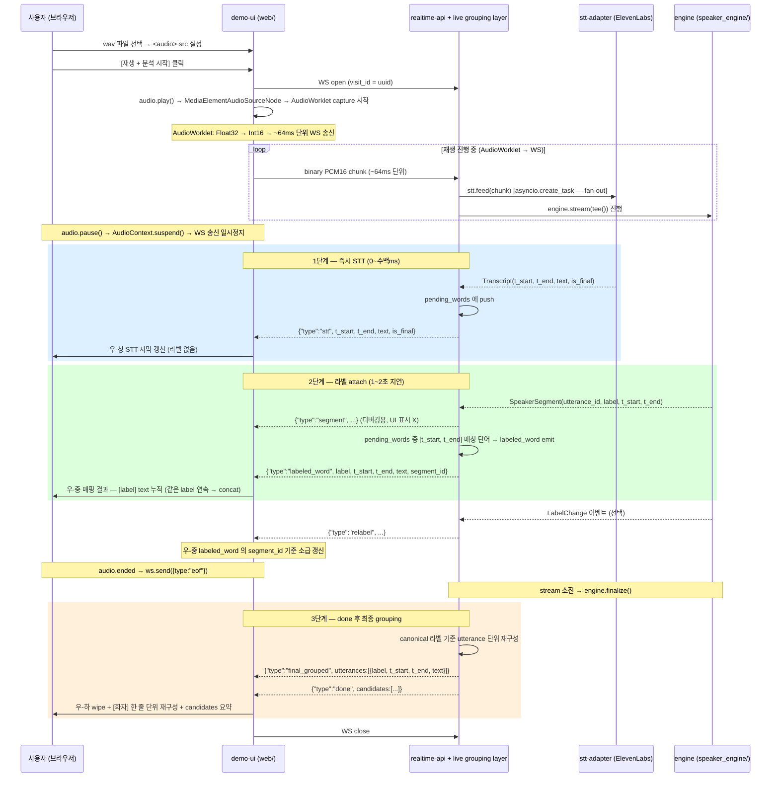

# V-04 데모 시나리오 — 회의 음성 end-to-end 시연 (git tag v0.1.0)

---

## §0 PLAN-005 결과 + PLAN-006 전환 근거

> **이 섹션은 PLAN-006 전환 박제 (2026-05-21)**. v0.1 데모 구조가 Pattern B → STT-driven Chain 으로 변경됨.

### PLAN-005 실측 결과 (2026-05-20)

| session | streaming raw DER | finalize DER |
|---|---|---|
| ES2002a | 23.76% | 21.25% |
| ES2003a | 12.74% | 16.75% |
| ES2008a | 11.21% | 10.16% |
| IS1000a | 29.88% | 30.75% |
| **avg** | **19.40%** | **19.73%** |

**핵심**: streaming raw ≈ finalize. adr-09 live grouping layer 추가에도 동일 한계 — 매핑 layer 로는 boundary 불일치 본질 해결 불가.

**시연 한계**: boundary 불일치로 라벨링이 발화 끝나야 도착("엄청 느림") / 긴 발화 (~30초) 한 줄 누적.

### PLAN-006 전환 결정

- **폐기**: adr-02 Pattern B fan-out + adr-09 live grouping layer
- **채택**: adr-10 STT-driven Sequential Chain — STT phrase boundary SSOT
- **구조 변화**: engine 이 STT 의 phrase PCM slice 를 receive → 화자 라벨 반환

### 자산 보존

- 4-패널 grid 레이아웃 + 음파/RMS 시각화 (T-005/T-005b) — 유지
- AudioWorklet capture (Float32→Int16, T-014) — 유지
- `_pcm_stream` graceful close + eof 시그널 (T-004) — 유지
- ElevenLabs WS 연결 + partial/final 파싱 (T-008) — commit_strategy 만 변경 (T-003)
- `speaker_engine` V-01 closed 본체 (eval / engine.stream / finalize) — legacy 보존
- Docker 단일 컨테이너 (T-012) — 유지

---

## §0-1 T-014 hybrid 부분 회귀 — 학습 채널 부활

> **이 섹션은 PLAN-006 admin smoke v4 결과 박제 (2026-05-21)**. adr-10 §Amendment + PLAN-006-T-015 결정.

### 발견 (T-006 smoke v4)

| 측정 항목 | 결과 |
|---|---|
| 2명 대화 시 라벨 수 | A/B/C/D/E **5개** split (기대: 2개) |
| `engine.stream()` 호출 횟수 | **0회** (Chain 구조에서 T-004 미연결) |
| `_clusterer.centers` 상태 | **None** — 학습 누적 없음 |
| `identify_phrase` 동작 | `_phrase_centroids` 단발 매칭만 수행 |

**근본 원인**: T-001(adr-10) + T-004 워커가 "Pattern B 폐기" 결정을 너무 넓게 적용 — segment 출력 무시 ≠ PCM 입력(학습 채널) 폐기.

### 결정 (PLAN-006-T-015)

- **유지**: STT phrase boundary = 라이브 매핑 wire (`labeled_phrase`) SSOT (adr-10 §Decision 변경 없음)
- **부분 부활**: PCM fan-out 학습 채널. `audio_ws` 가 `engine.stream` 에 PCM 을 계속 공급 → 4 컴포넌트 (Online/Adaptive/Final/Identifier) 학습 누적
- **UI 불변**: `engine.stream` 의 segment 출력 → server 소비만, UI emit X

### 관련 문서

- [[adr-10-stt-driven-sequential-chain]] §Amendment
- [[adr-02-pattern-b-fanout-chain]] §Partially Superseded
- [[spec-04-clustering-algorithms]] §9-5

---

## §0-2 v6~v10 admin smoke 측정 + T-025 diart segment lookup 전환 결정

> **이 섹션은 PLAN-006 admin smoke v6~v10 결과 박제 (2026-05-21)**. adr-10 §Amendment v2 + PLAN-006-T-025/T-026 결정.

### 발견 (smoke v6~v10)

| 측정 항목 | 결과 |
|---|---|
| threshold/weight/gate knob 7개 조정 | collapse vs split 양극 오실레이션 — 안정 불가 |
| phrase-level embedding 분포 | duration 별 cluster 형성 (화자 ≠ 강한 신호) |
| 동일 화자 연속 phrase (v10) | A/B/C/D 복수 라벨 split |

**근본 원인**: T-014 fan-out 이후 `engine.stream` 의 SpeakerSegment yield 를 server 가 무시 (`pass`). diart 의 sliding window context 결과를 활용하지 않고 phrase-level embedding 단독 호출 — 화자 분리 부적합 신호 사용.

### 결정 (PLAN-006-T-025/T-026)

- **유지**: STT phrase boundary = 라이브 매핑 wire (`labeled_phrase`) SSOT (adr-10 §Decision 1 변경 없음)
- **전환**: `engine.stream` SpeakerSegment yield → server segment label map 수집 + STT phrase time-window overlap dominant speaker_id 결정
- **fallback 한정**: `identify_phrase` 직접 호출은 segment 미도착 초기 구간에만

### 관련 문서

- [[adr-10-stt-driven-sequential-chain]] §Amendment v2
- [[spec-04-clustering-algorithms]] §9-6/§9-7

---

## §1 목적 / 한 줄

회의 음성 wav 파일 → 화자 분리 + 한국어 STT → 브라우저 라이브 표시. `git tag v0.1.0` 의 시연 자산. STT 는 ElevenLabs streaming STT (Scribe 모델, 실시간 독립 채널).

---

## §2 범위 (In / Out)

### In scope

| 항목 | 상세 |
|---|---|
| 파일 업로드 | 브라우저에서 wav 파일 선택 → PCM16 변환 후 WS 전송 |
| STT (ElevenLabs streaming) | ElevenLabs streaming WS, 한국어 (`language="ko"`), `ELEVENLABS_API_KEY` 필요 |
| WS json 스트림 | 7종 이벤트 (`segment`, `stt`, `labeled_word`, `final_grouped`, `relabel`, `done`, `error`) — spec-07 §3 |
| 서버 live grouping layer | audio_ws 내 STT 단어-화자 매핑 (1~2초 지연) → `labeled_word` emit + finalize 후 `final_grouped` emit — adr-09 |
| 라이브 UI | 발화 로그 (화자별 색상·시간, STT 텍스트) + relabel 소급 업데이트 + 종료 시 candidates 요약 |
| 오디오 포맷 | PCM 16-bit signed LE, 16kHz, mono — 브라우저 resample 책임 (spec-03 §2, adr-06) |
| Docker / docker-compose | 단일 server 컨테이너 + env_file. spec-08 참조 |

### Out of scope (v0.2+ 예정)

| 항목 | 이유 |
|---|---|
| 마이크 실시간 입력 | AudioWorklet 패턴 — v0.2 |
| 다채널 오디오 | mono only (adr-06-mono-only-v1-multichannel-v2) |
| 인증 / 세션 영속화 | DB 영속화는 사용처 도메인 — 데모는 memory:// 스토어 |
| LLM 추천 표시 | 의료 도메인 (planning-01) 과 무관 |
| ~~STT ↔ segment 서버 매핑~~ | ~~v0.2 검토~~ → **v0.1.1 에서 서버 live grouping layer 로 앞당겨 결정** (adr-09, spec-07 §OQ-07-1 resolved) |

---

## §3 시나리오 — 3단계 라이브 표시 (v0.1.1, adr-09)

---

## §4 KPI (V-04 통과 기준)

CLAUDE.md 의 핵심 KPI 중 v0.1.0 에서 측정 가능한 것만 명시.

| 지표 | 목표 | v0.1.0 측정 방법 |
|---|---|---|
| 화자 분리 정확도 (DER) | < 15% | `pytest tests/eval/ -m eval` (AMI 기준 파일) — V-01 baseline 20.89% → 추가 튜닝 진행 중 |
| STT 정확도 (WER, 한국어) | < 15% | ElevenLabs Scribe 한국어 응답 기준 — `ko_sample.wav` 로 integration 테스트 (spec-06 §6) |
| 실시간 지연 (mic → UI) | < 2초 | 파일 업로드 데모에서는 미측정 (마이크는 v0.2) — **측정 제외** |
| 라이브 라벨링 정확도 | — | **측정 안 함** — 회의 도구 수준 사용성 우선. raw streaming DER ~20% 이지만 ~80% 단어는 올바른 화자에 attach 가능 (PLAN-005 baseline 2026-05-20). UX 평가만. |
| 상담사 식별 정확도 | > 95% | 등록 speaker 없는 데모에서는 미측정 — **측정 제외** |
| 추천 적중률 | > 70% | LLM 미포함 — **측정 제외** |
| LLM 비용 / 세션 | < 1,500원 | LLM 미포함 — **측정 제외** |

> DER 목표 미달 (현재 20.89%) 은 V-01 runbook 에서 deferred 처리. v0.1.0 데모는 회귀 없음 확인으로 통과 기준 완화. 라이브 라벨링은 정량 KPI 설정 X — 사용성(1~2초 지연 후 화자 라벨 노출) 으로 판단.

---

## §5 컴포넌트 경계

CLAUDE.md 모듈 경계 테이블 기반, V-04 데모 시 각 모듈 구체 책임.

| 모듈 | 에이전트 | 위치 | V-04 데모 시 구체 책임 |
|---|---|---|---|
| `engine` | `engine-core` | `speaker_engine/` | 화자 분리 + 클러스터링 + `SpeakerSegment` / `LabelChange` yield |
| `stt-adapter` | (사용처, `realtime-api` 범주) | `server/stt/elevenlabs.py` | ElevenLabs streaming STT 래핑 + `feed` / `stream` / `close` 인터페이스 구현 (spec-06) |
| `realtime-api` | `realtime-api` | `server/` | FastAPI WS 핸들러 + Pattern B tee split + json 이벤트 직렬화 (spec-07) |
| `live grouping layer` | `realtime-api` | `server/` (audio_ws 내부) | `pending_words` 버퍼 관리 + segment 도착 시 시간 매칭 → `labeled_word` emit + finalize 후 `final_grouped` emit. engine / STT 외부 — 사용처(server) 책임 (adr-09) |
| `demo-ui` | `demo-ui` | `web/` | 파일 업로드 + `<audio>` 재생 master clock + AudioWorklet capture (Float32→Int16) + WS 연결 + 3단계 라이브 표시 (spec-07 §4) |
| `engine` ↔ `stt-adapter` | 횡단 | — | 독립 채널: PCM fan-out. 시간 결합은 **서버 live grouping layer** 책임 (adr-09, spec-07 §OQ-07-1 resolved) |

**인터페이스 원칙**: `engine` 은 STT 에 의존하지 않는다. 반대도 동일. PCM 만 공유. 시간 좌표 매핑은 서버 live grouping layer 가 담당 (adr-09). 클라이언트 매핑 로직 제거.

---

## §7 PLAN-006 작업 분해

> **PLAN-006 = adr-10 채택 후 코드 반영**. plans/PLAN-006-stt-driven-chain.md 와 일치.

| T | 작업 | 워커 | 범위 |
|---|---|---|---|
| T-001 | spec-04 / spec-06 / spec-07 / planning-03 갱신 + adr-02 폐기 + adr-10 신설 + _map.md | architect | 문서만, 코드 0 |
| T-002 | `speaker_engine.identify_phrase` 신규 인터페이스 구현 + unit | engine-core | spec-04 §9 기반 |
| T-003 | `server/stt/elevenlabs.py` commit_strategy=vad 검증 + 전환 (또는 fallback VAD) | stt-adapter | spec-06 §OQ-06-3 기반 |
| T-004 | `examples/fastapi_ws_demo.py` Chain 흐름 재작성 (Pattern B / live grouping layer 폐기) | realtime-api | spec-07 §3 기반 |
| T-005 | `web/index.html` `labeled_phrase` 핸들러 (`segment` / `labeled_word` / `relabel` 폐기) | demo-ui | spec-07 §4 기반 |
| T-006 | end-to-end 시연 + admin smoke + V-04 tag v0.1.0 확인 | admin | KPI §4 기준 |
| T-014 | `server/audio_ws.py` engine.stream PCM fan-out 부활 — 학습 채널 재연결 (segment 출력 server 소비, UI emit X) | realtime-api | smoke v4 결과 후속, 코드 변경 |
| T-015 | adr-10 §Amendment + adr-02 status 변경 + spec-04 §9-5 + planning-03 §0-1 박제 (학습 채널 부활 SSOT) | architect | 문서만, 코드 0 |
| T-025 | `server/audio_ws.py` engine.stream SpeakerSegment yield 수집 + STT phrase time-window overlap dominant speaker_id lookup (smoke v6~v10 후속) | realtime-api | 코드 변경 |
| T-026 | adr-10 §Amendment v2 + spec-04 §9-6/§9-7 + planning-03 §0-2 박제 (diart segment lookup 전환 SSOT) | architect | 문서만, 코드 0 |

---

## §6 V-04 DoD

`tag v0.1.0` 종료 조건 체크리스트. 부모: PLAN-004 plan.

- [ ] `examples/basic_chunk_stream.py /tmp/meeting.wav` 가 에러 없이 완주 + `auto:A/B/C` 라벨링 표시 + finalize candidates 출력
- [ ] `examples/fastapi_ws_demo.py` uvicorn 기동 + WS 클라이언트 1회 연결 + `segment` / `stt` 이벤트 수신 통합 테스트 통과
- [ ] t_start 가 session-relative (예: 0.0 ~ 120.0s) 임을 통합 테스트로 확인
- [ ] MemoryStore.init_schema(embedding_dim=512) 가 박히는지 통합 테스트로 확인
- [ ] 기존 V-01 DER baseline 회귀 없음 (`pytest tests/eval/ -m eval` 통과)
- [ ] demo-ui 에서 wav 파일 업로드 → `done` 이벤트 수신 → candidates 요약 브라우저 표시 확인
- [ ] stt-adapter ElevenLabs Scribe 한국어 WER 초기 측정값 기록 (integration 테스트 결과)
- [ ] `ELEVENLABS_API_KEY` 환경변수 없으면 서버 기동 시 즉시 예외 확인
- [ ] `docker-compose up` 으로 e2e 통과 (WS 연결 + AMI 2분 wav → `done` 수신)
- [ ] `git tag v0.1.0` push
- [ ] 우-상 STT 자막 즉시 흐름 동작 확인 (stt 이벤트, 라벨 없음)
- [ ] 우-중 매핑 결과: `labeled_word` 이벤트 기반 — 1~2초 지연 후 `[label] text` 누적 표시
- [ ] 우-하 최종 결과: `final_grouped` 이벤트 수신 시 wipe + `[화자] 전체 텍스트` 한 줄 재구성
- [ ] AMI 2분 wav 시연에서 `[화자A] ... [화자B] ...` 형태 출력 확인 (정확도 KPI X — UX 통과 기준)
